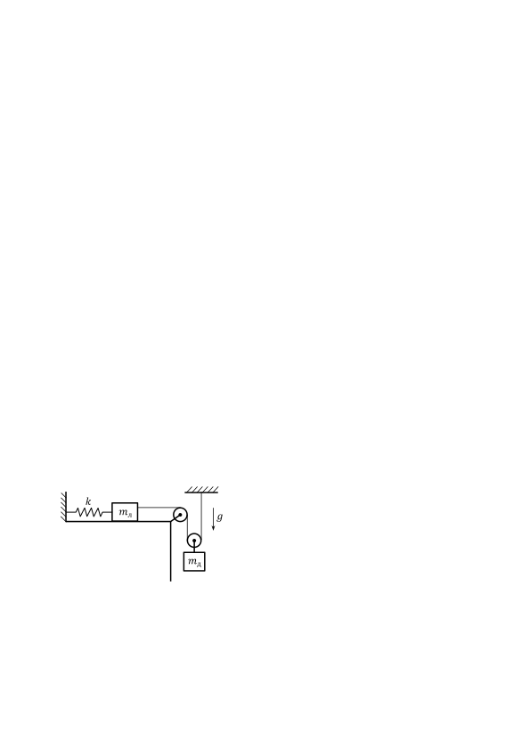
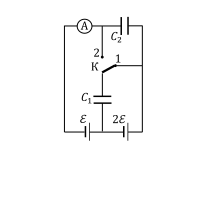

[[Състезания/esenno/11/2022|◂ 2022]] | [[Състезания/esenno/11r/2023|решения]] | [[Състезания/esenno/11/2024| 2024 ▸]]

**Задача 1. Механика**

**Част I** Двама работници трябва да изгребат водата от цилиндричен кладенец с помощта на малка кофа, закачена на въже. Първо единият изважда определено количество вода от кладенеца, след което вторият работник изгребва останалата вода. Дълбочината на кладенеца е d = 7 m, а височината на водния стълб в кладенеца е h = 6 m. Колко пъти повече вода трябва да изгребе първият работник в сравнение с втория, за да може двамата да извършат една и съща работа? Използвайте, че гравитационната потенциална енергия на цилиндричен воден стълб съвпада с потенциалната енергия на материална точка с маса, равна на масата на стълба, намираща се в средата на стълба във вертикално направление. Приемете, че водата се загребва от нейната повърхност и се издига от работника до горния край на кладенеца. Масата на кофата и въжето да се пренебрегне. \[3,5 т.\]

**Част II** Футболна топка лежи първоначално на земята. В даден момент топката е ритната с неизвестна начална скорост v0 под ъгъл $\alpha$ = 30$^\circ$ спрямо хоризонта. В същия момент топче е хвърлено вертикално надолу с начална скорост v0 /2 от височина H = 20 m над земната повърхност. Двете тела се удрят в момента, когато футболната топка достига максимална височина на издигане. Може да използвате, че земното ускорение е g $\approx$ 10 m/s 2 .
Съпротивлението на въздуха да се пренебрегне.
а) На колко е равно разстоянието D между футболната топка и топчето в началото? \[3,5 т.\]

б) Намерете стойността на началната скорост v0 на футболната топка. \[1,5 т.\]

в) Определете изминалото време t от началото на движението до момента на удара между телата. На каква височина hmax над земята се сблъскват футболната топка и топчето? \[1,5 т.\]

**Задача 2. Трептящи системи**

Част I Две трупчета са свързани по начина, показан на фигурата вляво. Лявото трупче (с маса mл = 0,75 kg) може да се хлъзга без триене по хоризонтална плоскост, като отляво е свързано за неподвижно закачена безмасова пружина с коефициент на еластичност k = 100 N/m, а отдясно се дърпа от безмасова и неразтеглива нишка. Нишката минава първо през неподвижна безмасова макара, а след това през подвижна безмасова макара, на която е закачено дясното трупче с маса mд = 1 kg. Десният край на нишката е неподвижно закачен за тавана. Може да приемете, че земното ускорение g $\approx$ 10 m/s 2 .
Съпротивлението на въздуха да се пренебрегне.

а) Намерете с колко е разтегната пружината в равновесното състояние на системата. \[1,5 т.\]

б) Лявото трупче е отместено на малко разстояние от равновесното си положение. Колко е периодът T на хармоничните трептения на системата? \[3,5 т.\]

**Част II** Теглилка с неизвестна маса m е закачена за безмасова пружина с коефициент на еластичност kП и безмасов ластик, както е показано на фигурата. Теглилката може да се хлъзга без триене по хоризонталната повърхност. Ластикът се държи като пружина с коефициент на еластичност kЛ в разтегнато състояние, но в неразтегнато състояние не влияе на движението на теглилката (няма действаща сила от страна на отпуснатия ластик). Дадено е, че когато теглилката е в равновесие, на нея не действат никакви сили от страна на пружината или ластика, като ластикът е изпънат (не е отпуснат). С други думи, в равновесно положение разстоянието от теглилката до дясната стена е точно равно на дължината на неразтегнатия ластик. Системата е приведена в движение по протежение на пружината и ластика, като теглилката трепти с максимална скорост vmax . Големината на максималната сила, приложена в точката на окачване на пружината (т. O) по време на трептенето, е Fmax .

а) Намерете масата m на теглилката. \[2 т.\]

б) На колко е равно разстоянието d между крайното ляво положение на теглилката и нейното крайно дясно положение по време на трептенето? \[1,5 т.\]

в) Определете периода T на хоризонталните трептения на теглилката. \[1,5 т.\]

**Задача 3. Електрически вериги**

**Част I** Батерия с неизвестно електродвижещо напрежение $\mathcal E$ и неизвестно вътрешно
съпротивление r е свързана с резистор със съпротивление R = 1 $\Omega$, при което в резистора се отделя мощност P1 = 10 W. Ако свържем последователно две такива батерии със същия резистор, мощността в резистора става тройно по-голяма. Намерете напрежението $\mathcal E$ и съпротивлението r. \[4,5 т.\]

**Част II** Два кондензатора (с капацитети C1 = 2 mF и C2 = 3 mF), две батерии (с неизвестни електродвижещи напрежения $\mathcal E$ и 2$\mathcal E$), идеален амперметър и ключ К са свързани по начина, показан на фигурата вляво. В началото ключът е в положение 1, при което зарядът на долния кондензатор е q1 = 6 mC.

а) Намерете напрежението $\mathcal E$ на лявата батерия и заряда q2 на горния кондензатор в тази ситуация. \[2 т.\]

б) Ключът е превключен в положение 2. На колко е равен общият заряд Q, който протича през амперметъра след превключването? \[2,5 т.\]

в) Коментирайте какво се случва с всяка една от двете батерии след
превключването - разреждат ли се, зареждат ли се или остават със същия заряд. \[1 т.\]
