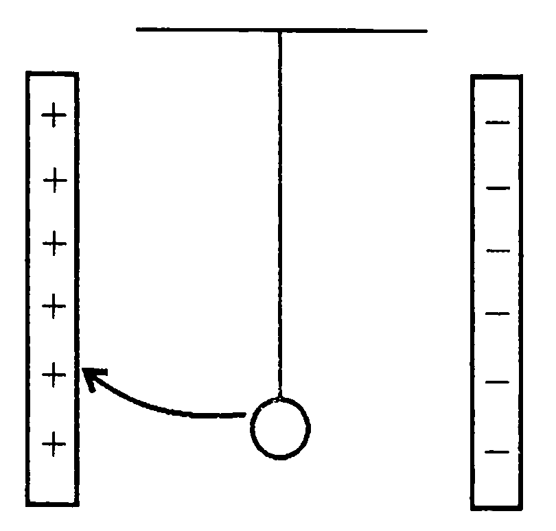
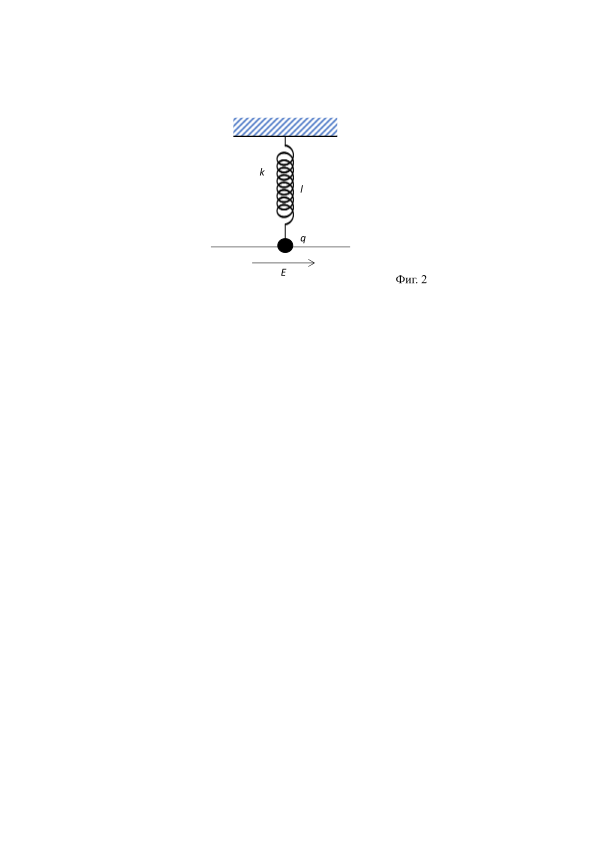

**Задача 1. Вълни на Дьо Бройл**

Част А. Електрон се ускорява от състояние на покой в еднородно електрично поле под
действие на напрежение U .

 a) Намерете зависимостта на дължината на вълната на Дьо Бройл $\lambda$ на електрона
от напрежението U .\[3 т.\]
 
 б) Начертайте графиката на зависимостта $\lambda$(U ) при 25 V < U < 250 V .\[1 т.\]

Част Б. Електрон с енергия Е = 5, 0 еV се движи праволинейно, като електрическата му
потенциална енергия първоначално е W1 = 0 eV при х < 0 , а при х > 0 със скок тя става
W2 = 3, 0 eV .

 a) Начертайте графиката на потенциалната енергия W ( x) на електрона. \[1 т.\]
 
 б) Областта 1 при х < 0 и областта 2 при х > 0 по аналогия с оптиката могат да
се разглеждат като еднородни среди, на границата х = 0 между които може да се
наблюдава отражение и преминаване от 1 в 2 на вълната на Дьо Бройл. Определете
относителния показател на пречупване n .\[5 т.\]

Полезни кoнстанти: константа на Планк h = 6, 626.10 -34 J.s , маса на електрона
m = 9,11.10 -31 kg , елементарен заряд q0 = 1,602.10-19 C .

**Задача 2. Трептене**

Част А. Между две разноименно заредени метални пластини с равни по големина заряди
се намира метално незаредено топче, окачено на изолираща нишка (фиг. 1). Опишете и
обяснете какво ще се наблюдава, ако топчето бъде отклонено от равновесното положение
в посоката, указана на фиг. 1. \[5 т.\]

Фиг. 1

Указание. Електричното поле между пластините е еднородно около средата им, докато
около краищата им е силно нееднородно.

Част Б. На фиг. 2 е показано малко метално топче с положителен електричен заряд
q = 10 $\mu$C , нанизано на гладка изолирана хоризонтална спица и свързано с изолирана
вертикална неразтегната пружина с дължина l = 5 cm и коефициент на еластичност
k = 50 N/m . Включва се еднородно електрично поле с хоризонтално насочен интензитет,
който бавно достига стойност Е = 50 N/C = 50 V/m , като топчето се отмества на
разстояние х0 .

а) В какви граници трябва да бъде разстоянието х0 , ако x0 /l 1 ? \[1 т.\]

б) Намерете х0 .\[4 т.\]

Полезна формула: (1 + х)$\alpha \approx$ 1 + $\alpha$х при х 1

**Задача 3. Стрелба под обсада**

Обсадените в древна крепост са водели стрелба по настъпващия противник с помощта на катапулт зад крепостната стена с височина $H = 20~\mathrm{m}$. Началната скорост на изстрелваните гюлета е $\upsilon_0 = 25~\mathrm{m/s}$ . На фиг. 3 е показана траекторията на гюле, която минава непосредствено над крепостната стена.

а) На какво максимално разстояние $s_{\max}$ от крепостната стена може да се намира цел, по която стрелят обсадените, ако траекторията на гюлето е показаната на фиг. 3? **\[8 т.\]**

б) Сравнете това разстояние с максималната възможна далечина на полета $L_{\max}$ на гюлетата, ако няма крепостна стена. Съпротивлението на въздуха се пренебрегва.
Приемете земното ускорение $g \approx 9,8~\mathrm{m/s^2}$ **\[2 т.\]**

**Указание.** Тъй като вида на траекторията не зависи от посоката на движение по нея - от катапулта към целта или от целта към катапулта, разгледайте движението на гюлето от целта към катапулта в координатна система с начало в целта, вертикална ос нагоре и хоризонтална ос от целта към катапулта.

**Полезна формула:** $\displaystyle \frac{1}{\cos^2\alpha} = 1+\tan^2\alpha$