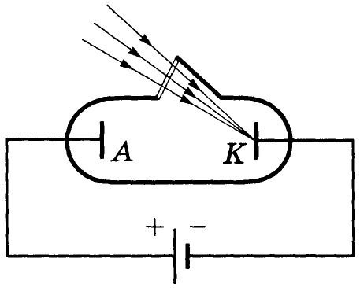
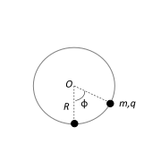

[[Състезания/esenno/11/2024|◂ 2024]] | [[Състезания/esenno/11r/2025|решения]]

**Задача 1. Фотоефект**

Лъчението на аргонов лазер е фокусирано в точка върху равнината на катод K на вакуумен фотоелемент (фиг. 1). Между плоския анод A и успоредния му катод K, разположени на разстояние d, се подава постоянно напрежение U (ускоряващо или

Фиг. 1

задържащо). Върху анода се наблюдават кръгли петна от попадналите електрони. Отделителната работа на електроните в катода е $A_0 = 2 \text{ eV}$, а дължината на вълната на лазерното лъчение е $\lambda = 500 \text{ nm}$. Намерете:

а) израз за радиуса $R_1$ на петното от електрони върху анода при наличие на ускоряващо напрежение. Приемете, че движението на електроните се извършва с постоянно ускорение $a$. [4 т.]

б) израз за радиуса $R_2$ на петното от електрони върху анода при наличие на задържащо напрежение, получено при размяна на полюсите на източника. Границите на петното се определят от електроните, които достигат анода с нулева компонента на скоростта, перпендикулярна на равнината на анода. [4 т.]

в) напрежението на източника, ако $R_1 / R_2 = 2$. [2 т.]

Полезни константи.

Константа на Планк – $h = 6,63 \cdot 10^{-34}$ J.s

Елементарен заряд – $q_0 = 1,6 \cdot 10^{-19}$ С

Скорост на светлината във вакуум – $c = 3,0 \cdot 10^8$ m/s

**Задача 2. Механично равновесие.**

Частица с маса $m$ и електричен заряд $q$ се движи по вертикален гладък изолиран обръч с радиус $R$ (фиг. 2). В най-ниската част на обръча се намира неподвижно закрепено топче с електричен заряд $q$. Действието на силата на тежестта не се пренебрегва.

а) Начертайте силите, която действат на частицата и напишете израз за всяка сила.
\[5 т.\]

б) Определете равновесните положения на частицата. [5 т.]
Полезни тригонометрични равенства:

$$\sin 0 = 0, \quad \cos 0 = 1, \quad \sin\left(\frac{\pi}{2} - \alpha\right) = \cos \alpha, \quad \cos\left(\frac{\pi}{2} - \alpha\right) = \sin \alpha, \quad \sin 2\alpha = 2\sin \alpha \cos \alpha$$

**Задача 3. Движение по окръжност.**

Хоризонтална кръгова платформа с радиус $r$ се върти с постоянна ъглова скорост $\omega$ около вертикална ос, минаваща през центъра ѝ. Върху платформата се намират стрелец с лък и мишена, в която той насочва стрела със скорост $v$ спрямо лъка. Разгледайте следните два случая:

а) Стрелецът се намира в центъра на платформата, а мишената в т. А от периферията на платформата (фиг. 3, поглед отгоре). Под какъв ъгъл $\theta_1$ спрямо отсечката ОА трябва да бъде изстреляна
стрелата, за да попадне в мишената? [5 т.]

Фиг. 3

б) Стрелецът и мишената сменят местата си – мишената се поставя в центъра, а стрелецът се намира в т. А. Под какъв ъгъл $\theta_2$ спрямо отсечката АО трябва да бъде насочена стрелата, за да попадне в мишената? [5 т.]

Действието на силата на тежестта върху стрелата се пренебрегва.
