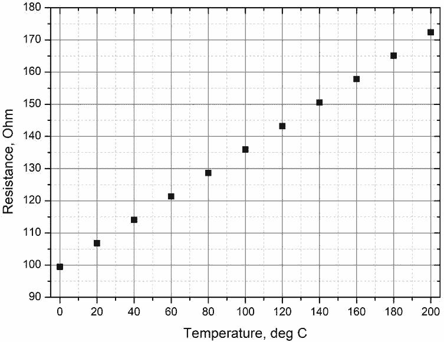

**Задача 1. Салто мортале.**

Фигурата е само илюстративна.
Мащабът не е спазен.

а) Тяло излита със скорост $v_0$ от височина h под ъгъл $\beta$ спрямо хоризонталната равнина. Земното ускорение е g. Получете формула за времето на полета t \[1,5 т.\] и далечината на полета L. \[0,5 т.\]

б) Велосипедист се спуска по писта, която завършва с участък с формата на дъга от окръжност с радиус R. Радиусът от края на дъгата сключва ъгъл $\alpha$ с вертикалата. Велосипедистът се спуска от пистата от височина H, а пистата свършва на височина h над хоризонталната равнина. Масата на велосипедиста (заедно с велосипеда) е m, инерчният му момент (заедно с велосипеда) спрямо центъра на масата и ос, перпендикулярна на чертежа, е I. Инерчният момент на колелата се пренебрегва. Разстоянието между двете колела на велосипеда е много по-малко от R. Получете формула за скоростта v0 , с която велосипедистът ще излети от пистата. \[2,0 т.\]

в) При какви ъгли на завъртане $\omega$ по време на полета велосипедистът ще се приземи
едновременно с двете колела на велосипеда? \[0,5 т.\]

г) Получете условие за всички възможни височини на спускането H, при които велосипедистът ще се приземи едновременно с двете колела. \[2,0 т.\]

д) Изчислете с точност 5 cm минималната височина H, изпълняваща това условие при следните стойности: g = 9,81 m/s2, $\alpha$ = 60,0$^\circ$, R = 10,00 m, h = 5,00 m, $\frac{I}{mR^2} = 0,01$. \[2,5 т.\]

е) За тази минимална височина изчислете v0 \[0,5 т.\] и L \[0,5 т.\].

**Задача 2. Равновесна температура.**

а) Към краищата на тънка дълга пластина, направена от вещество 1, се подава напрежение E =
5,00 V. Всяка oт двете страни на пластината има площ S = 2,00 cm2. Топлинните загуби
(отделената енергия от единица площ за единица време) от пластината се дават от формулата $\frac{\Delta Q}{\Delta S\Delta T} = \alpha (T-T_0)$ където T е температурата на пластината, T0 = 20,0 $^\circ$C е температурата на околната среда, а $\alpha$ = 10,0 m2 K. Зависимостта на електрическото съпротивление R1 от температурата T е дадена на фиг. 1. Определете с точност 2 $^\circ$C равновесната температура T1 на пластината от вещество 1. \[3,0 т.\]

б) Идентична по форма и размери пластина, направена от вещество 2, е поставена при същите условия като в подусловие а). Зависимостта на електрическото съпротивление R2 от
температурата T е дадена на фиг. 2. Определете с точност 2 $^\circ$C температурата T2 на пластината от вещество 2. \[3,0 т.\]

в) Двете пластини от подусловие а) и б) са плътно допрени една към друга и са поставени при
същите условия като в подусловие а). Определете с точност 2 $^\circ$C температурата T3 на двете
пластини. \[4,0 т.\]

**Задача 3. Лещи.**

Две еднакви събирателни лещи 1 и 3, всяка с оптична сила Ф+ = +5 dpt, са поставени симетрично от двете страни на една разсейвателна леща 2 с оптична сила $\Phi^* = -5\ \mathrm{dpt}$ на разстояние d = 10 cm от нея.

а) На какво разстояние x отляво на леща 1 трябва да се постави точков източник на светлина, така че светлината, идваща от него, след като премине през трите лещи, отдясно да излезе като успореден сноп? \[3,5 т.\]

б) На какво разстояние y отляво на леща 1 трябва да се постави точков източник на светлина,
така че светлината, идваща от него, след като премине през трите лещи, отдясно да се събере в точка, намираща се на същото разстояние y от леща 3? \[3,5 т.\]

в) Разстоянието между лещите се променя от d на d', при което успореден сноп, след като премине през трите лещи, остава успореден. Изчислете d'. \[3,0 т.\]

