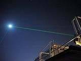

Задача 1. Поглед към Космоса

Част 1. Илюстрациите на фиг. 1 от листа за отговори (стр. 3) пресъздават снимки на
нощното небе, направени през определен интервал от време. И на двете снимки
фотоапаратът е бил насочен в една и съща посока.

А) Защо двете снимки изглеждат по различен начин? \[1 т\]

Б) Отбележете Полярната звезда със стрелки върху двете илюстрации от листа за
отговори. Обяснете защо сте избрали именно тази звезда. Ако е нужно, можете да чертаете
върху илюстрациите. \[2 т\]
Предайте стр. 3 заедно с останалите листа от вашите решения.
В) Колко време е минало между снимките? \[2 т\]
Част 2. Във фантастичен филм, излъчван наскоро по кината, е описан следният проект за
космическо оръжие. Към космически кораб, обикалящ около Земята, е закачена мощна
бомба. Когато корабът минава над целта си, бомбата се откача и пада върху целта.
 - Обяснете защо този проект е нереалистичен. \[2 т\]
 
 
 

Част 3. По време на мисията на космическия кораб
Аполо-11 астронавтите са монтирали на Луната
огледало, насочено към Земята, както е показано на
снимката вдясно. Оттогава до днес то се използва за
точно определяне на разстоянието между Земята и
Луната. За целта от лазер, разположен на Земята, към
огледалото се излъчва кратък светлинен сигнал
Установено е, че сигналът се връща обратно на Земята за
време t = 2,52 s, след като бъде излъчен.
 - Ако е известно, че скоростта на светлината e
 c = 300 000 km/s , пресметнете разстоянието L от
 Земята до Луната. \[3 т\]

Задача 2. Движение

Част 1. На голф-игрище има две пътечки - А и Б с еднакви дължини. На първата пътечка
има издатина, а на втората - вдлъбнатина със същата форма и дължина като издатината на
първата пътечка (вж. фиг. 3). В началото на двете пътечки са пуснати да се търкалят
едновременно две топчета с еднакви скорости.
 А

 Б

 - Кое от двете топчета ще достигне първо края на своята пътечка? Обосновете
 отговора си.
 \[3 т\]
 5m
Част 2. Два камиона с еднакви дължини 15 m се 15 m 50 m
намират на еднакви разстояния 50 m от 5m
кръстовище с широчина 5 m. Първият камион се v1
движи към кръстовището със скорост v1 = 10 m/s.

 - С каква скорост v2 трябва да се движи
 вторият камион така, че камионите да
 преминат кръстовището без да се сблъскат и v2
 без да се налага да спират? \[7 т\]

Задача 3. Сили

Част 1. Площта на буталото на помпа е S1 = 15 cm2, а на отвора на маркуча - S2 = 0.3 cm2.
Ваш съученик натиска буталото със сила F1 = 200 N. С каква сила F2 трябва да притиснете
с пръст отвора на маркуча, така че въздухът да не излиза от помпата? \[4 т\]

Част 2. Върху блюдото на елктронна везна е поставена чаша с вода. Везната отчита маса
m0 = 60 g .

а) Върху блюдото, без да се маха чашата, е поставено пластмасово кубче със страна 2 cm и
плътност $\rho$ = 0,6 g/cm 3 . Колко ще показва везната в този случай? \[2,5 т\]

б) Пластмасовото кубче е пуснато в чашата. Плътността на водата е $\rho$ 0 = 1 g/cm 3 , а
g = 10 N/kg . Колко е изтласкващата сила, с която водата действа на кубчето? \[2,5 т\]

в) Колко ще показва везната, когато кубчето се намира в чашата с вода? \[1 т\]

 2
 ЛИСТ ЗА ОТГОВОРИ

 към част 1 на задача 1

 Предайте този лист заедно с останалите листа от решението

Посочете Полярната звезда на двете снимки.

Фиг. 1 а б

Обяснете защо избрахте точно тези звезди.

 3
