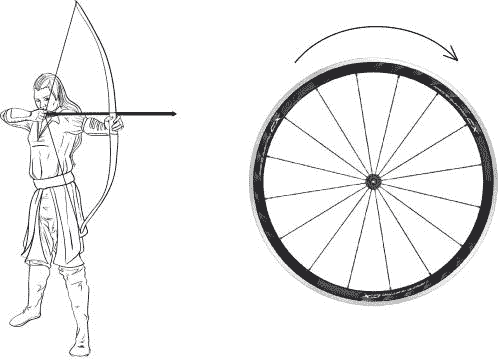
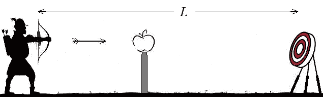
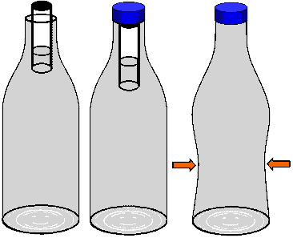
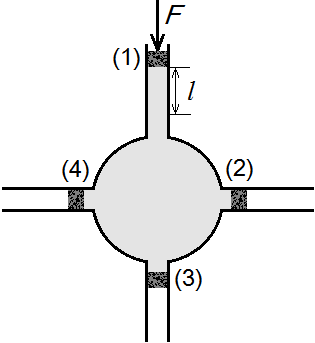

[[Състезания/esenno/7/2013|◂ 2013]] | [[Състезания/esenno/7r/2014|решения]] | [[Състезания/esenno/7/2015| 2015 ▸]]

Задача 1. Стреляй в целта

В тази задача приемаме, че стрелите се движат равномерно и праволинейно от момента на изстрелване до забиването в мишената. Трите части на задачата са независими.

Част 1. За да спечели принцеса Драупади, принц Арджуна трябва да изстреля стрела, която да мине между спиците на въртящо се колело без да бъде докосната от тях. Колелото има n = 100 много тънки спици и извършва едно пълно завъртане за T = 1 s (виж Фиг. 1). Стрелата е тънка пръчка с дължина l = 60 cm. Принцът я изстрелва със скорост v = 50 m/s. Възможно ли е да спечели принцесата? \[4 т.\]

Забележка: n спици разделят колелото на n еднакви сектора.

 Фиг. 1

Част 2. Робин Худ трябва да изстреля последователно три стрели, които да пристигнат в мишената едновременно. Той прилага различен опън на тетивата (опъната нишка на лък, чрез която се изстрелват стрелите) при всеки изстрел, така че стрелите излитат с различна скорост. На Фиг. 2 е показана връзката между силата, с която се опъват тетивата, и съответната скорост на стрелата. За първата стрела Робин опъва тетивата със сила F = 120 N. Каква сила трябва приложи върху тетивата при втората и третата стрела, така че трите да пристигнат едновременно в мишената, която е на разстояние L = 120 m от Робин? Втората стрела е изстреляна t0 = 1 s след първата, а третата - t0 = 1 s след втората. \[4 т.\]

Част 3. Вилхелм Тел изстрелва с лъка си стрела, която пронизва ябълка преди да се забие в мишената (виж Фиг. 3). Първоначално стрелата има скорост v0 = 35 m/s. След пронизването на ябълката скоростта ѝ намалява с 10%. Разстоянието между стрелеца и мишената е L = 100 m. На какво разстояние от Вилхелм трябва да се намира ябълката, така че стрелата да се забие в мишената точно t0 = 3 s след като е изстреляна? \[2 т.\]

Задача 2. Солено или сладко

В 1 g вода може да се разтворят най-много 0,4 g сол или най-много 5 g захар. В тази задача разглеждаме солени или сладки разтвори, всеки от тях съставен от 1 g вода и един вид разтворено вещество.

а) Солен или сладък е разтвор с плътност $\rho_0$ = 1,23 g/cm3? \[2 т.\]

б) Колко е масата на разтвореното вещество в разтвора от подусловие а)? \[3 т.\]

в) Известно ни е, че кухо алуминиево топче не може да плава в солен разтвор, но може да плава в сладък (това може да не е някой от разтворите, разгледани в предишните подточки!). Каква максимална и минимална част от обема на топчето може да бъде заета от кухината? \[5 т.\]

Приемете, че плътностите на солта и на захарта не зависят от това дали веществото е разтворено или не. Плътността на водата е 1 g/cm3; на солта е 2,1 g/cm3; на захарта е 1,4 g/cm3; на алуминия е 2,7 g/cm3.

Задача 3. Флуиди под налягане
Част 1. В пластмасова бутилка, пълна догоре с вода, е потопена с дъното нагоре малка епруветка. В епруветката има вода дотолкова, че да плава почти изцяло потопена в бутилката. Затваряме плътно бутилката и силно я стискаме (виж Фиг. 4). Вследствие на това, епруветката бавно се придвижва надолу. Когато престанем да стискаме бутилката, епруветката се придвижва нагоре. Без да използвате пресмятания, обяснете защо епруветката потъва при стискане на бутилката. \[3 т.\]

 
 Фиг. 4

Част 2. В тази част гравитационните ефекти се пренебрегват.

а) Бутала (1) и (3) на хидравличната машина на Фиг. 5 имат площ А0 а буталото (2) е с площ 3А0. Върху буталото (2) е приложен натиск F = 200 N. Какъв натиск трябва да се приложи върху буталата (1) и (3), така че системата да е в равновесие, т.е. буталата да не се движат? \[3 т.\]

 
 Фиг. 5

Буталата (1), (2), (3) и (4) на хидравличната машина от Фиг. 6 имат еднаква площ.

б) Буталото (1) се придвижва надолу на разстояние l = 3 cm (виж Фиг. 6). На какво разстояние ще се придвижат другите три бутала? \[2 т.\]

в) Върху бутало (1) е приложен натиск F = 300 N. Какъв натиск трябва да се приложи върху другите три бутала, така че системата да е в равновесие, т.е. буталата да не се движат? \[2 т.\]

 Фиг. 6
