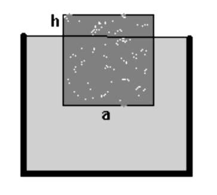
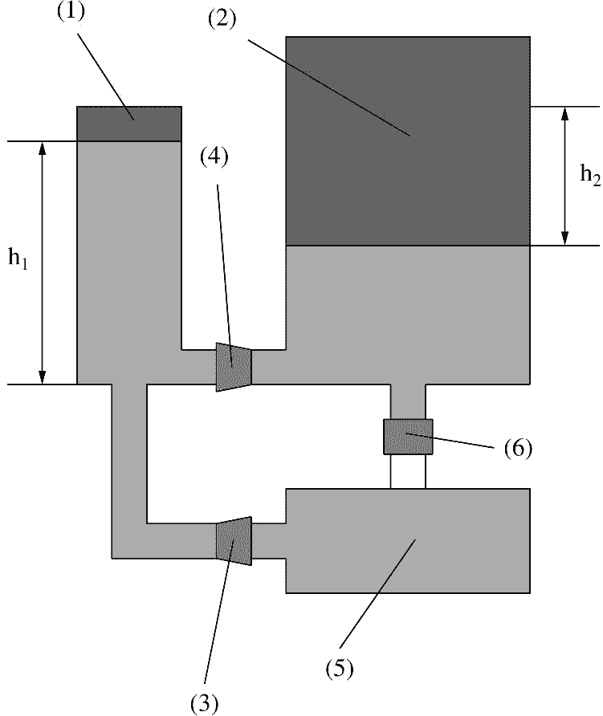

Задача 1. Слънчево зайче
 Любопитната котка Бианка наблюдава слънчево зайче, което в началото е точно до
нея. В даден момент зайчето започва да се движи пред нея с постоянна скорост. Без да мърда
в продължение на няколко минути, Бианка гледа как то се отдалечава, след което тръгва с
постоянна скорост към него. По някое време го настига, но изгубила интерес към зайчето,
продължава напред без да променя скоростта си. Малко по-късно зайчето спира да се движи.
Скоро след това Бианка също спира, свива се на кълбо и заспива. Разстоянието d между
котката и зайчето се променя с течение на времето t, както е показано в следната таблица за
определени моменти.
 t [min] 0 1 2 3 4 5 6 7 8 9 10 11 12 13 14 15
 d [m] 0 0 - 6 - 22 23,5 18,5 - - - 1,5 - - 26 -

 Решете подусловията, ако ви е известно, че зайчето спира да се движи, когато е
изминало 78 m.
 а) Намерете с каква скорост vЗ се движи слънчевото зайче и в кой момент tЗ започва
движението му. \[1,5 т.\]
 б) Определете в кой момент tЗ' зайчето спира да се движи. \[1 т.\]
 в) Намерете с каква скорост vБ се движи Бианка и в кой момент tБ тя тръгва към
зайчето. \[3 т.\]
 г) Намерете в кой момент tН Бианка настига зайчето. \[2 т.\]
 д) Определете в кой момент tБ' Бианка спира да се движи. Пречертайте таблицата в
собствения си лист и попълнете липсващите данни. \[2,5 т.\]

Задача 2. Двете части на задачата са независими
Част А. Лост
 Алуминиево кълбо (1) и желязно кълбо (2) са окачени на лост, който е неподвижен и
хоризонтален. Разстоянието от опорната точка до точката на окачване на кълбото (1) е l1, а
разстоянието от опорната точка до точката на окачване на кълбото (2) е l2 . Сравнете
дължината l1 с дължината l2 в следните два случая:
 а) двете кълба имат еднакви маси; \[2 т.\]
 б) двете кълба имат еднакви обеми. \[3 т.\]
Плътността на алуминия е $\rho_1$ , на желязото - $\rho_2$ , като $\rho_1$ < $\rho_2$ .
Част Б. Плаване на куб лед
 Куб лед се поставя в празен съд, в който след това се налива вода до горния ръб на
съда. Горната стена на плаващия куб, успоредна на повърхността на водата, се оказва на
височина h = 1 cm (фиг. 1).

 Фиг. 1
 
 а) Намерете масата на налятата вода, ако обемът на съда е V = 1,5 L. Плътността на
водата е $\rho_1$ = 1 g/cm3, а плътността на леда - $\rho_2$ = 0,9 g/cm3. \[3 т.\]
 Забележка. Едно тяло плава потопено в течност, когато масата на тялото е равна на
масата на изместения от потопената му част обем течност.
 б) Кубът лед се стопява и се превръща във вода. Обяснете кой от възможните случаи
ще се наблюдава - част от водата ще прелее, нивото на водата няма да се измени, нивото на
водата в съда ще се понижи. \[2 т.\]

Задача 3. Хидравличен крик

 Хидравличният крик е механично
устройство, което най-често се използва за
повдигане на тежки обекти. На фигурата е
показана схема на устройството на такъв
крик. Той се състои от две бутала: малко,
означено с (1), и голямо, означено с (2).
Две клапи (3) и (4) пропускат работното
вещество на крика (хидравлично масло)
само в едната посока. Също така има
резервоар за масло (5), както и кран за
източване на маслото (6).
 Едно напомпване ще наричаме
следната последователност: вдигаме
бутало (1) нагоре, при което клапа (3) се
отваря, клапа (4) се затваря, и така в обема
между буталата се вкарва масло от
резервоара. При натискане на бутало (1)
надолу клапа (3) се затваря, клапа (4) се
отваря и бутало (2) се премества нагоре.
Така при многократно напомпване на
масло в обема между двете бутала, бутало
(2) се издига нагоре и могат да се повдигат
тежести с голяма маса.
 Площта на бутало (1) е S1 = 5 cm2, а тази на бутало (2) е S2 = 15 cm2. Разстоянието,
което изминава бутало (1) при едно напомпване, е h1 = 6 cm.
 а) Определете колко нютона е силата F1 , с която трябва да действаме върху бутало (1),
за да може да се повдигне автомобил с маса m = 2,4 тона. Приемете, че се вдига целият
автомобил. \[3 т.\]
 б) Колко пъти трябва да напомпаме с бутало (1), така че бутало (2) да се издигне на
височина h2 = 0,18 m? \[2 т.\]
 в) При отваряне на крана (6) допълнителното масло, което е напомпано в обема
между двете бутала, се връща обратно в резервоара на крика. Ако знаем, че маслото изтича
през отвора на крана със средна скорост v = 4,5 m/s за време t = 20 s и бутало (2) е било
издигнато на височина h = 12 cm, определете площта S на отвора на крана. \[5 т.\]
