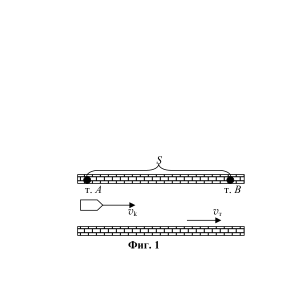
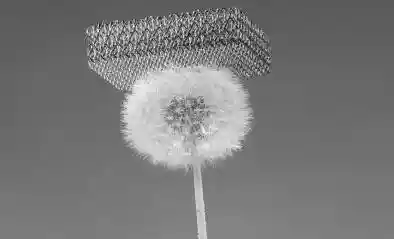
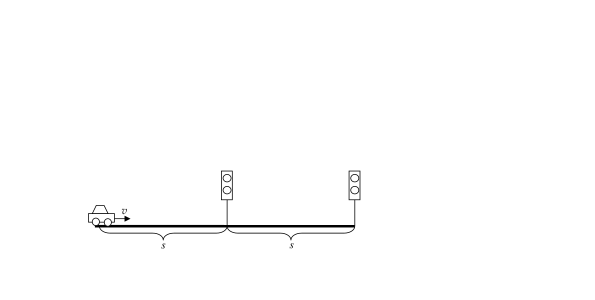

 Есенно национално състезание по физика

 Първа състезателна група - VII клас, 12.11.2022 г, гр. Сливен

Зад. 1. Двете подусловия (Част 1 и Част 2) на задачата са независими.

 Част 1. Проверка на воден канал. Необходимо е да се осъществи проверка на изправността на стените на воден канал. Експерти използват катер, който се движи по канала и има скорост vk в спокойна вода. Те обследват стените от т. А до т. В (разстоянието между тях е S) и после се връщат обратно в т. А. (вж. Фиг. 1)

А) изразете времето t1, за което катерът се връща в т. А след като е тръгнал, при условие, че се движи в спокойна вода. (1 т)

Б) изразете времето t2, за което катерът се връща в т.А след като е тръгнал, при условие, че скоростта на течението водата в канала е vт. (2 т)

В) в кой случай, "със" или "без" течение на водата в канала, експертите по-бързо ще обследват канала? Обосновете отговора си. (2 т)

 Част 2. Малката Бени помага на дядо.

 
Дядото на малката Бени полива тревата в двора. За целта е поставил много гъвкав, неразтеглив маркуч, с дължина L = 100 m, по права линия. Единият край на маркуча е закрепен към кран (К) за вода, а
другият е свободен. На разстояние l = 60 m от крана е завързана панделка (П). Малката Бени хваща свободния край на маркуча и започва да тича в посока към крана, по дължината на маркуча със скорост v = 4 m/s. (вж. Фиг. 2)

А) Определете след колко време t1 панделката ще започне да се движи (2 т)

Б) Определете след колко време t2 панделката ще достигне до крана (Бени продължава да тича по права линия и след като подмине крана) (2 т)

В) Намерете скоростта на движение v1 на точката на огъване (т. A) на маркуча (1 т)
Зад. 2. Нови технологии и съвременни постижения на науката.

Част. 1. Лист от графен.

Движейки обикновен черен молив (графит) върху лист хартия се отделят атоми от графита (атоми въглерод). Те се нанасят върху повърхността на листа, като оставят черна следа, тънък графитен слой с дебелина около $d = \frac{0,25}{109}$ m. Ако успеем да почерним целия лист с молива и после внимателно отделим получения слой от листа хартия се получава "графен". Графенът е нов материал, чието откритие и изследване е донесло Нобелова награда по физика през 2010 г.

Учените разработват графенов слой с цел получаване на огромно квадратно платно за
космически кораб. Те използват графит от обикновен молив, с дължина L = 17 cm и
напречно сечение S0 = 4 mm2. Плътността на графита е $\rho$ = 2300 kg/m3.

А) Каква е масата m на платното? (2 т)

Б) Намерете площта S на платното (2 т)

Част 2. Най-лекият материал.

 През 2011 година е получен "най-лекият материал ", наречен
 "аерогел", състоящ се от запълнени с въздух преплетени по-
 тънки от човешки косъм тръбички, изготвени от никел-
 фосфорна сплав (масата на никела в сплавта е 93%, а на
 фосфора е 7%). В научните статии се дават данни за
Аерогелът е толкова лек, че дори плътността на един такъв образец - 0,9 mg/cm3, като тази
не може да деформира и цвета на
глухарче
 стойност се дава без да се отчита въздуха в него.

 А) Намерете плътността $\rho$Ni-P на никел-фосфорната сплав
(твърдата (плътната) част от материала) (3 т)

Б) Каква относителна част х от обема на аерогела е заета от твърдо вещество - никел и
фосфор? (VNi-P/Vмат = ?) (2 т)

В) Намерете приблизителната стойност на плътността на материала, ако отчитаме
наличието на въздух в него? (1 т)

Плътността на въздуха е $\rho$ = 1,2 mg/cm3, на никела $\rho$Ni = 8,9 g/cm3, плътността на
фосфора е $\rho$P = 1,85 g/cm3.

Да се приеме, че обемът на никел-фосфорната сплав е равна на сумата от обемите на
никела и фосфора, влизащи в състава на образеца.

Зад. 3. Да караме без да спираме. На прав участък са поставени два светофара на
разстояние s = 1 km един от друг. Червеният и зеленият сигнал на светофарите светят
по t = 30 s всеки. Цветовите сигнали (червения и зеления) на двата светофара се
включват едновременно, т.е. когато светне червеният сигнал от единия светофар, тогава
светва червеният и на другия.

Максимално разрешената скорост по правия участък е vmax = 80 km/h, а минималната
скорост е vmin = 24 km/h.

Автомобил, движещ се с постоянна скорост, се намира на разстояние s = 1 km от
първия светофар в момента, когато светва зеления му сигнал.

Част 1.

Светофарите работят при напрежение U = 220 V, като съпротивлението на всяка лампа
е R = 440 $\Omega$. Те са свързани като консуматори към захранващата градска мрежа.

А) Как трябва да са свързани (успоредно, последователно) светофарите към градската
мрежа, така че в случай на авария на единия, другият да продължи да работи нормално?
Аргументирайте отговора си и го подкрепете чрез подходяща схема. (1 т)

Б) Намерете електричния ток I, който тече през всяка лампа, когато тя свети. (1 т)

В) Намерете какъв заряд q е протекъл през всяка лампа за време t = 30 s. (1 т)

Част 2.

А) С какви скорости (в какъв интервал са стойностите на скоростта) трябва да се движи
автомобилът, така че да премине на зелено през първия светофар? (4,5 т)

Б) С какви скорости (в какъв интервал са стойностите на скоростта) трябва да се движи
автомобилът, така че да успее да премине и през двата светофара на зелено без да
спира?

При извършване на пресмятанията изразете скоростта в km/h. (2,5 т)
