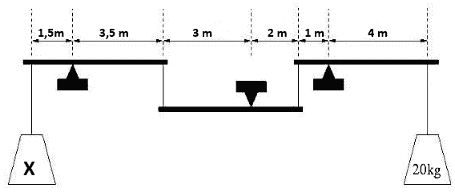
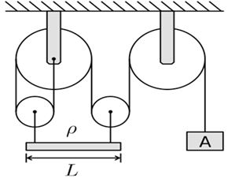
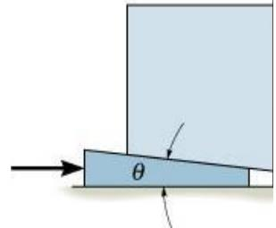
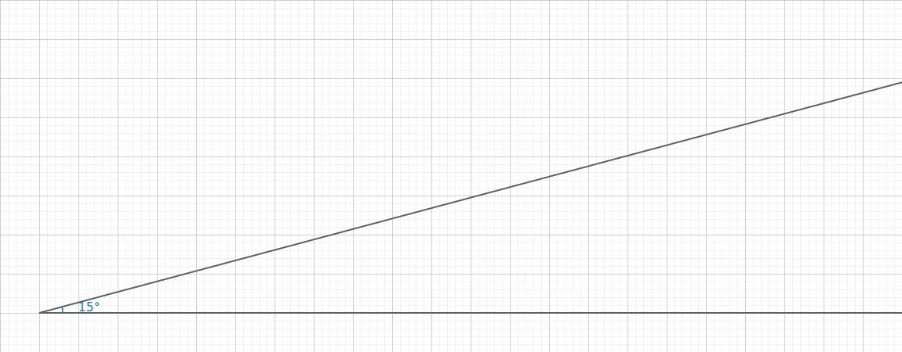
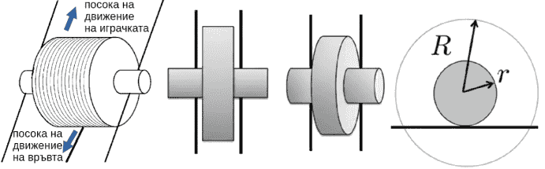
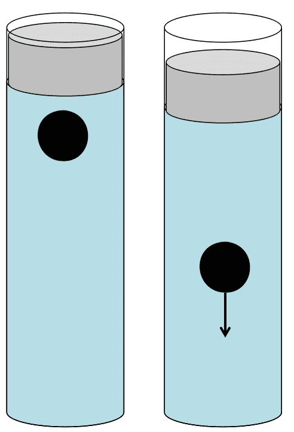

Задача 1. Златното правило на механиката

Преди повече от 2000 години Архимед формулирал идеята, която днес наричаме
"златното правило на механиката". Легендата казва, че той заявил: "Дайте ми опора и
ще повдигна Земята." Зад тази смела фраза стои проста, но дълбока истина: печелим
сила за сметка на пътя. Ако искаш да вдигнеш голям товар с малка сила, трябва да
"платиш" с по-дълго движение на точката, където прилагаш усилието. Това е валидно
за лоста, за макарата, за наклонената равнина, за винта, за системата "колело и ос" -
за всички прости машини. Например формулата за равновесие на лост е:
F1 . l1 = F2 . l2
1.1.

\[1 т.\]

Колко трябва да бъде
масата на товара X, за
да имаме равновесие?

1.2.

\[2 т.\] Еднородна дъска с дължина L = 80 cm, широчина w = 20 cm и дебелина d =
30 mm се поддържа хоризонтално във въздуха от леки
неразтегливи нишки, завързани за двата ѝ края. Всяка от
тези нишки е прикрепена към малка лека макара, която
е свързана с две големи макари посредством еднаединствена нишка, както е показано на фигурата.
Намерете масата на теглилката A в килограми,
необходима, за да се запази системата в равновесие.
Плътността на дървения материал е $\sigma = 0,0005\ \mathrm{g/mm^3}.

1.3.

\[2 т.\]

На чертежа е показан клин, който се вкарва хоризонтално под
масивен блок (товар). Горната му наклонена страна опира в
1

Фигура на клин

долната повърхност на блока, а клинът се движи надясно с прилагане на хоризонтална
сила F�. При вкарването на клина блокът се повдига вертикално. На фигурата ъгълът
между горната наклонена страна на клина и хоризонталата е $\theta\iota$ = 15$^\circ$. Теглото на блока е
P� = 1,2 kN. Клинът се вкарва хоризонтално с ход s� = 0,1 m. Намерете необходимата
сила F, която трябва да се прилага върху клина. Използвайте фигурата, показваща ъгъл
от 15 градуса. Триенето се пренебрегва.

Фигура на ъгъл от 15 градуса.

1.4 \[2,5 т.\]

Три зъбни колела са част от механизъм, както е показано на схемата. Зъбното колело A
има 60 зъба. Зъбното колело B има две
венчета: вътрешно с 15 зъба и външно с 45
зъба. Зъбното колело C има 15 зъба на своя
вътрешен венец. Колелото A се върти по
часовниковата стрелка и извършва пълно
завъртане за 1 час. Да се определи за колко
време зъбното колело C ще извърши едно
пълно завъртане.

1.5 \[2,5 т.\]

Имам играчка, която се състои от цилиндър с радиус R, около който е навита връв. Към
този цилиндър са прикрепени два по-малки цилиндъра с радиус r, които се движат по
релси, както е показано на схемата ( r < R). Когато дърпам връвта назад, играчката се
движи напред. Да се приеме, че триенето е достатъчно голямо, така че няма
приплъзване. Ако искам играчката да се премести напред на разстояние d, на какво
разстояние dназад трябва да дръпна връвта назад?

ЗАДАЧА 2. Полет около Земята

Приемаме, че Земята е идеално сферична с радиус RЗемя = 6390 km.
четири точки на Земята със съответните ширини и дължини:
$\cdot$

N:�ширина +60\sqrt , дължина 0\sqrt

$\cdot$

S: ширина *60\sqrt , дължина 0\sqrt

$\cdot$

E: ширина 0\sqrt , дължина +90\sqrt

$\cdot$

W:�ширина 0\sqrt , дължина *90\sqrt

Дадени са

Самолет се движи по най-късите пътища по повърхността в реда: N \Rightarrow S \Rightarrow E \Rightarrow W.
На междинните т. S�и E самолетът спира по 1 час за презареждане. Самолетът се
движи на височина от 10 km над повърхността, затова в изчисленията ще приемем, че
R = 6400 km. Скоростта спрямо земната повърхност е постоянна: v = 900 km/h.
Пренебрегваме ветровете. Самолетът тръгва в понеделник по обяд в 12:00. Когато
самолетът лети от E \Rightarrow W , той се движи в посока, противоположна на въртенето на
Земята.

а) Намерете разстоянието и времето за полета N \Rightarrow S. \[2 т.\]

б) Намерете разстоянието и времето за полета S \Rightarrow E. \[2 т.\]

в) Кога самолетът излита от E�(местно време в E)?
\[2,5 т.\]

г) Намерете разстоянието и времето за полета E \Rightarrow W. \[2 т.\]

д) Кога самолетът пристига в W: ден и местен час в W? \[1,5 т.\]

Бележка: Когато посочвате времената, използвайте 24 часов формат например, 07:35,
18:40 и т.н. В задачата използваме непрекъснато местно (слънчево) време, което се
изменя плавно с географската дължина. За опростяване приемаме, че часовите
разлики между съседни зони са по един час. Това е идеализиран модел, различен от
официалното време по часови пояси, които се определят административно и дори на
някои места часовата разлика не е цял час (напр. Индия и Непал).

ЗАДАЧА 3. Вода и ток

Задачи 3.1 и 3.2 са независими една от друга.

3.1 \[5 т.\] Вертикален затворен цилиндър с вътрешен радиус
r = 1,85 cm е напълнен с вода. Във водата плава играчка с форма
на кълбо с радиус a = 1 cm. Играчката е направена от гъвкава
мембрана, пълна с въздух. Масата на играчката е m = 1 g.
Отгоре на цилиндъра има плътно прилепващо бутало, което
можем да натискаме надолу на разстояние x. Водата се счита за
несвиваема, в цилиндъра няма други въздушни мехури освен
въздуха вътре в играчката. Когато натиснем буталото надолу, обемът на въздуха в
играчката намалява, като при определено x�играчката започва да потъва.
На какво максимално разстояние x (в милиметри) можем да натиснем буталото, преди
играчката да започне да потъва?
4

Дадено: плътност на водата $\sigma$в = 1000 kg/m3 ; Vкълбо = $\sigma$r 3
3

3.2. \[5 т.\]

За измерване на неизвестно съпротивление R се използват схемите от фигурата.
Източникът е идеален с напрежение Uбат . При измерванията са отчетени следните
стойности:
1. По схема а): I' = 1,004 A и U' = 9,99 V.
2. По схема б): I'' = 1,000 A и U'' = 12,0 V.

Намерете:

а) напрежението на батерията Uбат ;
\[0,5 т.\]

б) вътрешното съпротивление на амперметъра RA ; \[1,5 т.\]

в) неизвестното съпротивление R; \[1,5 т.\]

г) вътрешното съпротивление на волтметъра RV . \[1,5 т.\]

Бележка:

В теорията често приемаме, че измервателните уреди са идеални, тоест не влияят на
електрическата верига, в която са включени. Идеалният амперметър има нулево
вътрешно съпротивление и не предизвиква спад на напрежение, когато през него
протича ток, а идеалният волтметър има безкрайно голямо вътрешно съпротивление и
не пропуска ток през себе си. На практика обаче такива уреди не могат да се направят
- всеки реален амперметър и волтметър имат свое вътрешно съпротивление, което
леко влияе на измерванията. Вътрешното съпротивление на амперметъра е малко и е
свързано последователно в схемата, а това на волтметъра е голямо и е свързано
паралелно към елемента, чието напрежение се измерва.
4


