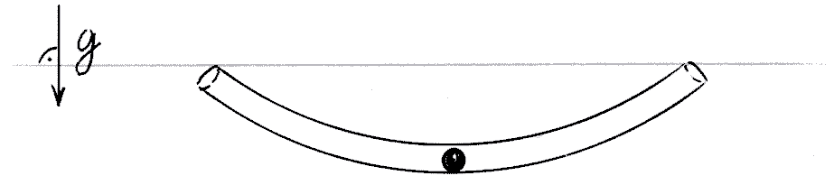
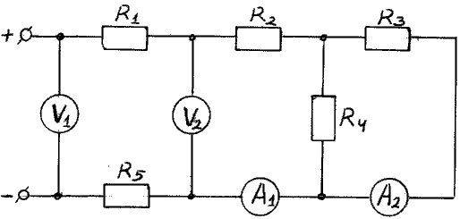

 Тема за 8 клас

Зад.1 Тяло се придвижва от една точка до друга по права
линия. Първата четвърт от пътя изминало с постоянна скорост 2V,
втората четвърт от пътя със скорост 3V. Останалата част от
разстоянието тялото се движило една трета от оставащото време със
скорост V, една трета от времето със скорост 2V и последната третина
от времето със скорост 6V.

а.) Намерете средната скорост при този начин на придвижване.
б.) Второ тяло потегля едновременно с първото без начална скорост.
Отначало се движи равноускорително, после равнозакъснително със
същото по големина ускорение и пристига на финала с нулева
скорост, едновременно с първото тяло. Каква максимална скорост е
достигнало второто тяло при този начин на придвижване?

Зад.2 Стъклена тръба има дъговидна форма и е обърната с
рогата нагоре, както е показано на чертежа. В тръбата е поставено
стоманено топче, разположено в най-ниската точка, в положение на
устойчиво равновесие. Топчето може да се движи свободно по
дължината на тръбата.

 Посочете колкото може по-голям брой различни начини за
изкарване на топчето от тръбата, без да се променя наклона и спрямо
хоризонта. Методите трябва да бъдат неразрушаващи за тръбата и
топчето.
Зад.3 В дадената електрическа схема, захранвана от
идеален източник, резисторите имат стойности: , ,
 , , . Вторият волтметър показва
напрежение 120V. Какви стойности на тока и напрежението показват
останалите уреди по схемата? Как ще се променят показанията на
уредите, ако разменим местата на волтметър 2 и амперметър 1?
Измерителните уреди на схемата смятайте за идеални.

