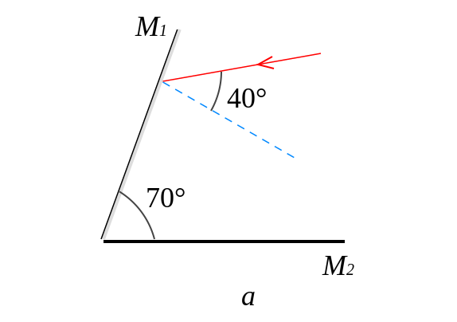

 Задача 1. На фиг. 1 е показана част от електрическа верига, в която са свързани
неизвестните съпротивления R1 , R2 , R3 . Когато между точките A и B се свърже източник с
напрежение U 1 = 12 V , а между точките C и D - волтметър, той показва напрежение V1 = 3 V .
Тогава през съпротивлението R2 протича ток I = 0,15 A . Когато между точките C и D се свърже
източник с напрежение U 2 = 6 V , а между точките - A и B волтметър, той показва напрежение
V2 = 2,4 V .

 A ○ ○ C
 R2
 R1 R3

 B ○ ○ D
 Фиг. 1

 а) Начертайте двете електрически схеми с включен източник на напрежение и
 волтметър. \[1 т.\]
 б) Намерете съпротивленията R2 и R3 . \[5 т.\]
 в) Определете съпротивлението R1 . \[4 т.\]

 Задача 2. Към източник с неизвестно напрежение U се включват два последователно
свързани консуматори. Единият от тях е с неизвестно съпротивление R , а другият има
съпротивление R1 = 4 $\Omega$ и неговата мощност е P = 9 W . Когато във веригата заменим
консуматора със съпротивление R1 с друг със съпротивление R2 = 9 $\Omega$ , неговата мощност също
е P=9W.
 а) Начертайте двете схеми на описаните електрически вериги. \[1 т.\]
 б) Определете неизвестното съпротивление R . \[6 т.\]
 в) Намерете напрежението на източника. \[3 т.\]

 !
 Задача 3. A) Две плоски огледала сключват ъгъл $\beta$ = 70 помежду си, както е показано
 !
на фиг. 2. Светлинен лъч пада под ъгъл $\alpha$ 1 = 40 към първото огледало M 1 . Определете ъгъла
 '
на отражение $\alpha$ 2 от второто огледало M 2 . \[2,5 т.\]

 фиг.2
 
 В) Момиче стои пред стенно огледало.
 а) При какво условие то ще може да се види в цял ръст? \[5,5 т.\]
 б) Каква част от своя образ в огледалото ще вижда момичето, когато не е изпълнено това
условие? \[2 т.\]