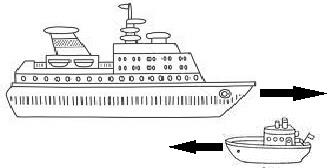
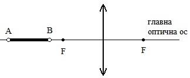
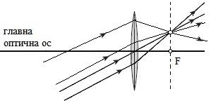

Задача 1. Двете части на задачата са независими!

Част 1. Състезателите
Двама спринтьори се състезават в бягане на 100 m. Първият се ускорява за време t1 = 2 s,
достигайки максималната си скорост v1max, която поддържа през останалата част от трасето.
Вторият се ускорява за време t2 = 4 s, достигайки максималната си скорост v2max, която
поддържа до края на състезанието. Ако двамата тръгват от покой и пристигат едновременно,
изминавайки цялото разстояние за време t = 12 s.

а) Какви са ускоренията a1 и a2 съответно на първия и втория спринтьор, с които те се движат в
началото на състезанието? (3 точки)

б) Какви са максималните скорости v1max и v2max на двамата
състезатели? (2 точки)

в) Кой от двамата състезатели ще бъде пред другия след като
изтече половината от времето t? (2 точки)

Част 2. Кораб и лодка

Дълъг туристически кораб, който се движи с ускорение
a1 = 0,2 m/s2 се разминава с лодка, която се движи в
противоположната посока с ускорение a2 = 0,05 m/s2. И
двата плавателни съда се движат равноускорително. В
момента на срещата скоростта на кораба е v1 = 3 m/s, а
скоростта на лодката е v2 = 1 m/s. Ако разминаването
между лодката и кораба трае t = 10 s, пресметнете колко
е дължината на кораба. Дължината на лодката се
пренебрегва. (3 точки)

Задача 2. Двете части на задачата са независими!

Част 1.
Две крушки достигат нормалните си работни мощности P1 = 20 W и P2 = 80 W, ако поотделно
всяка от тях се включи към източник на напрежение от 12 V.
а) Намерете съпротивлението на всяка от крушките. (1 точка)
б) С каква мощност ще светят крушките, ако двете се свържат последователно към същия
източник? Изразете отговора в проценти спрямо нормалната работна мощност на всяка крушка.
(4 точки)

Приемете, че съпротивленията на крушките са постоянни.

Част 2.
Резистор със съпротивление R0 = 10 $\Omega$ и реостат с променливо съпротивление са свързани
последователно към източник на напрежение U = 24 V.

a) Какво трябва да е съпротивлението R на реостата, за да може напрежението в краищата на
резистора да е U0 = 12 V? (1 точка)

 1
Нека успоредно на резистора със съпротивление R0 се свърже електрическа крушка - Фиг.1.
Крушката има нормална работна мощност P = 12 W, която се достига при напрежение от 12 V.

б) Какво е съпротивлението на крушката? (1 точка)
в) С каква мощност ще свети крушката след като се свърже успоредно
на резистора? (3 точки)

Приемете, че съпротивлението на крушката е постоянно.

 Фиг. 1
 
Задача 3. Двете части на задачата са независими!

Част 1. Бягащата свещ
Свещ е плътно допряна до леща с фокусно разстояние f = 30 cm. В даден момент свещта
започва да се отдалечава от лещата със скорост v = 5 cm/s. След известно време се появява
действителният образ на свещта. Събирателна или разсейвателна е лещата? Обосновете се.
Пресметнете след колко време се появява действителният образ на свещта. (3 точки)

Част 2. Полегнали източници
На Фиг. 2 и Фиг. 3 са показани събирателна леща и предмет AB, който е поставен пред нея на
разстояние по-голямо от фокусното. Постройте образа А1В1 на плоския предмет АВ в двата
случая. Номерирайте и накратко опишете с думи последователността на геометричните
построения, които правите. Направете ясни чертежи. (7 точки)

 Фиг. 2 Фиг. 3

Упътване: За решаването на задачата може, но не е задължително да използвате следното
свойство. Когато падащите върху събирателна леща сноп успоредни лъчи не са успоредни на
главната оптична ос, след пречупването си от лещата те се събират в точка, която лежи
върху права,която минава през фокуса на лещата и е перпендикулярна на главната оптична ос

 Фиг. 4