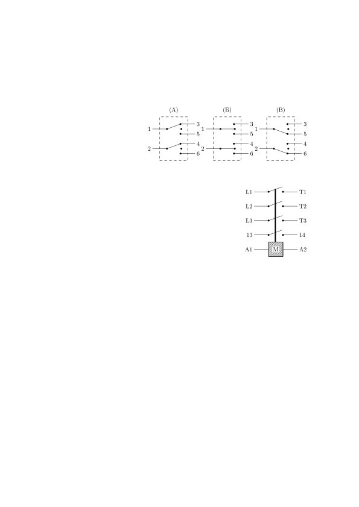
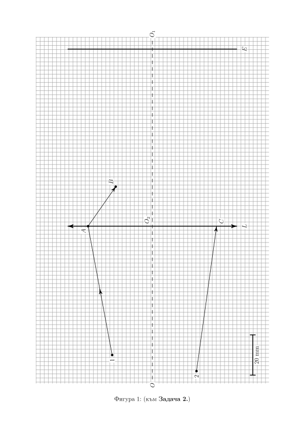

[[Състезания/esenno/8/2019|◂ 2019]] | [[Състезания/esenno/8r/2022|решения]] | [[Състезания/esenno/8/2023| 2023 ▸]]

Задача 1. Следващите подусловия са независими.

1.1. От две спирки, A и B, тръгват едновременно два автобуса. Автобусът, тръгващ
от спирка A, се движи със скорост vA 56 km\ h, а този от спирка B се движи
със скорост vB . Разстоянието между спирките е s0 100 m. След време t 6 min
разстоянието между автобусите е s 1.5 km. Определете колко km\ h е скоростта vB .
Има ли случай, в който автобусът, тръгнал от спирка B, превишава максимално
позволената скорост vmax 50 km\ h? Разгледайте всички възможни случаи. (6 т.)

1.2. В 8:45 ч. от летище A тръгва самолет, който пристига в летище B и се
връща веднага обратно. Без значение от посоката на движение самолетът развива
постоянна скорост v 121 m\ s спрямо въздуха. През целия ден духа постоянен
вятър със скорост vв и посока по правата, свързваща двете летища. Средната
скорост на самолета спрямо земята за целия път A B A, е vср 120 m\ s.
Определете скоростта на вятъра vв (3.5 т.) и в колко часа самолетът пристига в B,
ако летищата се намират на разстояние s 158.4 km едно от друго. (0.5 т.)

Задача 2. На Фигура 1 (виж последния лист) са показани два лъча 1 и 2, които

преминават през събирателна леща L с главна оптична ос OO1 . Началото и на
двата лъча е на разстояние, по-голямо от фокусното разстояние на лещата f . След
като преминава през лещата, лъчът 1 се движи по правата AB и достига екрана
E. Довършете хода на лъч 2 до достигането му до екрана (коя точка от екрана
осветява пречупеният лъч 2). Обосновете подхода, който сте използвали, за да
довършите хода на лъча. (8 т.) Крайния чертеж направете върху листа с условието
на задачата. (1 т.) За по-голяма прегледност означавайте характерните точки от
чертежа с големи латински букви. Определете фокусното разстояние f на лещата,
като използвате чертежа, който сте направили и мащаба, означен на фигурата.
(1 т.)

Задача 3. Следващите подусловия са независими.

3.1. Често пъти е по-удобно дадена лампа да (А) (Б)
бъде включвана и изключвана от различни ключове. На фигурата вдясно е показан електрически ключ, с който това може да бъде направено.
Ключът има две позиции и три клеми, означени с цифри от 1 до 3. В позиция (А)
има връзка между клеми 1 и 2. В позиция (Б) има връзка между клеми 1 и 3.
 Разполагате само с два такива ключа, батерия, лампа и съединителни проводни-
ци. Начертайте електрическа схема, при която лампата ще се включва и изключва
независимо кой от двата ключа използвате. Опишете как работи схемата. (2.5 т.)

3.2. Постояннотоковите електромотори могат да сменят посоката си на въртене
при смяна на полярността на подаваното им напрежение. Един от най-простите
начини за смяна на посоката на въртене е като се използва електрически ключ с
три позиции. В една от позициите моторът е изключен, а в другите две моторът
се върти в противоположни посоки. На фигурата вдясно е показан такъв двоен
електрически ключ, който има три позиции и шест клеми Клемите са означени с
цифри от 1 до 6. В позиция (А) има връзка между клеми 1 и 3, както и между 2 и 4. В позиция (Б) няма връзка между клемите. В позиция (В) има връзка между
клеми 1 и 5 и между 2 и 6. Ключът няма други възможни позиции, т.е. двете му
части се превключват по един и същ начин едновременно.
 Разполагате само с постояннотоков електромотор, описаният по-горе ключ, батерия и
съединителни проводници. Начертайте схема на свързване,
при която трите позициите на ключа ще отговарят на въртене по часовниковата стрелка, въртене в обратна посока и изключен електромотор
(не е нужно да се в същата последователност). Опишете как работи схемата. (3 т.)

3.3. За включване и изключване на електрически вериги или машини с голяма консумация на ток се използват електромеханични устройства наречени контактори. На фигурата вдясно схематично е показано устройството на контактор. Той се състои от главни контакти (в случая това са трите ключа между клемите означени с L и Т), спомагателни контакти (в случая само един - между клеми 13 и 14) и електромагнит M. Вертикалната линия, свързваща ключовете, представлява механична връзка, наречена котва, която позволява еднов-
ременното им отваряне и затваряне. При подаване на напрежение на клемите A1
и A2 на електромагнита (без значение на полярността му), котвата се издърпва
надолу и всички ключове на контактора се затварят. При спиране на напрежението,
пружина избутва котвата нагоре и контактите се отварят. По-надолу няма да се
интересуваме от главните контакти и това как точно се свързват към електричес-
ката мрежа и машината, която искаме да управляваме. Достатъчно е да знаем, че
когато електромагнитът е задействан, котвата е спусната и машината е включена.
Ако котвата е вдигната, машината е изключена.
 Начертайте схема за включване и изключване на машина с помощта на кон-
тактор; два незадържащи бутона, единият от които е "нормално отворен" (NO), а
другият "нормално затворен" (NC); батерия, която може да задейства електромаг-
нита и съединителни проводници. Опишете как работи схемата. (4.5 т.)
 Указание: от контактора трябва да използвате само клемите на спомагателния
контакт (13 и 14) и електромагнита (A1 и A2), а при натискане на единия бутон машината
трябва да се включи, при натискане на другия - да се изключи. Фигурата по-долу показва
схематичното представяне на двата вида незадържащи бутона. Те се наричат така, защото
имат пружина, която връща съответния бутон в едно положение. Така NO е отворен, ако
не е натиснат и е затворен, само докато се задържи натиснат. NC е затворен, ако не е
натиснат и отворен, само докато се задържи натиснат.

