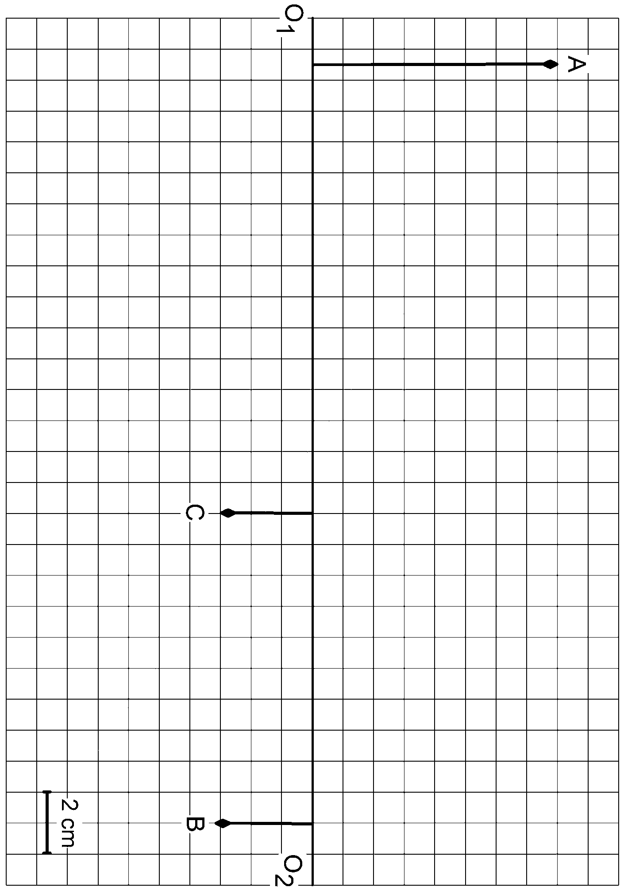
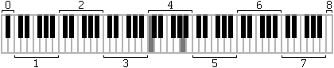
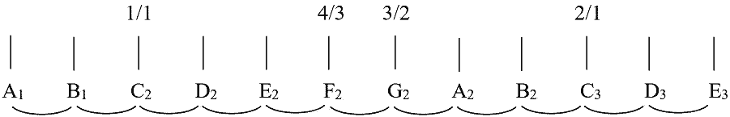

[[Състезания/esenno/8/2022|◂ 2022]] | [[Състезания/esenno/8r/2023|решения]] | [[Състезания/esenno/8/2024| 2024 ▸]]

**Задача 1. Електрически измервания.**

В схемата, показана вдясно, са извършени
електрически измервания. Първо волтметър е
включван към две от трите точки A, B и C. При R1 R2
различните свързвания той показал стойности 4,00 V, A C
5,00 V и 9,00 V. След това амперметър е включван
към две от трите точки A, B и C. При различните свързвания той показал стойности 1,80 mA,
2,25 mA, а при третото свързване през него протекъл голям ток, защитата му сработила и
прекъснала връзката му с веригата. От дадените данни изчислете:

а) напрежението на батерията U; \[2 т.\]

б) съпротивленията на двата резистора R1 и R2 ; \[4 т.\]

в) големината на тока I във веригата по време на измерванията с волтметъра; \[2 т.\]

г) консумираната от веригата мощност в ситуацията, когато амперметърът е бил включен към
веригата и е показвал ток 1,80 mA. \[2 т.\]

**Задача 2. Събирателна леща.**

На фигура на третата страница е дадена оптичната ос (правата О1О2) на събирателна леща с
неизвестно положение и фокусно разстояние. Когато източник на светлина (примерно свещ) се
постави в положение А, неговият образ се наблюдава с положение B.

а) С помощта на геометрични построения намерете къде се намира събирателната леща
(условно я нарисувайте така: $\updownarrow$) и колко е нейното фокусно разстояние (на фигурата е даден
използваният мащаб). \[5 т.\]

б) Знаейки вече от предното подусловие къде се намира лещата и колко е нейното фокусно
разстояние, постройте образа на дадения източник C. \[3 т.\] Опишете образа D с три
прилагателни имена (действителен/недействителен, прав/обърнат, уголемен/умален). \[1,5 т.\]
Колко cm е големината на образа? \[0,5 т.\]

Указание: Първо направете геометричните построения на работен помощен чертеж в
черновата. След като си представите напълно решението, на фигурата на третата страница
направете окончателните построения на решението си.

**Задача 3. Питагоров музикален строй.**

Не всяка комбинация или последователност от звуци с някакви честоти звучи добре за
човешкото ухо. Древните гърци са решили, че "хубавата музика" трябва да съдържа само звуци
с определени (фиксирани) честоти. Тези звуци (по-нататък ще се наричат "тонове") може да се
наредят в ред по нарастваща честота (отляво надясно, виж фигурата). По-късно в
Средновековието са наречени до (C), ре (D), ми (E), фа (F), сол (G), ла (A), си (B), пак до (C, но
с два пъти по-голяма честота) и така нататък. Това са "белите" клавиши на пианото. За да може
да се изпълнява една и съща мелодия, започвайки от различен тон, между тях са добавени и
звуци с междинни честоти ("черните" клавиши на пианото, не са дадени на фигурата и няма да
се използват в тази задача). Възниква въпросът как трябва да са свързани честотите (f) на тези
тонове, за да звучат максимално добре за човешкото ухо. Питагор е решил да се изпълняват
следните правила, започвайки от "основния" тон (тук на фигурата той е "до", C2):

1) Отношението на честотите на два тона, между които има други два тона (например f 2 )
трябва да е 4/3 (това отношение се нарича кварта);
2) Отношението на честотите на два тона, между които има други три тона (например f 2 )
трябва да е 3/2 (това отношение се нарича квинта);
3) Отношението на честотите на два тона, между които има други шест тона (например f 3 )
трябва да е 2/1 (това отношение се нарича октава).

а) Спазвайки тези правила, намерете отношенията на честотите на всички останали тонове на
фигурата към честотата на тона C2. Запишете ги по същия начин на фигурата, както вече
написаните отношения 1/1, 4/3, 3/2 и 2/1. \[4 т.\]

б) От вече получените честоти на всички тонове изчислете отношенията на честотите на всеки
два съседни тона (на по-високата към по-ниската) и ги запишете отново на фигурата пак като
обикновени дроби под средата на всяка дъгичка, свързваща два съседни тона. \[4 т.\]

в) На фигурата по-долу е нарисувана клавиатурата на едно пиано. Два от белите клавиши са
дадени в сив цвят - това са "до" и "ла" в четвърта октава. Ако тонът "ла" в четвърта октава (A4)
има честота fA4 = 440 Hz и пианото е настроено с Питагоров музикален строй, изчислете
честотите на най-левия и най-десния клавиш. Какви ще бъдат означенията на техните тонове?
\[2 т.\]

Указание: При правилно решение на подусловие б) трябва да се получат само два вида
отношения на честоти. Тези, които съответстват на два съседни бели клавиши между които има
черен клавиш, трябва да са равни на една стойност, а тези, които съответстват на два съседни
бели клавиши между които няма черен клавиш, трябва да са равни на друга стойност.