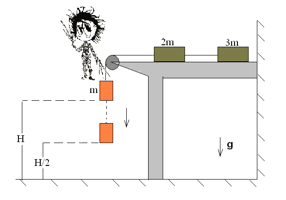
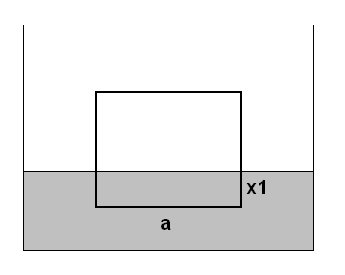
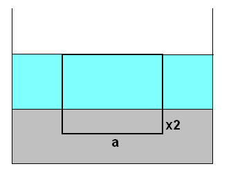
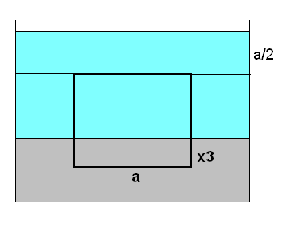
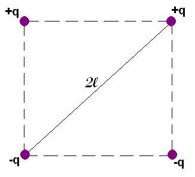

[[Състезания/esenno/9/2011|◂ 2011]] | [[Състезания/esenno/9r/2012|решения]] | [[Състезания/esenno/9/2013| 2013 ▸]]

Задача 1. Едуард Ножиците

 Фигура 1.

На идеално гладка хоризонтална маса са поставени две трупчета с маси 2m и 3m,
свързани с лека неразтеглива нишка. Трупчето с маса 2m е свързано с трето трупче с
маса m посредством лека неразтеглива нишка, прекарана през макара, разположена на
ръба на масата, така че да виси на височина H над земята. Ситуацията е показана на
Фигура 1. Земното ускорение приемете за g.

а) Определете ускорението, с което тежестта ще започне да се спуска. (1 т.)
б) Определете силата на опън T1 на нишката, свързваща m с 2m. (2 т.)
в) Определете силата на опън T2 на нишката, свързваща 2m с 3m по два начина. (3 т.)
Когато тежестта m вече се е спуснала на височина H/2 над земята, се появява Едуард
Ножиците и срязва нишката, свързваща m с 2m, при което тежестта пада на земята.
г) Каква е скоростта на тежестта точно преди удара със земята? (2 т.)
д) Ако приемем, че половината кинетична енергия се превръща в топлинна, определете
с колко ще се измени температурата на трупчето при удара в земята. (1,5 т.)
Специфичният топлинен капацитет на трупчето е c.
е) Пресметнете промяната на температурата на трупчето при удара, ако:
 m = 1 kg, H = 1 m, c = 500 J/kg.K, g = 9.8 m/s2 (0,5 т.)

Задача 2. Стомана, живак и вода

а) Стоманено кубче с ръб a и плътност $\rho_1$ е поставено да плава в живак с плътност $\rho_2$.
(Фигура 2.) На каква дълбочина x1 е потънало кубчето в живака? (2 т.)
б) Върху живака наливаме вода с плътност $\rho_0$, така че нивото й да достигне точно до
горния ръб на кубчето. (Фигура 3.) На каква дълбочина x2 се намира сега кубчето в
живака? (3 т.)

 Фигура 2. Фигура 3. Фигура 4.

Доливаме още вода, така че нивото й да достигне височина a/2 над горния ръб на
кубчето. (Фигура 4.)
в) На каква дълбочина x3 се намира сега кубчето в живака? Обяснете! (3,5 т.)
г) Пресметнете x1, x2 и x3, ако: $\rho_0$ = 1000 kg/m3, $\rho_1$ = 7800 kg/m3, $\rho_2$ = 13500 kg/m3,
а = 50 cm (1,5 т.)

Задача 3. Зарядите на Георги

 Фигура 5.

Георги имал четири електрични заряда във вакуум. Два били положителни със заряд +q
и два били отрицателни със заряд -q. Един ден Георги решил да подреди зарядите във
формата на квадрат с диагонал 2l (Фигура 5.) и да изследва получената система.
Помогнете на Георги!

а) Намерете потенциала на електричното поле в центъра на квадрата. (1 т.)
б) Намерете интензитета на електричното поле и посоката му в центъра на квадрата.
(2 т.)
в) Намерете потенциалната енергия на системата. (3 т.)
г) Определете големината на силата, действаща на всеки един от зарядите. (4 т.)

 2
