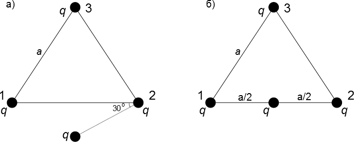

Задача 1. (Механика)
Малко топче с маса m се намира в началото на хоризонтална повърхност с дължина L и
коефициент на триене k, както е показано на фиг. 1. Хоризонталната повърхност преминава в
дъга от окръжност с нулев коефициент на триене, с радиус R и ъгъл $\alpha$ = 60о. В даден момент
на тялото се придава начална скорост V0 в посока, показана на фигурата.
а) Намерете каква трябва да бъде минималната начална скорост V0, така че тялото да
преодолее дъгата и да продължи хода си вдясно от нея. \[4 т.\]
б) Нека началната скорост на тялото да е такава, че то да достигне върха на дъгата (без да
падне), след което да започне да се спуска обратно по дъгата. Намерете какво разстояние ще
измине тялото по хоризонталната повърхност преди да спре своя ход. \[3 т.\]
в) Нека началната скорост на тялото да е такава, че то да спре още в началото на дъгата.
Намерете средната стойност на мощността на силата на триене по времето. \[3 т.\]
Упътване: средната стойност на мощността по времето е равна на изменението на
механичната енергия разделено на времето, за което се случва това изменение.

 Фиг. 1

Задача 2. (електричество)
Пет еднакви крушки и два ключа (С1 и С2) са свързани в схема, както е показано на фиг. 2.
Към двата края на схемата се включва източник на постоянно напрежение, при което
крушките светват. Нека с P1, P2, P3, P4, P5 да означим мощността на светене на крушките.
Намерете отношенията P2/ P1, P3/ P1, P4/ P1 и P5/ P1 за следните случаи:

а) С1 и С2 са отворени; \[2.5 т.\]

б) С1 и С2 са затворени; \[2.5 т.\]

в) С1 е отворен, а С2 затворен; \[2.5 т.\]

г) С1 е затворен, а С2 е отворен. \[2.5 т.\]

Считайте, че за крушките е изпълнен законът
на Ом и тяхното съпротивление не зависи от
тока и приложеното напрежение.
 Фиг. 2
Задача 3. (Електростатика)
Три заряда с големина q са закрепени неподвижно във върховете на равностранен
триъгълник. Четвърти заряд със същата големина q е поставен на безкрайно голямо
разстояние от триъгълника. Зарядите са положителни.
а) Намерете каква работа трябва да се извърши, за да се доближи (придърпа) свободният
заряд до триъгълника, както е показано на фиг. 3 а). Във фигурата свободният заряд е на
равни разстояния от заряди 1 и 2. \[3 т.\]
б) Намерете с каква сила действа триъгълникът на свободния заряд \[3 т.\] и с каква сила
действа свободният заряд на триъгълника. \[1 т.\]
в) Каква допълнителна работа трябва са се извърши, за да се премести свободният заряд от
положението, изобразено на фиг. 3 а), до положението, изобразено на фиг. 3 б)? Във фиг. 3 б)
зарядът лежи на основата на триъгълника на равни разстояния от заряди 1 и 2. \[3 т.\]

Полезни формули: kq
потенциал на електростатичното поле на точков заряд: $\varphi$= (k = 9.109 N$\cdot$m2/C2);
 r
Питагорова теорема: a2 + b2 = c2, където а и b са дължините на катетите на правоъгълен
триъгълник, а с е хипотенузата.

 Фиг. 3
