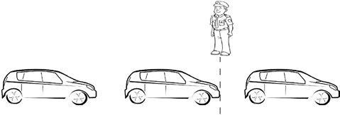
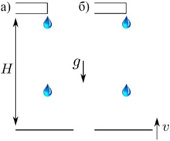
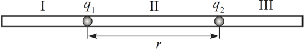

Задача 1. Кинематика

Част 1:
Полицай е застанал в непосредствена близост
до шосе и наблюдава преминаващите коли. Той
прави следното наблюдение: когато е
неподвижен, броят на преминалите коли за
минута във всяка от двете посоки е N 0 = 10 .
Това означава, че в момента t1 = 0 s край него

 Фиг. 1
 
преминава предницата на кола, която той
определя като първа, а в момента t2 = 60 s край него преминава предницата на 11-тата кола.
Полицаят забелязва също, че когато се движи със скорост v = 5 km/h, броят на преминалите коли по
посока на движението му е N1 = 9 . Колите са на равни (еднакви) разстояния една от друга, имат
дължина L0 = 3 m и се движат с еднаква скорост. Определете:

а) скоростта v0 на движение на колите (спрямо пътното платно); \[3т\]

б) разстоянието L между две съседни коли; \[2т\]
в) броя N 2 на насрещно движещите се коли, преминали за минута покрай полицая. \[1т\]

Част 2:
Две капки се отделят от покрив и падат върху повърхност,
както е показано на фигурата. Капките се отделят през времеви
интервал $\Delta$t , а височината на покрива е H. Намерете през какъв
интервал от време $\Delta$t ' капките достигат повърхността в
следните случаи:
а) повърхността е неподвижна (фиг. 1 а) \[1.5т\];
б) повърхността се движи вертикално нагоре със скорост v от
момента на отделяне на първата капка (фиг. 1 б) \[2.5т\].

 Фиг. 2
 
Задача 2. Електростатика

Две наелектризирани метални топчета (точкови
заряди) с положителни заряди q1 и q2 могат да
се хлъзгат без триене в тръба от изолатор.
Разстоянието между двете топчета е r. В
тръбата поставят трето топче със заряд q, така
че системата от три точкови заряда да се намира в равновесие.
а) Какъв е знакът на заряда q? \[1т\].
б) В коя от трите области, показани на фиг. 3, трябва да се постави третото топче? \[2т\]
в) Определете разстоянието x от заряда q1 до заряда q. \[4т\]
г) Намерете потенциала на полето, създадено от зарядите q1 и q2 , в точката, където се намира
зарядът q. \[3т\]
Задача 3. Балон с въздух

Балон с топъл въздух е направен от неразтеглив материал с маса m = 0.2 kg (и с пренебрежим обем) и
има постоянен обем V = 1 m3. Балонът има отвор и може да обменя въздух с околната среда.
Температурата на околната среда е t0 = 20о С, атмосферното налягане е P0 = 105 Pa, a плътността на
въздуха при тези условия е приблизително равна на $\rho_0$ =1 kg/m3. Земното ускорение е g = 9.8 m/s2.
а) Каква е минималната температура t1 на въздуха в балона, такава че той да се отлепи от земята?
\[3т\]
б) Балонът се завързва с въже към земята и въздухът в него се загрява до t2 = 150о С. Определете
силата на опън на въжето T . \[3т\]
в) Отворът на балона се затваря херметически (при температура t2 = 150о ), така че плътността на
въздуха в балона е константна. До каква височина ще се издигне балонът, след като се среже въжето?
В процеса на издигане температурата на въздуха в балона остава неизменна. За малки височини h
можем да приемем, че атмосферата е изотермна ( t0 = 20о С навсякъде) и че плътността на въздуха
$\rho$(h) се изменя приблизително по закона $\displaystyle \rho(h) = \rho_0\left(1 - \frac{\rho_0}{P_0}gh\right)$, където g е земното ускорение. \[4т\]