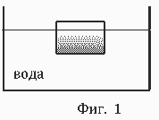
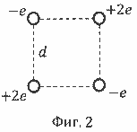

[[Състезания/esenno/9/2015|◂ 2015]] | [[Състезания/esenno/9r/2016|решения]] | [[Състезания/esenno/9/2017| 2017 ▸]]

Задача 1. Равноускорително движение.
Част I Кола, движеща се с превишена (постоянна) скорост v0 = 30 m/s, подминава
автомобил на пътната полиция, спрял край прав път. В същия момент полицейската
кола започва да преследва нарушителя, като се движи равноускорително с ускорение
a = 3,5 m/s2 . Когато полицаите наближават другата кола и са на разстояние l = 100 m
от нея, автомобилът на пътните полицаи спира да ускорява и започва да се движи
равномерно с вече достигнатата скорост.
а) Колко време след тяхното тръгване полицаите настигат другия автомобил? \[6 т.\]
б) Намерете разстоянието, което е изминала полицейската кола до настигането. \[1 т.\]
Част II В дълбок кладенец е пуснат камък без начална скорост. Известно е, че средната
скорост на камъка през първата половина от пътя му е v̅ = 20 m/s. Намерете колко
време след пускането на камъка ще се чуе плясък от падането на камъка на дъното на
кладенеца. Скоростта на звука е vS = 330 m/s. Използвайте, че земното ускорение е
g = 9,81 m/s2 . Съпротивлението на въздуха се пренебрегва. \[3 т.\]

Задача 2. Хидростатично налягане.

Може да използвате, че земното ускорение g = 9,8 m/s 2 .
 Част I Правоъгълно парче сапун с неизвестна плътност плава
 свободно във вана с вода, както е показано на Фиг. 1.
 Височината на парчето е h = 8 cm. Частта от сапуна, която се
 намира над водната повърхност, е с височина h/4. След това
 вода във ваната се налива достатъчно голямо количество олио с
 плътност $\rho$О = 0,8 g/cm3 , така че сапунът да плава само в
 Фиг. 1 олиото. Намерете височината z на частта от сапуна, която се
намира над олиото, ако плътността на водата е $\rho$В = 1 g/cm3 . \[3 т.\]
Част II Празен цилиндричен варел е обърнат с отвора надолу и е спуснат вертикално в
морето, така че плътното дъно на варела се намира на дълбочина d = 5 m под водата.
Варелът е висок l = 2 m. Плътността на морската вода е $\rho$ = 103 kg/m3 . Приемете, че
температурата на водата на тази дълбочина съвпада с температурата на въздуха над
повърхността на морето. Атмосферното налягане e p0 = 105 Pa.
а) Намерете височината x на водния стълб във вътрешността на варела след установя-
ване на термодинамично равновесие. \[6 т.\]
б) Колко е равновесното налягане p1 на въздуха във варела? \[1 т.\]

Задача 3. Електростатика.

 

 Четири заряда с големини +2e и -e са разположени във
 -e +2e върховете на квадрат със страна d, както е показано на Фиг. 2.
 Електричната константа е k.
 d а) Намерете големината на силата F$\vec$ , с която останалите заряди
 действат на долния десен заряд от системата. \[4 т.\]
 -e б) На колко е равна големината на интензитета E$\vec\vec$ , който създа-
 +2e
 ва системата от заряди в центъра на квадрата? \[1 т.\]
 Фиг. 2 в) Намерете потенциала $\varphi$ в центъра на квадрата. \[2 т.\]
 г) Определете работата A, която трябва да се извърши, за да се
отдалечи долния десен заряд на много голямо разстояние от останалите заряди. \[3 т.\]

Упътване: Диагоналът в квадрат с дължина на страните d е дълъг $\sqrt$2d.
