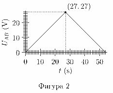
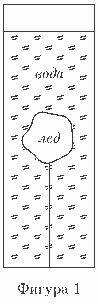

[[Състезания/esenno/9/2017|◂ 2017]] | [[Състезания/esenno/9r/2018|решения]] | [[Състезания/esenno/9/2019| 2019 ▸]]

Задача 1. Всеки от елементите Rx , използвани в електрическата схема, показана на Фигура 1, може да променя съпротивлението си в зависимост от напрежението Ux върху него. Между точките A и B се подава напрежение UAB , което бавно се променя с времето t, както е показано на Фигура 2. Зависимостта на съпротивлението Rx от напрежението Ux е:

$$Rx =\cases{ 3\ \Omega,\text{ ако }U_x \le 3\ \mathrm{V};\\ 6\ \Omega,\text{ ако }U_x > 3\ \mathrm{V}.}$$

Представете показанията на амперметъра от Фигура 1 като функция на времето - таблично и графично. (9,5 т.) Приемете, че амперметърът е идеален. В кой момент от време мощността на тока през веригата е максимална. Пресметнете тази мощност. (0,5 т.)

Задача 2. В топлоизолиран съд има вода с маса mв = 2 kg и температура t0 = 0 ◦ C. В съда се поставя парче лед с маса mл = 500 g и температура t1 = -10 ◦ C. Ледът е захванат за дъното на съда с нишка, както е показано на Фигура 1. С колко процента ще се измени масата на леда, когато в съда настъпи топлинно равновесие? (2 т.) След като настъпи топлинно равновесие, във водата се потапя нагревател с мощност P = 500 W. Колко минути трябва да е включен нагревателят, за се нагрее водата до температура t2 = 20 ◦ C. (4 т.) Определете силата на опън на нишката T , преди да бъде включен нагревателят, ако знаете, че в този момент височината на водата в съда е h1 = 25.6 cm, а след като се изключи нагревателят, височината на водата е h2 = 25.0 cm. Дъното на съда има площ S = 100 cm2 . (4 т.) Топлинните капацитети на съда и нагревателя, обемът на нагревателя, както и изпарението на водата и масата на въздуха над водата се пренебрегват. Да се приеме също така, че плътността на водата е постоянна и не зависи от температурата.

Полезни константи: специфичен топлинен капацитет на леда - cл = 2.1 kJ/kg.K, специфична топлина на топене на леда - $\lambda$ = 330 kJ/kg, специфичен топлинен капацитет на водата - cв = 4.2 kJ/kg.K, плътност на водата - $\rho$в = 1.0 g/cm3 , земно ускорение - g = 10 m/s2 .

Задача 3. Последният вагон на влак се намира на разстояние l от изхода на подлеза на перона. Пътник за същия влак излиза от подлеза, но забелязва, че влакът тръгва с постоянно ускорение a. С каква минимална скорост v0 трябва да бяга човекът, за да догони влака? Колко време t0 ще бяга човекът и на какво разстояние x0 от изхода на подлеза ще хване влака? (5 т.) Нека влакът има маса m и мощност P . Каква ще е максималната скорост на влака, ако знаем, че над определена скорост v съпротивителната сила действаща на влака се дава с израза fс = $\mu$N + kv, където $\mu$ и k са известни константи, а N е нормалната реакция на опората, действаща на влака? (5 т.)