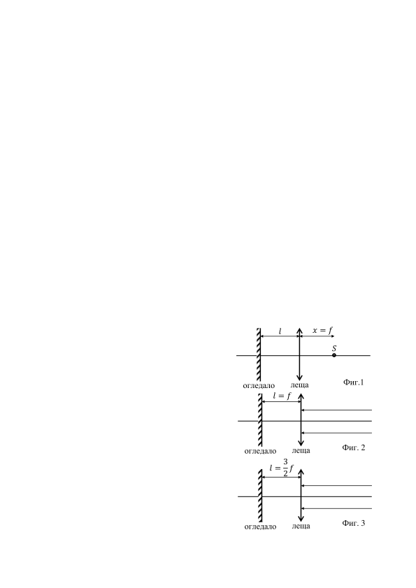
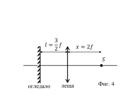

Задача 1. Снимки на кола.

Направени са 8 снимки на потегляща кола. Тя първоначално е в покой, след това се
движи с ускорение a, а след като достигне максималната си скорост vmax , продължава
да се движи равномерно. Снимките са правени през интервал от време t0 = 1,00 s.
Сравнени са положенията на колата. Оказало се, че между третата и четвъртата снимка
колата е изминала път s34 = 5,50 m, между четвъртата и петата снимка изминатият път
е s45 = 10,50 m, между шестата и седмата - s67 = 15,00 m, а между седмата и осмата -
s78 = 15,00 m. Изминатият път между петата и шестата снимка е s56 < s67 , а между
втората и третата е s23 > 0. От дадените данни изчислете:
а) максималната скорост vmax ; \[1 т.\]
б) ускорението a; \[2 т.\]
в) скоростта на колата в момента на петата снимка v5 ; \[2 т.\]
г) изминатия път между петата и шестата снимка s56 ; \[2 т.\]
д) изминатия път между втората и третата снимка s23 ; \[2 т.\]
е) изминатия път между първата и втората снимка s12 ; \[1 т.\]

Задача 2. Събирателна леща и огледало.

В тази задача ще се разгледа как работят събирателна леща и огледало, поставено на
някакво разстояние зад нея, така че да е перпендикулярно на нейната ос. Фокусното
разстояние на лещата е f. Светлинните лъчи (светлинният сноп) от светлинен източник
преминават през лещата, отразяват се от огледалото и на връщане пак преминават през
лещата.
а) На Фиг. 1 светлинният точков източник S се l x=f
намира на разстояние x = f от лещата и лежи на
 S
нейната ос. Огледалото се намира на неизвестно
разстояние l oт лещата. Как ще изглежда (къде ще
се събира) завръщащият се от лещата светлинен
сноп? \[2.5 т.\] огледало леща Фиг.1
 l=f
б) На Фиг. 2 светлинният точков източник S се
намира безкрайно далеч от лещата (пада
успореден светлинен сноп) и лежи на нейната ос.
Огледалото се намира на разстояние l = f oт
лещата. Как ще изглежда (къде ще се събира)
завръщащият се от лещата светлинен сноп? [2.5 огледало леща Фиг. 2
т.] 3
 l= f
 2
в) На Фиг. 3 светлинният точков източник S се
намира безкрайно далеч от лещата (пада
успореден светлинен сноп) и лежи на нейната ос.
 3
Огледалото се намира на разстояние l = 2 f oт
лещата. Как ще изглежда (къде ще се събира) огледало леща Фиг. 3
завръщащият се от лещата светлинен сноп? [2.5
 1
т.]
 3

 г) На Фиг. 4 светлинният точков източник S се 2
намира на разстояние x = 2f от лещата и лежи на
нейната ос. Огледалото се намира на разстояние S
 3
l = 2 f oт лещата. Как ще изглежда (къде ще се
събира) завръщащият се от лещата светлинен сноп?
\[2.5 т.\] огледало леща Фиг. 4

Задача 3. Електроенергия.

Приемете, че в едно домакинство единствените консуматори на електроенергия са
хладилник, телевизор и осветление. Първоначално домакинството ползвало за
осветление лампи с волфрамови жички и плащало през зимен месец 24 лв/месец. След
като заменило тези лампи с LED крушки, които консумират 6 пъти по-малка
електрическа мощност в сравнение със старите крушки, през зимен месец разходите
паднали на 14 лв/месец. Веднъж домът не бил обитаван в продължение на месец, само
хладилникът работел и тогава сметката за месеца била 3 лв. Приемете, че всеки месец
има 30 дни.
а) Колко лева на месец струва електроенергията, консумирана от телевизора? \[2 т.\]
б) Ако електрическата мощност на телевизора е 150 W и той работи средно по 10 часа
на ден, колко струва 1 kWh електроенергия? \[2 т.\]
в) Колко е средната консумирана мощност от хладилника? \[2 т.\]
г) Ако лампите през зимен месец светят средно по 8 часа на денонощие, колко е била
общата мощност на старото осветление с лампи с волфрамови жички? \[2 т.\]
д) Ако новите LED лампи през летен месец светят средно по 5 часа на денонощие,
каква месечна сметка ще плаща домакинството през летен месец? \[2 т.\]

 2
