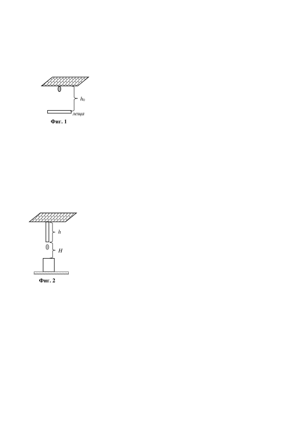
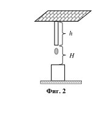
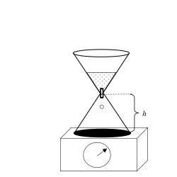

[[Състезания/esenno/9/2022|◂ 2022]] | [[Състезания/esenno/9r/2023|решения]] | [[Състезания/esenno/9/2024| 2024 ▸]]

Задача 1. Сняг, лед и очила.

В началото на пролетта Дарко е на гости на баба си. Покривът на
къщата ѝ е покрит със сняг, който се топи и непрекъснато капят
капки.

Част 1. Бабата на Дарко се оплаква, че има нужда от нови очила.
Той решава да измери с подръчни средства фокусното разстояние
на очилата на баба си. Поставя едната леща от очилата на разстояние h0 = 1 m от покрива
на къщата. Капка пада върху лещата. Дарко забелязва, че в момента време t = 0,13 s преди
капката да достигне лещата, образът на капката не може да се проектира върху екран.
Капката пада по оптичната ос на лещата.

А) Намерете времето t1, за което падаща капка от покрива ще достигне до лещата. \[1 т.\]

Б) Определете вида на лещата (събирателна или разсейвателна), като обосновете
отговора си. \[0,5 т.\]

В) Определете фокусното разстояние f на лещата. \[2,5 т.\]

Част 2. Дарко премахва лещата и наблюдава как започва да се образува
ледена висулка от топящия се на капки сняг. От падащите капки от
h покрива всяка девета замръзва на висулката, а от следващите осем
капки само половината замръзват върху земята, като образуват
вертикален леден стълб. Висулката и стълба имат правилна
цилиндрична форма. Диаметърът на стълба е 3 пъти по-голям от
диаметъра на висулката. След t2 = 1 час от началото на топене на снега
висулката има дължина h = 1,2 m, а между краищата на висулката и
цилиндъра разстоянието е H = 80 cm.

А) Намерете с каква скорост v1 ледената висулка нараства. \[1 т.\]

Б) Намерете отношението на скоростите на нарастване на стълба v2 и висулката v1 (v2/v1 =?) \[2 т.\]

В) Намерете скоростта v, с която се приближават висулката и стълба. \[1 т.\]

Г) След колко време Tx (смятано от момента, когато разстоянието между тях е било H)
висулката и стълбът ще се допрат? \[2 т.\]

В случай, че Ви потрябва: Лице на кръг S = $\pi$r2; обем на цилиндър V = $\pi$r2.h. Земното
ускорение е g = 10 m/s2.

Задача 2. Локомотив + вагони = влакова композиция

Влакова композиция се състои от локомотив и n = 10 вагона. Масата на един вагон и на локомотива са равни.

При внезапно спиране на влака, движещ се със скорост v = 20 m/s, спирачния път е S =
100 m. Коефициентът на триене между колелата и релсите е един и същ за всеки вагон и за локомотива.

А) Намерете коефициента на триене k между колелата на влака и релсите. \[3 т.\]

Б) Какъв ще бъде спирачния път S1, ако само на един от вагоните спирачките не сработят. \[3,5 т.\]

Влакът се намира в покой. Включва се двигателя, колелата му се завъртат и цялата
влакова композиция започва да се движи с ускорение. Коефициентът на триене само
между колелата на локомотива и релсите сега предполагаме, че е друг - k2. Законът,
изразяващ зависимостта на изминатия път от времето е:
S = 0,5.t2

В) Намерете ускорението a, с което се движи влаковата композиция. \[1,5 т.\]

Г) Намерете коефициентът на триене k2, при условие, че коефициентът на триене между колелата на вагоните и релсите, без да са задействани спирачките, е k1 = k/4. \[2 т.\]

Зад. 3. Част 1. Време за удар и сила на удар

Твърдо топче с маса m се хлъзга по пода и се удря със скорост v перпендикулярно в
стена. Стената е покрита с гъвкав материал като желе.
Намерете силата F, с която топчето действа върху стената.
При удара си в желето топчето потъва в него до пълно
спиране за време t0. \[2 т.\]

Част 2. Пътешествията на Гъливер и фалшиви
показания на везна

В книгата на Джонатан Суифт - "Пътешествията на Гъливер в страната на лилипутите" се описва как лилипутите намират пясъчен часовник в джоба на Гъливер. Часовникът се поставя върху везна. Песъчинките започват да падат една след друга през определен интервал от време $\Delta$t. Везната е много чувствителна и отчита моментално.

Разстоянието между процепа, от който падат песъчинките, и долната основа на часовника е h = 5 cm. В началния момент в горната част на часовника има N = 1000 на брой песъчинки. Масата на всяка песъчинка е m = 1 mg, земното ускорение е g = 10 m/s2. Долното дъно на часовника е покрито с гъвкав материал, като желе, в който песъчинката потъва и напълно спира за време t0 = 0,005 s.

При разглеждането на задачата да не се отчита масата на корпуса на часовника.

А) Намерете показанията на везната Р0 преди да е паднала първата песъчинка през
отвора. \[1 т.\]

Б) Намерете времето t, за което първата песъчинка ще достигне дъното и скоростта v, с която ще се удари. \[2 т.\]

В) Как ще се променят показанията на везната с времето, ако пада само една песъчинка. Начертайте примерна графика на показанията на везната с времето. Да се разгледа интервал от време T = t + 2t0. Не е необходимо да използвате конкретните стойности, а принципна графика. \[2 т.\]

Г) Как ще се променят показанията на везната с времето, ако песъчинките падат една
след друга през интервал от време t1 = t/20. Разгледайте интервал от време T = t + 3t1.
Начертайте графика как ще се променят показанията на везната в този случай. Не е
необходимо да използвате конкретните стойности, а принципна графика. \[3 т.\]
