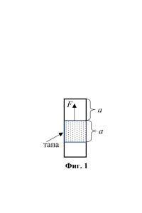
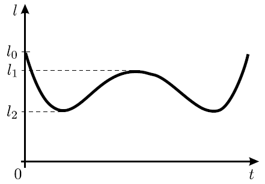
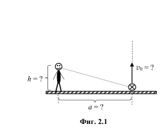

[[Състезания/esenno/9/2024|◂ 2024]] | [[Състезания/esenno/9r/2025|решения]]

Задача 1.

Част 1. Как да извадим коркова тапа? В стъклен цилиндър, отворен и от двата си края,
се намира коркова тапа с дължина а (Фиг. 1).Тапата се намира на разстояние а от
началото на цилиндъра. Tрябва да се извади тапата като действа със
сила F. Начертайте примерна графика на зависимостта на силата F от
разстоянието х, така че тапата да се движи равномерно, докато не се
отвори цилиндъра. Обяснете графиката, която сте начертали като
дадете съображения за решението си. Съобразете, че силата на триене
тапа
(f = k.N) НЕ зависи от скоростта на движение и от площта на
триещите се повърхности (закон на Амонтон-Кулон). (2,5 т)
Фиг. 1

Част 2. "Ако е така, ако е иначе" или да изследваме възможности
Тяло се движи равнозакъснително по хоризонтална повърхност като за първия интервал
от време t1 изминава път S1. Коефициентът на триене между тялото и повърхността е k.
Земното ускорение е g.

А) С какво ускорение а се движи тялото? (1 т)

Б) Изследвайте какъв път S2 е възможно тялото да измине за следващия, втори интервал
от време t2? (6,5 т)
Разгледайте всички възможни случаи. Изразете S2 само чрез дадените величини S1, t1, t2,
g и k.

Внимание!!! Обърнете внимание, че не е уточнено в условието дали тялото спира
напълно и кога спира.

Задача 2. Подскачаща топка. Топка е хвърлена от
земната повърхност вертикално нагоре (Фиг. 2.1).
Разстоянието l между топката и главата на неподвижен
наблюдател се изменя с времето t по начин, показан на
графиката (Фиг. 2.2).

А) Докажете: - че времето за достигане до максимална
височина t1 е равно на времето за падане t2 от
максимална височина. (1 т)
- формулата при равнопроменливо движение:
v 2 * v02 = 2aS (2 т)

Б) На какво разстояние а от линията на движение на
топката се намира наблюдателят. (2 т)

В) Намерете височината h на наблюдателя и
максималната височина H на издигане на топката . (3
т)

Г) Намерете началната скорост v0, с която е хвърлена топката. (2 т)

Приемете, че параметрите от графиката l0, l1 и l2 са известни, ускорението на свободно
падане е g.

Зад. 3. Система от тела. Върху гладка хоризонтална
опора (Фиг. 3.1) е поставена система от тела (дървени
трупчета), показана на чертежа. Телата с маси m са
свързани с безтегловна, неразтеглива нишка.
Коефициентите на триене между телата с маси m и M е
равен на k. На дясното трупче с маса M действа
постоянна, хоризонтална сила F.

А) Намерете ускоренията на телата от системата в случай, че всички тела имат едно и
също ускорение а. При каква гранична стойност на силата F това е възможно (Fкр \ge ?). (4
т)

Б) Намерете ускоренията на телата от системата и силата на опън T на нишката в случай,
че силата F \ll Fкр. (6 т)

Моля да използвате следните обозначения в решението си:

M - маса на големите трупчета; m - маса на малките

a1 - ускорение на лявото голямо тяло M

a2 - ускорение на дясното голямо тяло M

a - ускорение на малките тела (те са свързани помежду си и имат една и съща
скорост/ускорение)

T - сила на опъване в нишката

fl - сила на триене между лявото m и съответното M

fr - сила на триене между дясното m и съответното M