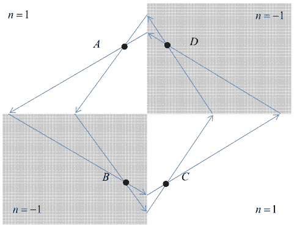
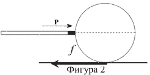

[[Състезания/esenno/st/2012|◂ 2012]] | [[Състезания/esenno/st/2013|условия]] | [[Състезания/esenno/st/2014| 2014 ▸]]

**Задача 1: Съотношение за неопределеност в астрофизиката**

**а)** Разглеждаме атома на водорода. Енергията на атома на водорода е сума от кинетичната енергия на движение на електрона и потенциалната енергия на взаимодействие между електрона и протона:
$$E(r, p) = \frac{p^2}{2m} - k \frac{e^2}{r^{n-2}}$$ \[0.5т\]

Като оценка ще приемем, че импулсът на електрона $p$ е равен на неопределеността в импулса $\Delta p$. Тогава от съотношението за неопределеност на Хайзенберг следва:
$$p \approx \hbar / r$$ \[0.5т\]

Енергията на атома на водорода като функция на $r$ ще има вида
$$E(r) = \frac{\hbar^2}{2mr^2} - k \frac{e^2}{r^{n-2}}$$ \[0.5т\]

Намираме първата производна на $E(r)$ спрямо $r$, приравняваме я на нула и намираме:
$$r^{n-4} = \frac{km e^2 (n-2)}{\hbar^2}$$ \[0.5т\]

Намираме и втората производна на $E(r)$ спрямо $r$:
$$\frac{d^2 E(r)}{dr^2} = 3 \frac{\hbar^2}{mr^4} - k(n-2)(n-1) \frac{e^2}{r^n} = \frac{\hbar^2}{r^4 m}(4-n)$$ \[1т\]

Следователно енергията има минимум, когато $n < 4$ (имаме стабилен атом на водорода само ако $n < 4$). \[1т\]

**б)** Тъй като електроните в бялото джудже образуват електронен газ, който е изроден, те не са локализирани в един атом, а обикалят колективно между всички атоми. Атомите са плътно прилепнали помежду си и разстоянията между тях са от порядъка на размера на самите атоми. Тогава може да приемем, че осреднено всеки електрон се намира в сфера с радиус $R$. Импулса определяме от съотношението за неопределеност на Хайзенберг:
$$P \approx \hbar / R$$ \[0.5т\]

Тогава за кинетичната енергия на всеки електрон имаме
$$E = \frac{P^2}{2m_e} \approx \frac{\hbar^2}{2m_e R^2}$$ \[0.75т\]

За налягането $S$, което създават електроните, имаме
$$S = -\frac{dE}{dV}$$ \[0.75т\],
където $dV = 4\pi R^2 dR$ е изменението на обема $\Rightarrow$
$$S \approx \frac{\hbar^2}{4\pi m_e R^5} \approx 9,6 \cdot 10^{10} \, N/m^2$$ \[0.5т\]

Аналогично за неутронната звезда имаме, че неутроните се движат в едно голямо „ядро” и на всеки неутрон се пада сфера с радиус $R \approx 10^{-15} \, m$. Тогава за налягането, което създават неутроните, имаме:
$$S \approx \frac{\hbar^2}{4\pi m_n R^5} \approx 5,25 \cdot 10^{32} \, N/m^2$$ \[0.5т\]

**в)** Решаваме аналогично на предишната подточка, като сега вместо класическата формула между кинетична енергия и импулс ($E = \frac{P^2}{2m_e}$) ползваме ултрарелативистко приближение $E = Pc$ \[0.5т\] $\Rightarrow$
$$E = Pc \approx \frac{\hbar c}{R}$$ \[0.75т\]

Тогава за налягането $S$, което създават електроните, имаме
$$S = -\frac{dE}{dV}$$ \[0.75т\],

където $dV = 4\pi R^2 dR$ е изменението на обема $\Rightarrow$
$$S \approx \frac{\hbar c}{4\pi R^4} \approx 2,5 \cdot 10^{13} \, N/m^2$$ \[0.5т\]

Аналогично за неутронната звезда ($R \approx 10^{-15} \, m$) имаме:
$$S \approx \frac{\hbar c}{4\pi R^4} \approx 2,5 \cdot 10^{33} \, N/m^2$$ \[0.5т\]

**Задача 2: Метаматериали**
**а)** Ходът на лъчите е даден на Фигура 1 \[2т\]

**б)** Тръгваме от Лоренцовите трансформации за енергията
$$E' = \frac{E - P_x u}{\sqrt{1 - u^2/c^2}}$$ \[0.25т\]

и заместваме $E = \hbar\omega$, $E' = \hbar\omega'$ \[0.25т\], а импулса с $P_x = P \cos \vartheta = \frac{nE}{c} \cos \vartheta$ \[0.5т\] $\Rightarrow$
$$\omega' = \omega \frac{1 - nu \cos \vartheta / c}{\sqrt{1 - u^2 / c^2}}$$ \[0.25т\],

където $n$ е показателят на пречупване, $\vartheta$ е ъгълът, под който наблюдател в $K$ вижда фотоните спрямо оста $x$. $\Rightarrow$
$$\omega = \omega' \frac{\sqrt{1 - u^2 / c^2}}{1 - \frac{nu \cos \vartheta}{c}}$$ \[0.75т\]

**в)** При $n = -1$ и $\vartheta = \pi$ (източникът се отдалечава от наблюдателя в $K$) имаме
$$\omega = \omega' \frac{\sqrt{1 - u^2 / c^2}}{1 - \frac{u}{c}} = \omega' \frac{\sqrt{(1 - u/c)(1 + u/c)}}{\sqrt{(1 - u/c)^2}} = \omega' \sqrt{\frac{1 + u/c}{1 - u/c}}$$ \[0.75т\]

Тоест имаме синьо отместване.

**г)** При $n = -1$ и $\vartheta = 0$ (източникът се приближава към наблюдателя в $K$) имаме
$$\omega = \omega' \frac{\sqrt{1 - u^2 / c^2}}{1 + \frac{u}{c}} = \omega' \frac{\sqrt{(1 - u/c)(1 + u/c)}}{\sqrt{(1 + u/c)^2}} = \omega' \sqrt{\frac{1 - u/c}{1 + u/c}}$$ \[0.75т\]

Тоест имаме червено отместване.

**д)** Записваме закона за запазване на енергията заедно с релативисткия инвариант за енергията и импулса на частицата:
$$E_1 = E_\gamma + E_2 \Leftrightarrow E_2 = E_1 - E_\gamma$$
$$E_1^2 = E_0^2 + P_1^2 c^2, \quad E_2^2 = E_0^2 + P_2^2 c^2$$ \[0.25т\]

където $E_1, P_1$ и $E_2, P_2$ са пълната релативистка енергия и импулса на частицата, съответно преди и след излъчването. $E_0$ е енергията на частицата в покой, а $E_\gamma$ е енергията на излъчения фотон. Ако повдигнем на квадрат закона за запазване на енергията и в него заместим енергията от релативисткия инвариант за енергията и импулса, получаваме:
$$P_2^2 c^2 = P_1^2 c^2 + E_\gamma^2 - 2E_\gamma E_1$$ \[0.25т\]
а от закона за запазване на импулса имаме
$$P_2^2 = P_\gamma^2 + P_1^2 - 2P_\gamma P_1 \cos \vartheta$$ \[0.25т\]

След като умножим горното равенство с $c^2$ и отчетем, че $P_\gamma = nE_\gamma / c$ \[0.25т\], получаваме:
$$P_2^2 c^2 = E_\gamma^2 n^2 + P_1^2 c^2 - 2ncE_\gamma P_1 \cos \vartheta$$ \[0.25т\]

Последното уравнение вадим от $P_2^2 c^2 = P_1^2 c^2 + E_\gamma^2 - 2E_\gamma E_1 \Rightarrow$
$$(n^2 - 1) \frac{E_\gamma}{2E_1} + 1 = \frac{ncP_1}{E_1} \cos \vartheta$$ \[0.25т\]

Сега можем да отчетем, че $E_\gamma / E_1 \ll 1 \Rightarrow$
$$\cos \vartheta = \frac{E_1}{ncP_1} = \frac{c}{nu}$$ \[0.5т\]

следователно за $n > 0, \cos \vartheta > 0$, и излъчването е насочено по посока на движение на заредената частица, а при $n < 0, \cos \vartheta < 0$, и излъчването е насочено в посока обратна на движение на заредената частица.

**е)** Понеже ударът на фотона с честота $2\omega$ е в решетката на кристала, импулсът и енергията, които придобива кристалът, могат да се пренебрегнат спрямо енергията на фотона. От съображение за симетрия и закона за запазване на импулса имаме, че двата новородени фотона с честота $\omega$ трябва да се движат под еднакви ъгли $\alpha$ спрямо първоначалната посока на фотона с честота $2\omega$.

От закона за запазване на импулса имаме:
$$P_{2\omega} = 2P_\omega \cos \alpha$$ \[0.4т\]

От закона за запазване на енергията имаме:
$$E_{2\omega} = 2E_\omega$$ \[0.35т\]

Също така имаме връзката между енергия и импулс на фотона с честота $2\omega$ и фотоните с честота $\omega$:
$$E_{2\omega} = \frac{P_{2\omega} c}{n_{2\omega}}, \quad E_\omega = \frac{P_\omega c}{n_\omega}$$ \[0.4т\] $\Rightarrow$
$$\frac{P_{2\omega} c}{n_{2\omega}} = 2 \frac{P_\omega c}{n_\omega}$$ \[0.35т\]

И окончателно за ъгъла $\alpha$ имаме
$$\cos \alpha = \frac{n_{2\omega}}{n_\omega} = -1 \Rightarrow \alpha = \pi$$ \[1т\]

Следователно фотоните с честота $\omega$ се движат в обратна посока на падналия фотон с честота $2\omega$ (действа като нелинейно огледало).

**Задача 3: Билярдна топка**

**а)** Законите за запазване на импулса и на момента на импулса спрямо центъра на топката са:
$$mv(t=0) = P \Rightarrow v(0) = P/m$$
$$\omega(t=0)I = 0 \Rightarrow \omega(0) = 0$$ \[0.75т\]

където $v(0)$ и $\omega(0)$ са началната линейна и ъглова скорост на топката, а инерчният момент на топката спрямо нейния център е
$$I = \frac{2}{5} mR^2$$ \[0.5т\]

На топката действа сила на триене (Фигура 2) $f = -\mu mg$ \[0.5т\], която променя линейната и ъглова скорост на топката
$$v(t) = v(0) - \mu gt$$
$$\omega(t) = \omega(0) + \frac{5\mu g}{2R} t$$ \[0.75т\]

В момента, в който линейната скорост на центъра на масите и линейната скорост на допирната точка в система център на масите се изравнят, приплъзването спира $v(T) = \omega(T)R$ \[0.5т\]. Оттук намираме и времето, за което става това:
$$T = \frac{2}{7} \frac{P}{\mu mg}$$ \[0.5т\]

**б)** Крайната скорост на центъра на топката се дава като
$$v(T) = \frac{P}{m} - \frac{2}{7} \frac{P}{m} = \frac{5}{7} \frac{P}{m}$$ \[1т\]

**в)** Законите за запазване на импулса и на момента на импулса спрямо центъра на топката дават:
$$mv(0) = P \Rightarrow v(0) = P/m$$
$$\omega(0)I = hP \Rightarrow \omega(0) = hP/I$$ \[0.75т\]

За да няма прихлъзване, линейната и ъглова скорост на топката в началния момент трябва да изпълняват $v(0) = \omega(0)R$ \[0.5т\] $\Rightarrow$
$$\frac{P}{m} = \frac{hPR}{I} \Rightarrow h = \frac{2}{5} R$$ \[0.75т\]

**г)** При удар под екваториалната равнина топката започва да се върти обратно на часовниковата стрелка. Отново от законите за запазване на импулса и на момента на импулса спрямо центъра на топката имаме:
$$mv(0) = P \Rightarrow v(0) = P/m$$
$$\omega(0)I = HP \Rightarrow \omega(0) = HP/I$$ \[0.5т\]

Промяната на линейната и ъглова скорост на топката се дава като
$$v(t) = v(0) - \mu gt$$
$$\omega(t) = \omega(0) - \frac{5\mu g}{2R} t$$ \[0.5т\]

От последното равенство намираме момента $T_1$, в който топката спира да се върти
$$T_1 = \frac{PH}{\mu mgR}$$ \[1т\]

Намираме времето $T$, за което топката започва да се движи без хлъзгане от момента, в който нямаме въртене
$$T = \frac{2P}{7\mu mg} \left( 1 - \frac{H}{R} \right)$$ \[0.5т\]

И окончателно за $T_2$ имаме
$$T_2 = T_1 + T = \frac{PH}{\mu mgR} + \frac{2P}{7\mu mg} \left( 1 - \frac{H}{R} \right) = \frac{P}{7\mu mg} \left( 2 + \frac{5H}{R} \right)$$ \[1т\]