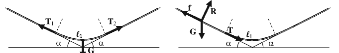

**Задача 1. Механика на тежък шнур**

А) Масата на висящия участък е:

$$ (1) \quad m_1 = \frac{ml_1}{l} = mk, $$

където $k = l_1/l$.

Силите на опън $T_1$ и $T_2$ в двата края на участъка са допирателни към шнура и имат еднакви големини: $T_1 = T_2 = T$. От условието за равновесие на висящия участък имаме:

$$ (2) \quad m_1 g = 2T \sin \alpha $$

или

$$ (3) \quad T = \frac{mg}{2 \sin \alpha} k. $$

От условието за равновесие на един от участъците, намиращи се върху наклонените равнини, имаме:

$$ (4) \quad \frac{mg(1-k)}{2} \sin \alpha + T = f; $$

$$ (5) \quad R = \frac{mg(1-k) \cos \alpha}{2}. $$

Дължината $l_1$ (съответно отношението $k$) е максимална, когато силата на триене $f$ приема своята максимална възможна стойност:

$$ (6) \quad f = \mu R. $$

Така получаваме:

$$ (7) \quad \frac{mg(1-k)}{2} \sin \alpha + \frac{mgx}{2 \sin \alpha} = \frac{\mu mg(1-k)}{2} \cos \alpha, $$

откъдето:

$$ (8) \quad k = \frac{(\mu \cos \alpha - \sin \alpha) \sin \alpha}{1 + (\mu \cos \alpha - \sin \alpha) \sin \alpha}. $$

Б) В момента $t = 0$ дължината на провесената част е $x(0) = \ell/2$. От друга страна, от закона за движение имаме $x(0) = A \cosh(0) = A$. Следователно:

$$ (9) \quad A = \ell/2. $$

Константата $k$ ще намерим от закона за запазване на енергията. Избираме хоризонталната повърхност като нулево ниво на потенциалната енергия. Масата на провесената част е $m_1 = m \cdot x/\ell$, а височината на центъра й спрямо нулевото ниво е $h = -x/2$. Следователно потенциалната енергия на шнура като функция на времето е:

$$ (10) \quad E_p = -\frac{mgx^2}{2\ell} = -\frac{mg\ell}{8} \cosh^2(kt). $$

Кинетичната енергия на шнура е:

$$ (11) \quad E_k = \frac{mv^2}{2} = \frac{m\dot{x}^2}{2} = \frac{m\ell^2k^2}{8} \sinh^2(kt), $$

защото всичките му точки се движат с една и съща скорост $v = \dot{x} = kA \sinh(kt)$. От закона за запазване на енергията следва равенството:

$$ (12) \quad \frac{m\ell^2k^2}{8} \sinh^2(kt) - \frac{mg\ell}{8} \cosh^2(kt) = -\frac{mg\ell}{8}, $$

което е изпълнено тъждествено, ако:

$$ (13) \quad k = \sqrt{\frac{g}{\ell}}. $$

Шнурът се отделя от масата в момента, когато $x(\tau) = \ell$, т.е.

$$ (14) \quad \cosh(k\tau) = 2. $$

Полагаме $y = \exp(k\tau)$, откъдето получаваме уравнението:

$$ (15) \quad y^2 - 4y + 1 = 0. $$

Избираме корена $y > 1$ на квадратното уравнение, защото той съответства на $\tau > 0$:

$$ (15) \quad y = 2 + \sqrt{3}. $$

Следователно:

$$ (16) \quad \tau = \sqrt{\frac{\ell}{g}} \ln(2 + \sqrt{3}). $$

В) В1. За първото трептене бихме могли да пренебрегнем изкривяването на шнура, т.е. да го разглеждаме като люлееща се твърда пръчка с инерчен момент:

$$ I = 1/3m\ell^2 $$

спрямо точката на окачване и разстояние:

$$ d = \frac{\ell}{2} $$

от центъра на масата до точката на окачване. От формулата за честота на физично махало намираме:

$$\omega_1 = \sqrt{\frac{mgd}{I}} = \sqrt{\frac{3g}{2\ell}} \approx 1.225\sqrt{\frac{g}{\ell}}.$$

Полученият отговор се различава от точния с около 2%, което е в рамките на допустимата грешка.

В2. Движението, което извършва участъкът от шнура, намиращ се под първия възел, може да се разглежда като най-нискочестотното трептене на шнур с дължина $\ell-x_1$. Следователно:

$$1.202\sqrt{\frac{g}{\ell-x_1}} = 2.760\sqrt{\frac{g}{\ell}},$$

откъдето:

$$x_1 = \left[ 1 - \left( \frac{1.202}{2.760} \right)^2 \right] \ell = 0.810 \ell.$$

Аналогично, за третото трептене движението на частта от шнура под най-горния възел може да се разглежда като второто по честота трептене на шнур с дължина $\ell-x_2$, т.е.

$$2.760\sqrt{\frac{g}{\ell-x_2}} = 4.327\sqrt{\frac{g}{\ell}};$$
$$x_2 = \left[ 1 - \left( \frac{2.760}{4.327} \right)^2 \right] \ell = 0.593 \ell.$$

Задача 2. Изгаряне на метеорит в атмосферата

А) Ако пренебрегнем разликата между средноквадратична и средна скорост, имаме:

$$\frac{m\overline{v}^2}{2} = \frac{3}{2} k_B T,$$

където $m = \mu/N_A$ е масата на една молекула. Като вземем предвид, че $k_B = R/N_A$, намираме:

$$\overline{v} = \sqrt{\frac{3RT}{\mu}} = 491 \text{ m/s}.$$

Б) От II принцип на механиката имаме за движението на Земята около Слънцето:

$$\frac{m_E v_E^2}{a} = \gamma \frac{m_E M}{a^2},$$

където $m_E$ е масата на Земята, $M$ – масата на Слънцето, а $a$ – радиусът на земната орбита. Оттук намираме:

$$v_E = \sqrt{\gamma \frac{M}{a}}.$$

Нека означим масата на метеорита преди на навлезе в земната атмосфера с $m_0$, а скоростта му спрямо Слънцето – с $v_m$. От закона на запазване на енергията имаме:

$$ \frac{m_0 v_m^2}{2} = \gamma \frac{Mm_0}{a}. $$

Оттук получаваме:

$$ v_m = \sqrt{2\gamma \frac{M}{a}} = \sqrt{2v_E}. $$

Скоростта на метеорита спрямо Земята е $\vec{v}_0 = \vec{v}_m - \vec{v}_E$ (виж фигурата), т.е. има големина:

$$ v_0 = \sqrt{v_E^2 + v_m^2} = v_E \sqrt{3} = 52 \text{ km/s} $$

и сключва ъгъл с вертикалата:

$$ \theta = \arccos \left( \frac{v_m}{v_0} \right) = \arccos \sqrt{\frac{2}{3}} = 35^\circ. $$

В) Разглеждаме удара между молекула на въздуха и метеорита в отправна система, свързана с метеорита. Тъй като ударът е идеално нееластичен, а масата $M$ на метеорита е много по-голяма от масата $m$ на една молекула, количеството топлина $q$, отделена при един удар, е равно на кинетичната енергия на падащата молекула:

$$ q = \frac{mv^2}{2}. $$

За време $t$ в метеорита се удрят молекулите, заемащи обем:

$$ V = \pi r^2 vt. $$

Броят на тези молекули е:

$$ N = nV = (\rho_a/m)\pi r^2 vt, $$

където $n = (\rho_a/m)$ е обемната концентрация на молекулите. Общата отделена топлина за това време е:

$$ Q = Nq = \frac{\rho_a \pi r^2 v^3}{2} t, $$

а мощността:

$$ P = \frac{Q}{t} = \frac{\rho_a \pi r^2 v^3}{2}. $$

Г) Нека за малък интервал от време $dt$ от метеорита се изпарява тънък сферичен слой с дебелина $-dr$ ($dr < 0$). Обемът на изпарения слой е $dV = -4\pi r^2 dr$, а масата му:

$$ dM = -4\pi \rho_m r^2 dr. $$

За изпарението на слоя е нужно количество топлина:

$$ dQ = LdM = -4\pi \rho_m Lr^2 dr. $$

От уравнението за топлинен баланс имаме:

$$\mathrm{d}Q = \eta P \mathrm{d}t \text{ или } -4\pi r^2 p_m L \frac{\mathrm{d}r}{\mathrm{d}t} = \frac{\eta p_a \pi r^2 v^3}{2},$$

откъдето получаваме:

$$\frac{\mathrm{d}r}{\mathrm{d}t} = -\frac{\eta p_a v^3}{8p_m L}.$$

Д) Приемаме, че скоростта на метеорита е постоянна по големина и по посока. За време dt
височината на метеорита се променя с:

$$\mathrm{d}h = -v_0 \cos \theta \mathrm{d}t = -\sqrt{2} v_E \mathrm{d}t.$$

Следователно промяната на радиуса на метеорита с височината се описва с уравнението:

$$\frac{\mathrm{d}r}{\mathrm{d}h} = \frac{\eta p_a v_0^2}{8p_m L \cos \theta} = \frac{3\sqrt{6}\eta p_a v_E^2}{16p_m L}.$$
От уравнението за хидростатично равновесие на атмосферата имаме:

$$\mathrm{d}p = -p_a \mathrm{d}h.$$

Следователно, промяната на радиуса на метеорита с височината е свързана със
съответната промяна на атмосферното налягане по траекторията на метеорита:

$$\mathrm{d}r = -\frac{3\sqrt{6}\eta v_E^2}{16p_m Lg} \mathrm{d}p.$$

Нека в атмосферата навлиза метеорит с радиус $r_{\text{min}}$. Когато достигне земната повърхност,
метеоритът изгаря напълно, т.е. $r = 0$ и съответно $\Delta r = -r_{\text{min}}$. От друга страна, във високите
слоеве на атмосферата, където започва изгарянето на метеорита, атмосферното налягане е
практически равно на нула, а на земната повърхност е равно на $p_0$, т.е. $\Delta p = p_0$.

Следователно:

$$r_{\text{min}} = \frac{3\sqrt{6}\eta v_E^2 p_0}{16p_m Lg} = 44 \text{ m}.$$

Задача 3. Радар

А) За да бъде регистриран, отразеният импулс трябва да се върне в радара след време, поголямо от продължителността на импулса:

$$\frac{2R}{c} \geq \tau.$$

Следователно за минималното разстояние получаваме:

$$R_{\text{min}} = \frac{c\tau}{2} = 150 \text{ m}.$$

Б) Пространственият ъгъл, в който е съсредоточено излъчването на радара се определя от ъгъла на дифракционна разходимост:

$$\theta = \frac{1.22\lambda}{D} \approx 3 \times 10^{-2} \text{ rad}.$$

Тъй като $\theta << 1$, можем да използваме приближението:

$$ \Omega = 4\pi \sin^2(\theta/2) \approx \pi\theta^2 = \frac{1.49\pi\lambda^2}{D^2} = 2.93 \times 10^{-3}\text{strad}. $$

Съответно яркостта на радара е:

$$ B = \frac{P_0}{\Omega} = \frac{P_0D^2}{1.49\pi\lambda^2} = 34 \text{ MW/strad.} $$

В) Пространственият ъгъл, под който радарът „вижда” сферата се определя от нейното напречно сечение:

$$ \Omega_s = \frac{\pi a^2}{R^2}. $$

Съответно върху сферата пада и изцяло се отразява мощност:

$$ P_r = B\Omega_s = \frac{P_0D^2a^2}{1.49\lambda^2R^2}. $$

Отразените лъчи сключват с падащите лъчи ъгли, които варират от 0 за лъчите, допиращи се до сферата, до 180° за лъчите, които се отразяват в обратна посока. Следователно отразената от сферата вълна се разпространява изотропно в рамките на пълния пространствен ъгъл:

$$ \Omega_r = 4\pi. $$

Г) По отношение на отразената вълна, сферата е източник с яркост:

$$ B_r = \frac{P_r}{\Omega_r} = \frac{P_0D^2a^2}{5.96\pi\lambda^2R^2}. $$

Входният отвор на радара се вижда под пространствен ъгъл $\frac{\pi D^2}{4R^2}$. Следователно, мощността, която пада върху параболичната антена и се фокусира върху детектора, е:

$$ P_d = \frac{P_0D^4a^2}{23.84R^4\lambda^2} $$

Д) За да може детекторът да регистрира отразената вълна е нужно:

$$ P_d\tau \geq \frac{3}{2}k_BT $$

или

$$ \frac{P_0D^4a^2\tau}{23.84R^4\lambda^2} \geq \frac{3}{2}k_BT $$

Оттук определяме максималното разстояние, на което сферата може да бъде регистрирана от радара:

$$ R_{\text{max}} = 0.17D\sqrt{\frac{P_0\tau}{k_BT}\sqrt{\frac{a}{\lambda}}} \approx 107 \text{ km.} $$