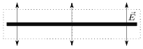
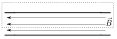
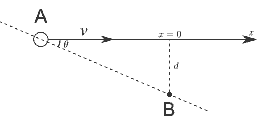

[[Състезания/esenno/st/2017|◂ 2017]] | [[Състезания/esenno/st/2018|условия]] | [[Състезания/esenno/st/2019| 2019 ▸]]

**Задача 1. Вектор на Пойнтинг**

а) Задачата е подобна на задача на движещ се със скорост $c$ флуид с плътност $\rho$ в тръба, при което се търси преминалата маса за единица време през единица площ. Отговорът е $S = \rho c$. \[1 т.\]

б) Първо търсим интензитета на полето, създадено от една плоча. Прилагаме теоремата на Гаус по повърхността, изобразена на фигурата, при което получаваме $E = \frac{q}{2\epsilon_0 A}$. Интензитетът, създаден от двете плочи, е $E = \frac{q}{\epsilon_0 A}$, а напрежението между тях е $U = Ed$. Така получаваме $C = \frac{\epsilon_0 A}{d}$. \[1 т.\]

в) Нека си представим, че зареждаме постепенно кондензатора. В началото зарядът на плочите е нула, при което и интензитетът е нула. Работата, необходима за пренасяне на безкрайно малък заряд $dq$, е $dA = Udq = \frac{q}{C} dq$, където $q$ е вече натрупаният в хода на процеса заряд. За енергията имаме $W_E = \int_0^Q dA = \frac{Q^2}{2C} = \frac{CU^2}{2}$. \[1 т.\]

г) Плътността е $\rho_E = \frac{W_E}{Ad}$, т.е. $\rho_E = \frac{\epsilon_0 E^2}{2}$. \[1 т.\]

д) За да намерим индукцията, прилагаме теоремата за циркулацията по контура, изобразен на фигурата. Получаваме $B = \mu_0 nI$, където $n$ е броят намотки на единица дължина. За потока имаме $\Phi \equiv LI = NBA$. Получаваме $L = \mu_0 n^2 Al$. \[1 т.\]

е) Започваме с нулев ток, който увеличаваме постепенно до $I$. При увеличаване на тока се индуцира напрежение $\mathcal{E} = -L \frac{di}{dt}$, което възпира увеличаването на тока. Мощността, която прилагаме, е $P = -\mathcal{E}i = iL \frac{di}{dt}$. Следователно работата, която извършваме, за да увеличим тока от $i$ до $i + di$, е $dA = Pdt = Lidi$. Енергията е пълната работа; след интегриране на $dA$ получаваме $W_B = \frac{LI^2}{2}$. \[1 т.\]

ж) Имаме $\rho_B = \frac{W_B}{Al} = \frac{B^2}{2\mu_0}$. \[1 т.\]

з) Плътността е сума от плътностите за двете полета: $\rho = \frac{\epsilon_0 E^2}{2} + \frac{B^2}{2\mu_0}$. \[1 т.\]

и) Използваме резултатите от подточки а) и з). След малко преобразувания получаваме: $S = \frac{EB}{\mu_0}$. \[1 т.\]

й) От дефиницията на векторно произведение намираме $\vec{S} = \frac{\vec{E} \times \vec{B}}{\mu_0}$. \[1 т.\]

**Задача 2. Механика**

**Част 1**

а) Силата, с която звездата привлича планетата, е $F = \frac{GMm}{R^2}$, която се явява центростремителна: $F = \frac{mv^2}{R}$. Така извеждаме третия закон на Кеплер: $\frac{R^3}{T^2} = \frac{GM}{4\pi^2}$ \[1 т.\]. За да изразим в Слънчеви маси, формираме отношението: $\frac{M_B}{M_S} = \left(\frac{R_B}{R_S}\right)^3 \left(\frac{T_S}{T_B}\right)^2$. \[1 т.\]

б) От фигурата намираме следното съотношение: $\frac{R_B}{R_S} \approx 110$.
За $\tau = 2$ години планетата изминава $s = 1.4$ AU. Така намираме за периода: $\frac{T_B}{T_S} \approx 987$ ($T_B = \frac{2\pi R_B}{s} \tau$). Следователно $\frac{M_B}{M_S} \approx 1.37$. \[1 т.\]

в) За грешката намираме: $T_B = \frac{2\pi R_B}{s} \tau$, $\left(\frac{\Delta T_B}{T_B}\right)^2 = \left(\frac{\Delta R_B}{R_B}\right)^2 + \left(\frac{\Delta s}{s}\right)^2$, $\frac{\Delta T_B}{T_B} = 10\sqrt{2}\%$ \[1 т.\]
$\left(\frac{\Delta r}{r}\right)^2 = \left(3\frac{\Delta R_B}{R_B}\right)^2 + \left(2\frac{\Delta T_B}{T_B}\right)^2$, $\frac{\Delta r}{r} \approx 40\%$, $0.82 \le r \le 1.97$ \[1 т.\]

Част 2
г) На капката действат две сили: гравитационна сила и сила на съпротивление от страна на въздуха. Имаме $m \frac{dv}{dt} = -mg - kv$. Разделяме променливите: $\frac{dv}{\frac{k}{m}g + v} = -dt$ \[1 т.\]. След интегриране получаваме $v(t) = (v_0 + v_T)e^{-\frac{kt}{m}} - v_T$, където $v_T = \frac{mg}{k}$. \[1 т.\]

д) Капката се издига, докато скоростта стане нула. За времето намираме $t = \frac{m}{k} \ln \left(1 + \frac{v_0}{v_T}\right)$. \[1 т.\]

е) Имаме $dh = v dt$ \[1 т.\]. След интегриране получаваме $h = \frac{v_0 v_T}{g} - \frac{v_T^2}{g} \ln \left(1 + \frac{v_0}{v_T}\right)$ \[1 т.\].

**Задача 3. Доплеров ефект**

**Част 1**

а) От значение е компонентата на скоростта, насочена към приемника B. Скоростта на звука в средата е винаги $c$ и не зависи от скоростта на източника. Ефектът е, че се намалява дължината на вълната, тъй като източникът „гони“ вълната, която излъчва. Редуцираната дължина на вълната в посока на приемника е $\lambda' = \lambda - vT \cos\theta$ \[1 т.\]. Ефектът е, че честотата нараства: $f' = \frac{c}{\lambda'} = \frac{f}{1-(v/c)\cos\theta}$. \[1 т.\]

**Част 2**

б) За приближаващ се източник $\theta = 0$, при което $f_a = \frac{f}{1-(v/c)}$, а за отдалечаващ се източник имаме $\theta = \pi$, при което $f_b = \frac{f}{1+(v/c)}$. Така намираме $v = \left(\frac{f_a}{f_b} - 1\right) \frac{c}{2} \approx 10.66$ m/s \[0.5 т.\], $f = \frac{f_a + f_b}{2} \approx 435$ Hz. \[0.5 т.\]

в) Означаваме оста, по която се движи източникът, с $x$, като $x = 0$ съответства на точката на максимална близост (и разстояние $d$). При $|x| \ll d$ имаме $\cos\theta \approx x/d$. Така намираме $f' \approx \frac{f}{1-(v/c)(x/d)}$ \[1 т.\]. Смятаме производна по времето и заместваме $x = 0$: $\frac{df'}{dt} = \frac{fv^2}{cd}$ \[1 т.\]. От фигурата определяме производната в центъра и намираме $d \approx 18$ m. \[1 т.\]

Част 3
г) Козирката се движи към звуковата вълна, при което ефективно скоростта на звука се увеличава на $v' = c + v$ \[1 т.\]. Така намираме честотата, с която козирката „чува“ звука: $f' = f(1 + \frac{v}{c}) = f(1 + \frac{gt}{c})$. \[1.5 т.\]

д) Падащата козирка отразява звук с честота $f'$. Използваме резултата от подточка а) на част 2, за да намерим честотата, с която човекът чува отразения от козирката звук $f'' = \frac{f'}{1-\frac{v}{c}} = f \frac{c+gt}{c-gt}$. \[2.5 т.\]