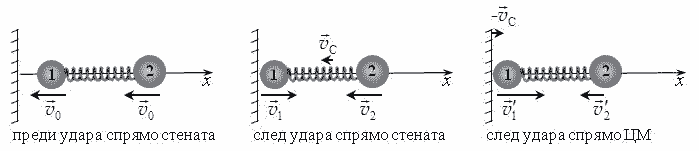
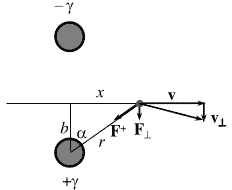
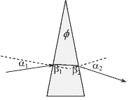

[[Състезания/esenno/st/2023|◂ 2023]] | [[Състезания/esenno/st/2024|условия]] | [[Състезания/esenno/st/2025| 2025 ▸]]

**Задача 1. Трептяща гира**

а) Избираме ос $x$ по нормалата към стената с посока навън от стената, т.е. противоположно на началната скорост на гирата, както е показано на фигурата. Непосредствено след удара проекцията на скоростта на първата топка по $x$ става $v_{1x} = v_0$, а на втората съответно $v_{2x} = -v_0$. Скоростта на центъра на масата (ЦМ) след удара е:

$$ (1) \quad v_C = \frac{m_1 v_{1x} + m_2 v_{2x}}{m_1 + m_2} = -\frac{(m_2 - m_1)}{m_2 + m_1} v_0. \quad [0.5 \text{ т}] $$

В отправната система на ЦМ, скоростите на двете топки след удара са:

$$ (2) \quad v_{1x}' = v_{1x} - v_C = \frac{2m_2}{m_2 + m_1} v_0; \quad v_{2x}' = v_{2x} - v_C = -\frac{2m_1}{m_2 + m_1} v_0 \quad [1.0 \text{ т}] $$

а общата им кинетична енергия:

$$ (3) \quad E_K = \frac{m_1 v_{1x}'^2}{2} + \frac{m_2 v_{2x}'^2}{2} = \frac{2m_1 m_2}{m_2 + m_1} v_0^2 \quad [0.5 \text{ т}] $$

В момента на максимално свиване на пружината двете топки са неподвижни спрямо ЦМ и началната кинетична енергия се е трансформирала изцяло в потенциална енергия на пружината:

$$ (4) \quad \frac{2m_1 m_2}{m_2 + m_1} v_0^2 = \frac{k \Delta \ell^2}{2}, \quad [0.5 \text{ т}] $$

откъдето намираме:

$$ (5) \quad \Delta \ell = 2v_0 \sqrt{\frac{m_1 m_2}{k(m_1 + m_2)}} = 0.04 \text{ m}. \quad [1.0 \text{ т}] $$

б) В отправна система на ЦМ топките трептят хармонично в противофаза. Нека преместването на първата топка спрямо равновесното ѝ положение в даден момент е $x_1$. Понеже ЦМ е неподвижен, втората топка се е преместила в противоположна посока на разстояние:

$$ (6) \quad x_2 = -\frac{m_1 x_1}{m_2}, $$

а деформацията на пружината е съответно:

$$ (7) \quad x = x_1 - x_2 = \frac{(m_1 + m_2)x_1}{m_2}. \quad [0.5 \text{ т}] $$

От закона на Хук следва, че уравнението за движение на първата топка е:

$$ (8) \quad \ddot{x}_1 = -\frac{kx}{m} = -\frac{k(m_1 + m_2)}{m_1m_2}x_1, \quad [0.5 \text{ т}] $$

което описва хармонично трептене с кръгова честота:

$$ (9) \quad \omega = \sqrt{\frac{k(m_1 + m_2)}{m_1m_2}} \quad [0.5 \text{ т}] $$

и период:

$$ (10) \quad T = \frac{2\pi}{\omega} = 2\pi \sqrt{\frac{m_1m_2}{k(m_1 + m_2)}}. \quad [0.5 \text{ т}] $$

След удара пружината достига от недеформирано състояние до състояние с максимална деформация за четвърт период:

$$ (11) \quad t_1 = \frac{T}{4} = \frac{\pi}{2} \sqrt{\frac{m_1m_2}{k(m_1 + m_2)}} \approx 0.105 \text{ s}. \quad [1.0 \text{ т}] $$

в) След удара, в отправна система на ЦМ топката се движи по закона:

$$ (12) \quad x_1 = A \sin(\omega t) \quad [0.5 \text{ т}] $$

с амплитуда:

$$ (13) \quad A = \frac{\nu_{1x}'}{\omega} = \frac{2m_2v_0}{\omega(m_1 + m_2)}. \quad [0.5 \text{ т}] $$

В същата отправна система, след удара стената се движи спрямо ЦМ със скорост -vC и преместването ѝ се дава съответно със закона:

$$ (14) \quad x_w = \frac{(m_2 - m_1)}{m_1 + m_2}v_0t \quad [0.5 \text{ т}] $$

Вторият удар настъпва в момента, в който координатите на топката и стената се изравнят:

$$ (15) \quad \frac{(m_2 - m_1)}{m_1 + m_2}v_0t = \frac{2m_2v_0}{\omega(m_1 + m_2)}\sin(\omega t), $$

откъдето получаваме уравнението:

$$ (16) \quad \frac{(m_2 - m_1)}{2m_2}\omega t = \sin(\omega t), \quad [0.5 \text{ т}] $$

Удобно е уравнението да се решава спрямо фазата $\phi = \omega t$. Като вземем предвид числените стойности на двете маси, свеждаме уравнението до:

$$f(\phi) = \frac{\phi}{4.00} - \sin \phi = 0.$$

Търсим решение на уравнението в интервала \[$\pi$/2; $\pi$\]. Левият край, където f($\varphi$) < 0,
съответства на момента на максимална деформация, който очевидно е преди втория
удар. В десния край f($\varphi$) > 0, което означава, че между двете стойности уравнението
има корен. \[0.5 т\] Решаваме уравнението чрез последователно разполовяване на
интервала, така че в левия край на всеки нов интервал функцията да е отрицателна, а в
десния край - положителна. Деленето продължава, докато границите $\varphi_2$ и $\varphi_2$ на
интервала съвпаднат в рамките на желаната точност, както е дадено в таблицата по-
долу. \[0.5 т\]

Следователно можем да приемем, че решението на
уравнението е приблизително $\varphi$ $\approx$ 2.47 rad, а
съответният момент на втория удар:

$$t_2 = \frac{\phi}{\omega} = \phi \sqrt{\frac{m_1 m_2}{k(m_1 + m_2)}} \approx 0.16 \text{ s.} \qquad [0.5 \text{ т}]$$

Точките за числено решение - от формула (17) до края,
се дават за всеки друг обоснован метод - графичен,
Нютон-Рафсон, последователни приближения и т.н.

Задача 2. Електростатична призма

а) Разглеждаме мислена цилиндрична повърхност с
радиус r, обхващаща жичката. Количеството заряд,
заградено от повърхността, е:

| $\varphi_1$ (rad) | $\varphi_2$ (rad) |
| ----------------- | ----------------- |
| 1.570796          | 3.141593          |
| 2.356194          | 3.141593          |
| 2.356194          | 2.748894          |
| 2.356194          | 2.552544          |
| 2.454369          | 2.552544          |
| 2.454369          | 2.503457          |
| 2.454369          | 2.478913          |
| 2.466641          | 2.478913          |
| 2.472777          | 2.478913          |
| 2.472777          | 2.475845          |
| 2.474311          | 2.475845          |
| 2.474311          | 2.475078          |
| 2.474311          | 2.474695          |

$$(1) \qquad q = \gamma \ell, \qquad [0.5 \text{ т}]$$

където l е височината на цилиндъра. Тъй като електричното поле е перпендикулярно
на околната повърхност на цилиндъра и има постоянен по големина интензитет E(r),
потокът на полето през цилиндъра е:

$$(2) \qquad \Phi = E(r) \cdot 2\pi r \ell. \qquad [0.5 \text{ т}]$$

От теоремата на Гаус $\Phi$ = q/$\varepsilon_0$, намираме:

$$(3) \qquad E(r) = \frac{\gamma}{2\pi \varepsilon_0 r}. \qquad [0.5 \text{ т}]$$

б) Понеже радиусът на жичките, е много по-малък от разстоянието между тях, може да
приемем, че разпределението на заряда върху тяхната повърхност е практически
равномерно. Следователно всяка жичка, създава поле, еквивалентно на полето на
равномерно заредена линия. На разстояние r от оста на положително заредената жичка
интензитетът на полето на жичката е:

$$(4) \qquad E^+(r) = \frac{\gamma}{2\pi \varepsilon_0 r}.$$

В областта между двете жички, отрицателно заредената жичка създава поле в същата посока като $E^+(r)$ с интензитет:

$$ (5) \quad E^-(r) = \frac{\gamma}{2\pi\epsilon_0(L-r)} $$

и резултатното поле е:

$$ (6) \quad E(r) = E^+(r) + E^-(r) = \frac{\gamma}{2\pi\epsilon_0r} + \frac{\gamma}{2\pi\epsilon_0(L-r)} \quad [0.5 \text{ т}] $$

Падът на потенциала, т.е. напрежението между две много близки точки е: $dU \equiv -d\varphi = \vec{E}(\vec{r}) \cdot d\vec{r}$. Следователно, напрежението между двете жички се дава с интеграла:

$$ (7) \quad U = \int_a^{L-a} E(r)dr = \frac{\gamma}{2\pi\epsilon_0} \left( \int_a^{L-a} \frac{dr}{r} + \int_a^{L-a} \frac{dr}{L-r} \right) = 2 \cdot \frac{\gamma}{2\pi\epsilon_0} \ln \left( \frac{L-a}{a} \right). \quad [1.0 \text{ т}] $$

Като пренебрегнем $a$ спрямо $L$ в числителя, намираме окончателно:

$$ (8) \quad \gamma = \frac{\pi\epsilon_0U}{\ln(L/a)}. \quad [0.5 \text{ т}] $$

в) От закона за запазване на енергията: $mv^2/2 = eV$, изразяваме скоростта на електрона на много голямо (безкрайно) разстояние от жичките:

$$ (9) \quad v = \sqrt{\frac{2eV}{m}}. \quad [0.5 \text{ т}] $$

Въвеждаме $X$ в посоката на началната скорост на електроните и с начало в точката, където оста "пробожда" равнината между жичките, т.е. на разстояние $b$ от положително заредената жичка. В нулево приближение електронът се движи с постоянна скорост $v$ по оста $X$. Да разгледаме преместването на електрона от точка с координата $x$ до точка с координата $x+dx$. Времето за това преместване е:

$$ (10) \quad \mathrm{d}t = \frac{\mathrm{d}x}{v}. \quad [0.5 \text{ т}] $$

В този интервал положително заредената жичка действа на електрона със сила:

$$ (11) \quad F^+ = eE^+(r) = \frac{ey}{2\pi\epsilon_0r}, $$

чиято проекция, перпендикулярно на траекторията, е:

$$ (12) \quad F_{\perp}^+ = F^+ \cos \alpha = \frac{F^+b}{r} = \frac{eyb}{2\pi\epsilon_0(b^2 + x^2)}. \quad [0.5 \text{ т}] $$

За малкия интервал от време (10) тази сила има импулс в перпендикулярно направление:

$$ (13) \quad \mathrm{d}J_{\perp}^+ = F_{\perp}^+ \mathrm{d}t = \frac{eyb\mathrm{d}x}{2\pi\epsilon_0v(b^2 + x^2)}, $$

а за цялото време на движение:

$$ (14) \quad J_+^1 = \int_{-\infty}^{\infty} \frac{eybdx}{2\pi \epsilon_0 v(b^2 + x^2)} = \frac{ey}{2\epsilon_0 v}. \quad [0.5 \text{ т}] $$

Вижда се, че импулсът на силата не зависи от разстоянието $b$, на което електронът се доближава до жичката. Следователно отрицателно заредената жичка действа със сила, която има същия по големина и посока импулс по време на движението:

$$ (15) \quad J_-^1 = \frac{ey}{2\epsilon_0 v}. $$

Тогава общият импулс на електростатичните сили е:

$$ (16) \quad J_\perp = J_+^1 + J_-^1 = \frac{ey}{\epsilon_0 v}. \quad [0.5 \text{ т}] $$

Съответно електронът придобива допълнителна скорост, перпендикулярно спрямо началната му скорост:

$$ (17) \quad v_\perp = \frac{J_\perp}{m} = \frac{ey}{\epsilon_0 mv}. \quad [0.5 \text{ т}] $$

Тъгълът, на който се отклонява електронният сноп, е:

$$ (18) \quad \theta \approx \tan \theta = \frac{v_\perp}{v} = \frac{ey}{\epsilon_0 mv^2} = \frac{\pi U}{2V \ln(L/a)}. \quad [0.5 \text{ т}] $$

г) На фигурата са дадени ъглите, които лъчът светлина сключва с нормалата към входната и към изходната повърхност на призмата. От закона на Снелиус:

$$ (19) \quad \sin \alpha_1 = n \sin \beta_1; \quad \sin \alpha_2 = n \sin \beta_2. \quad [0.4 \text{ т}] $$

Общият ъгъл на отклонение лъча е:

$$ (20) \quad \theta = (\alpha_1 - \beta_1) + (\alpha_2 - \beta_2). \quad [0.6 \text{ т}] $$

Като вземем предвид, че ъглите са малки, т.е. $\sin x \approx x/\text{rad}$, получаваме:

$$ (21) \quad \theta = (n-1)(\beta_1 + \beta_2) $$

От геометрични съображения е ясно, че:

$$ (22) \quad \beta_1 + \beta_2 = \phi. \quad [0.5 \text{ т}] $$

Следователно:

$$ (21) \quad \theta = (n-1)\phi. \quad [0.5 \text{ т}] $$

При дадените параметри за електростатичната призма намираме:

$$ (22) \quad \theta = \frac{3.14 \cdot 100 \text{ V}}{2 \cdot 10 000 \text{ V} \cdot \ln(10 \text{ mm}/0.1 \text{ mm})} \approx 3.41 \cdot 10^{-3} \text{ rad} = 0.195^\circ. \quad [0.5 \text{ т}] $$

Тогава за ъгъла при върха на оптичната призма получаваме:

$$ (23) \quad \phi = \frac{\theta}{n-1} = 0,390^\circ = 23.4'. \quad [0.5 \text{ т}] $$

**Задача 3. Раждане на електрон-позитронна двойка**

а) От закона за запазване на енергията следва, че:

$$ (1) \quad E_\gamma + Mc^2 = E, \qquad [1.0 \text{ т}] $$

където $E$ е сумарната релативистична енергия на началната частица и възникналите след процеса електрон и позитрон. Сумарният импулс на трите частици след процеса е:

$$ (2) \quad P = P_\gamma, \qquad [1.0 \text{ т}] $$

където $P_\gamma$ е импулсът на фотона преди процеса. Минималната енергия на падащия фотон съответства на случая, когато след процеса електронът, позитронът и началната частица се движат с еднаква скорост, т.е. като едно цяло тяло с маса в покой:

$$ (3) \quad M' = M + 2m_e. \qquad [1.0 \text{ т}] $$

Вземаме предвид, че за фотона:

$$ (4) \quad E_\gamma = P_\gamma c, \qquad [1.0 \text{ т}] $$

а за трите частици след процеса:

$$ (5) \quad E^2 = P^2 + (M'c^2)^2. \qquad [1.0 \text{ т}] $$

След като повдигнем на квадрат двете страни на уравнение 1 и на уравнение 2, умножени с $c^2$, и ги съберем почленно, получаваме:

$$ (6) \quad E_\gamma^2 + M^2c^4 + 2E_\gamma Mc^2 + P^2c^2 = E^2 + P_\gamma^2c^2. \qquad [1.0 \text{ т}] $$

Вземаме предвид тъждествата (4) и (5) и намираме окончателно:

$$ (7) \quad E_\gamma = \frac{(M + 2m_e)^2c^2 - M^2c^2}{2M} = \frac{2(M + m_e)m_ec^2}{M}. \qquad [1.0 \text{ т}] $$

б) В граничния случай на много тежко ядро, $M \gg m_e$, т.е. при $M \to \infty$, намираме:

$$ (8) \quad E_\gamma = 2m_ec^2 = 2 \times 9,11 \times 10^{-31}\text{kg} \times (3,00 \times 10^8 \text{ m/s})^2 = 1.64 \times 10^{-13}\text{ J}. \qquad [1.0 \text{ т}] $$

Като вземем предвид, че $1 \text{ MeV} = 1,60 \times 10^{-13} \text{ J}$, намираме енергията на фотона в мегаелектронволити:

$$ (9) \quad E_\gamma \approx 1,02 \text{ MeV}. \qquad [1.0 \text{ т}] $$

При взаимодействие с електрон, $M = m_e$:

$$ (10) \quad E_\gamma = 6m_ec^2 \approx 3,06 \text{ MeV}. \qquad [1.0 \text{ т}] $$