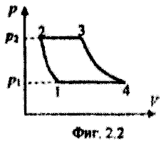
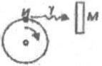
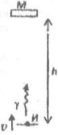

**Задача 1.** Изкачване на бордюр

Автомобил с маса $m$ и радиус на колелата $R$ трябва да изкачи бордюр с височина $h$, както е показано на фигурата. Разстоянието между осите на предните и задните колела е $L$. Центърът на масата C на автомобила е разположен симетрично спрямо предната и задната оси. При изкачване на бордюра предните и задните гуми не приплъзват спрямо пътя. Автомобилът се движи толкова бавно, че на практика се намира в състояние на статично равновесие. Удобно е да изразите аналитичните отговори чрез "ъгъла на атака" $\alpha$, както е дефиниран на чертежа, вместо непосредствено чрез височината $h$.

А) Приемете, че автомобилът е със задвижване на предните колела, т.е. въртящият момент $M$ на двигателя е приложен към предната ос, а задните гуми могат да се въртят свободно. В този случай определете:

А1. Минималния коефициент $\mu$ на триене между гумите и пътя, за да може автомобилът да премине бордюра, без гумите да боксуват, както и общата сила на реакция $N_1$, с която бордюрът действа върху предните гуми. **\[4.0 т]**

А2. Минималния въртящ момент $M$ върху предната ос, нужен за преодоляване на бордюра.

Б) Разгледайте автомобил със задвижване на задните колела, т.е. в случая въртящият момент $M$ на двигателя е приложен към задната ос, а предните гуми могат да се въртят свободно. В този случай определете: **\[4.0 т]**

Б1. Минималния коефициент $\mu$ на триене между гумите и пътя, за да може автомобилът да премине бордюра, без гумите да боксуват, както и общата сила на реакция $N_1$, с която бордюрът действа върху предните гуми.

Б2. Минималния въртящ момент M върху предната ос, нужен за преодоляване на бордюра.

В) Нека автомобилът има следните данни: $m = 1000 \mathrm{\ kg}$, $R = 0.3 \mathrm{\ m}$, $L = 2.5 \mathrm{\ m}$, височината на бордюра е $h = 0.1 \mathrm{\ m}$ и $g = 10 \mathrm{\ m/s^2}$. Попълнете със съответните числени стойности таблицата: **\[2.0 т]**

| Задвижване на | $\mu$ | $N_1\ \mathrm{(N)}$ | $M\ \mathrm{(N\cdot m)}$ |
| ------------- | ----- | ------------------- | ------------------------ |
| предни колела | |   |    |
| задни колела | |   |    |

**Задача 2.** Газова турбина

На фиг. 2.1 е показано принципното устройство на газова турбина - двигател, който се използва при самолетите, в електростанциите и дори в някои модели спортни автомобили. На фиг. 2.2 е показан идеализиран термодинамичен цикъл на работата на газовата турбина (т. нар. цикъл на Брайтън). Компресорът поема атмосферен въздух с налягане $p_1 = 1.0\times10^5 \mathrm{\ Pa}$ и температура $T_1 = 300 \mathrm{\ K}$ и го свива адиабатно до $p_2 = 1.0\times10^6 \mathrm{\ Pa}$ (процес 1-2), след което въздухът попада в горивната камера. Там той се загрява от изгарящото гориво и се разширява при практически постоянно налягане (2-3). Масата на впръсканото гориво и на продуктите от неговото изгаряне е много по-малка от масата на постъпващия въздух. След това въздухът попада върху лопатките на турбината, като до отделянето му в атмосферата налягането му намалява адиабатно до $p_1 = 1.0\times10^5 \mathrm{\ Pa}$(3-4). Отделеният в атмосферата горещ въздух се охлажда при постоянно налягане до температурата на околния въздух (4-1).

А) В коя точка от цикъла температурата на въздуха е максимална? Дайте обосновка на отговора си. **\[1.0 т]**

Б) Без да анализирате детайлно отделните процеси от работния цикъл, получете оценка отгоре за коефициента $\eta$ на полезно действие на двигателя. Приемете, че въздухът в горивната камера се загрява до максимална температура $T_{\max} = 1000 \mathrm{\ K}$. **\[1.0 т]**

В) Получете точен израз за $\eta$ чрез коефициента на компресия $k = p_2/p_1$ и показателя на адиабатата $\gamma$ на въздуха. Пресметнете $\eta$, като приемете, че въздухът е съставен само от двуатомни молекули. **\[4.0 т]**

Г) На практика горещият въздух се отделя в атмосферата с налягане pm, което е по-голямо от външното атмосферно налягане $p_1$. Адиабатното разширение на въздуха продължава в атмосферата, като при това въздухът не извършва полезна работа. Пресметнете числено КПД $\eta'$ на турбината в този случай при $p_m = 2.0\times10^5 \mathrm{\ Pa}$. **\[4.0 т]**

**Задача 3.** Ефект на Мьосбауер

Ако атом премине от възбудено енергетично ниво с енергия $E_1$ в основното си ниво с енергия $E_0$, се излъчва фотон с енергия $h\nu = E_1 - E_0$. Този фотон може да бъде погълнат от атом на същото вещество, който първоначално се намира в основното ниво E0 и преминава във възбудено състояние с енергия $E_1$. Този процес се нарича резонансна флуоресценция и се наблюдава лесно, когато излъченият фотон е в оптичната част на спектъра. В случай, когато фотонът се излъчва при преход между енергетичните нива на атомното ниво обаче резонансна флуоресценция се наблюдава само при специални условия. Причината е, че излъченият фотон ($\gamma $-квант) придава значителен импулс на излъчващото ядро, а следователно и част от своята енергия. С по-ниската си енергия $\gamma $-квантът не може да бъде погълнат от друго ядро на съшия изотоп, намиращо се в основно състояние.

А) Разгледайте свободно ядро (например в газ) с маса m и разлика в енергиите между възбуденото и основното ниво $E_1 - E_0 = h\nu$, където $\nu_0$ е честотата, с която би бил излъчен $\gamma$-квантът, ако ядрото беше неподвижно закрепено.

Получете приблизителни изрази за кинетичната енергия $E_R$ на ядрото след излъчването на $\gamma $-кванта и за енергията $h\nu 1$ на излъчения фотон, ако първоначално ядрото е неподвижно. Изразете отговорите чрез $h\nu_0$, $m$ и скоростта на светлината $c$. Можете да приемете че $h\nu_0 \ll mc^2$ и да използвате приблизителните равенства $(1 + x)^n \approx 1 + nx$ и $(1+x)(1+y) \approx 1 + x + y$, когато $|x|,|y|\ll 1$. **\[2.5 т]**

Колко трябва да бъде енергията $h\nu_2$ на $\gamma $-квант, за да бъде погълнат от първоначално неподвижно ядро, намиращо се в основното си състояние? **\[1.0 т]**

Б) Ще разгледаме конкретно ядро на изотопа $^{57}Fe$ на желязото (моларна маса $M = 0.057 kg/mol$). Възбудените ядра излъчват в случайни моменти от време, като средното им време на живот е $\tau = 10^{-7} s$. Поради това, енергията на излъчените кванти не е фиксирана, а е случайно разпределена в малък интервал $\nu_1 \pm \Delta \nu$. Аналогично, неподвижното ядро може да поглъща фотони в интервал от честоти $\nu_2 \pm \Delta \nu$ със същата широчина.

- Като използвате принципа за неопределеност, оценете полуширочината $\Delta \nu$ на честотния интервал при излъчване или поглъщане. **\[1.0 т]**

- Пресметнете при какви енергии $h\nu_0$ е възможен процес на резонансна флуоресценция за свободни ядра на желязото. **\[1.5 т]**

 

В) За ядрото $^{57}Fe$ разликата в енергиите на двете нива е $h\nu_0 = 14.4 keV$, което значително превишава граничната енергия за наблюдаване на резонансна флуоресценция от свободни неподвижни ядра. Един от начините за наблюдаване на това явление е радиоактивният източник И, съдържащ възбудени ядра $^{57}Fe$, да се монтира на въртящ се диск. Мишената М от същите ядра в основното състояние е закрепена неподвижно в направление на допирателната към диска.

- С каква ъглова скорост $\omega$ трябва да се върти дискът, за да може максимален брой фотони, излъчени от източника, да бъдат погълнати от ядрата в мишената? Радиусът на диска е $R = 5 \mathrm{\ cm}$. **\[2.0 т]**

Г) Когато атом се намира в кристал, между него и съседните атоми съществува силна връзка, в резултат на което атомът трепти около своето равновесно положение с определена честота $\nu_{vib}$. Трептящият атом може да поглъща механична енергия само на кванти $\epsilon = h\nu_{vib}$. Ако енергията $E_R$ на откат на излъчващото ядро е по-малка от вибрационния квант енергия $\epsilon$ и температурата е сравнително ниска, импулсът на излъчения фотон не е достатъчен, за да възбуди трептене на ядрото в кристала. Фотонът се излъчва или поглъща с непроменена енергия $h\nu_0$, като откатният импулс се поема от кристала като цяло. Този ефект е бил открит от немския физик Мьосбауер през 1956 г. за ядрата на изотопа $^{57}Fe$ в кристалната решетка на желязото при температури, по-ниски от 77 K.

 

През 1959 г. Английските физици Паунд и Ребка използват ефекта на Мьосбауер, за да установят промяната на честотата на фотона при движение в гравитационно поле. Схемата на опита е дадена на фигурата. Източникът И - стоманена пластинка, съдържаща възбудени ядра $^{57}Fe$, е монтиран на мембраната на високоговорител. На високоговорителя се подава електрическо напрежение, изменящо се с времето така, че мембраната да се движи вертикално с контролируема скорост. Мишената - идентична пластина, в която ядрата на желязото са в невъзбудено (основно) състояние се намира на височина $h = 22.5 \mathrm{\ m}$ над източника.

- С каква скорост $v$ трябва да се движи мембраната нагоре, за да се наблюдава резонансно поглъщане на $\gamma $-квантите, излъчени от източника? Приемете, че $\gamma $-квантите се излъчват и поглъщат безотказно. **\[2.0 т]**

**Основни константи**
Константа на Планк, $h = 6.63\times10^{-34} \mathrm{\ J.s}$
Скорост на светлината във вакуум, $c = 3.00\times108 \mathrm{\ m/s}$
Елементарен електричен заряд, $e = 1.60\times10^{-19} \mathrm{\ J.s}$
Число на Авогадро, $N_A = 6.02\times10^{23} \mathrm{\ mol^{-1}}$
Ускорение на свободно падане, $g = 9.80 \mathrm{\ m/s^2}$
