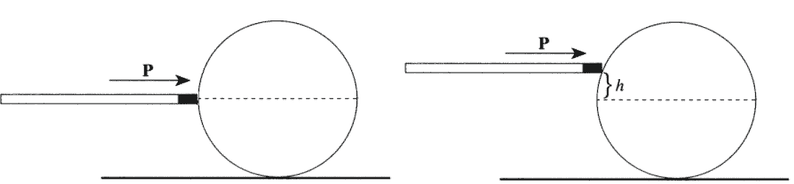
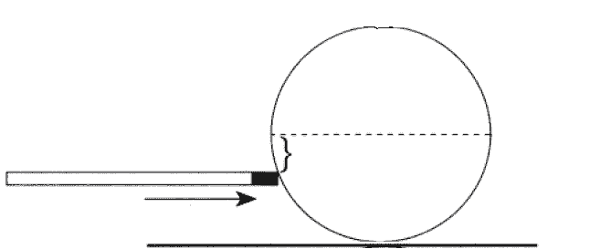

[[Състезания/esenno/st/2012|◂ 2012]] | [[Състезания/esenno/st-r/2013|решения]] | [[Състезания/esenno/st/2014| 2014 ▸]]

Задача 1: Съотношение за неопределеност в астрофизиката
 Използвайте съотношението за неопределеност, за да дадете оценъчно решение на следните задачи:

1.1 Съотношение за неопределеност и размерност на Вселената

а) Засега физиците не могат да дадат ясна причина, поради която пространството има три измерения. Ако разглеждаме вселена с n пространствени измерения, се оказва, че електростатичната потенциална енергия между два точкови заряда се задава като:
$$U(r) = k\frac{q_1q_2}{r^{n-2}},$$
където q1 и q2 са големините на зарядите, r е разстоянието между тях, а k е електричната константа.
Покажете, че когато n > 3, водородният атом е нестабилен \[4т\]

1.2 Съотношение за неопределеност, бели джуджета и неутронни звезди
Белите джуджета и неутронните звезди са екзотични астрономически обекти. Те се образуват в крайния етап от живота на една звезда, когато звездата е изчерпала цялото "гориво", което поддържа термоядрените реакции. Тогава звездата се свива под действие на собствената си гравитация. Свиването продължава докато електроните, които изграждат материята, се сближат прекалено близо един до друг и принципът на Паули ги задължи да имат различни нива на енергия. Тогава, за да се добави още един електрон в даден обем, е нужно повишаване на нивото на енергията на електроните. Това поражда налягане на електронния газ, което спира свиването на белите джуджета. За по-масивните звезди налягането на електронния газ не може да противодейства на гравитацията и свиването се прекратява от налягането на неутронния газ (аналогичен на електронния газ).

б) Оценете налягането в бяло джудже и неутронна звезда като използвате
съотношението за неопределеност. Считайте, че електронният газ (респективно неутронният газ) е нерелативистки. \[3т\]

в) Оценете налягането в бяло джудже и неутронна звезда като използвате
съотношението за неопределеност. Считайте, че електронният газ (респективно неутронният газ) е ултрарелативистки. \[3т\]

Упътване: Приемете, че при белите джуджета плътността на материята е толкова голяма, че атомите практически за залепени един до друг и са на разстояния от порядъка на размера на атома ( R 10-10 m ). За неутронните звезди приемете, че плътността на материята е толкова голяма, че ядрата на атомите практически се допират и разстоянията между тях са от порядъка на R 10-15 m . Да се пренебрегне налягането, дължащо се на взаимодействието между частиците. Считайте, че кинетичната енергия на електроните (респективно неутроните) е изцяло свързана със съотношението за неопределеност.

Фундаментални физични величини:
- скоростта на светлината във вакуум, c = 3, 00.108 m / s ;
- редуцирана константа на Планк, $\hbar = \frac{h}{2\pi} = 1, 05.10^{-34}\ \mathrm{J.s}$;
- масата на електрона me = 9,11.10-31kg ;
- маса на неутрона mn = 1,67.10-27 kg .

**Задача 2: Метаматериали**

В последното десетилетие е модерно да се създават метаматериали - изкуствени материали, проектирани да имат свойства, които не са достъпни в природата. Типичен пример е материал с отрицателен показател на пречупване (например n = -1 ).

**2.1 Метаматериали в класическата оптика**

а) Начертайте ходовете на двата лъча от Фигура 1 и отбележете образите на източника А. \[2т\]

**2.2 Метаматериали в релативистката оптика**

Нека сега разгледаме отправна система K ' , която се движи с постоянна скорост u спрямо неподвижна система K . Нека скоростта u да е насочена по оста x и в момента t = t ' = 0 началото O ' (начало на K ' ) да съвпада с началото O (начало на K ). Нека в точка от отправната система K с координати x, y , z в момента от време t става някакво събитие. Координатите x ', y ', z ' и времето t ' на събитието, определени от наблюдател в K ' , са свързани в специалната теория на относителността чрез Лоренцовите трансформации:
$$t' = \frac{t-xu/c^2}{\sqrt{1-u^2/c^2}},$$
$$x' = \frac{x-ut}{\sqrt{1-u^2/c^2}},\ y'=y,\ z'=z.$$
Импулсът Px , Py , Pz и енергията E на частица в отправна система K са свързани с
импулса Px ', Py ', Pz ' и енергията E ' за наблюдател в K ' чрез Лоренцовите
трансформации за импулс и енергия:
$$P_x' = \frac{P_x-Eu/c^2}{\sqrt{1-u^2/c^2}},\ P_y'=P_y,\ P_z'=P_z,$$
$$E' = \frac{E-P_xu}{\sqrt{1-u^2/c^2}}.$$
Приемете, че импулсът на фотон в среда с показател на пречупване n e p = n $\hbar\omega$/c.

б) Използвайки Лоренцовите трансформации за импулс и енергия и разглеждайки фотона като частица с енергия E = h$\omega$ , насочен под ъгъл $\theta$ спрямо оста x , изведете релативисткия ефект на Доплер (връзката между честота $\omega$ за наблюдател в K и честотата $\omega$ ' за наблюдател в K ' ). \[2т\]

в) Нека средата има показател на пречупване n = -1 и нека имаме източник на светлина в отправна система K ' , който излъчва фотони с честота $\omega$ ' , отдалечавайки се успоредно на наблюдател в K . Намерете каква е честотата $\omega$ в отправна система K .
\[0.75т\]

г) Нека средата има показател на пречупване n = -1 и нека имаме източник на светлина в отправна система K ' , който излъчва фотони с честотата $\omega$ ' , приближавайки се успоредно на наблюдател в K . Намерете каква е честотата $\omega$ в отправна система K .
\[0.75т\]

д) Заредена частица с енергия на покой E0 , движеща се праволинейно и равномерно със скорост u > c / n през материална среда с показател на пречупване n , става източник на светлина (ефект на Вавилов-Черенков). Като използвате законите за запазване на енергията и импулса, определете ъгъла $\theta$ , под който става това излъчване. \[2т\]

**Упътване:** Приемете, че енергията на излъчен фотон h$\omega$ е много по-малка от енергията на покой на заредената частица ( h$\omega$ / E0 1). Какво е направлението на излъчване на фотоните, ако n > 0 и ако n < 0 ?

е) В нелинейна кристална среда, която има показател на пречупване n$\omega$ за честота $\omega$ и едновременно с това има показател на пречупване n2$\omega$ за честота 2$\omega$ , се раждат два фотона с честота $\omega$ при удара на фотон с честота 2$\omega$ в един от възлите на кристалната решетка. Определете посоката на фотоните с честота $\omega$ спрямо посоката на разпространение на фотона с честота 2$\omega$ , ако n$\omega$ = 1 , а n2$\omega$ = -1 . \[2.5т\]

**Упътване:** Приемете, че енергията на падналия фотон h$\omega$ е много по-малка от енергията на покой на кристалния възел ( h$\omega$ / E0 1), тоест считайте, че кристалният възел остава на място след удара.

**Задача 3: Билярдна топка (A Guide to Physics Problems 1.4)**

Разгледайте хомогенна билярдна топка с маса m и радиус R , която седи неподвижна на хоризонтална маса. Коефициентът на триене при хлъзгане между топката и масата е $\mu$ , а триенето при търкаляне може да се пренебрегне. За много кратко време топката се удря с билярдна щека, която предава импулс P .

а) Намерете времето T , за което топката ще започне да се търкаля без хлъзгане, ако щеката удря топката в екваториалната равнина и ударът е насочен към центъра на топката (Фигура 2а). \[3.5т\]

б) Каква е крайната скорост V на центъра на топката, когато вече се е установило търкалянето без хлъзгане? \[1т\]

Фигура 2а Фигура 2б

в) На каква височина h над екватора (Фигура 2б) трябва да се удари топката, за да може тя веднага да започне да се търкаля без хлъзгане? \[2т\]

г) Ако ударим топката на височина H (Фигура 3) под екватора, какво ще бъде времето T1 , за което топката ще си промени посоката на въртене, и времето T2 , за което топката ще започне да се търкаля без хлъзгане? \[3.5т\]

Фигура 3