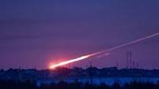

Основни константи

 - земно ускорение, g = 9.8 m/s2;
 - универсална газова константа, R = 8.314 J/(mol$\neg$K);
 - константа на Болцман, kB = 1.381$\times$10-23 J/K;
 - скорост на светлината, c = 3.00$\times$108m/s;

Задача 1. Механика на тежък шнур

Задачата се състои от три независими подусловия, в които се разглеждат различни случаи
на равновесие и движение на еднороден, тежък и неразтеглив шнур. Масата на шнура е m,
а дължината му е l. Шнурът е идеално гъвкав, т.е. за огъването му не е нужна сила.
Земното ускорение е g.

А) Шнурът е поставен симетрично върху две
допиращи се равнини, наклонени под еднакви
ъгли $\alpha$ спрямо хоризонта, както е показано на
фигурата. Коефициентът на триене между l1
 $\alpha \alpha$
шнура и равнините е $\mu$ ( $\mu$ > tan $\alpha$ ).

Намерете отношението k = l1/l, където l1 е максималната възможна дължина на
свободновисящата част от шнура, когато той е в равновесие. [3.0 точки]

Б) Половината от шнура се намира върху хоризонтална гладка маса
(без триене), а другата му половина виси от ръба на масата, както е
показано на фигурата. Шнурът е пуснат да се свлича от масата с x
нулева начална скорост. При това дължината x на висящата му част
се изменя с времето по закона:
$$x = A \cosh(kt) .$$

Намерете неизвестните константи A и k. За колко време $\tau$ шнурът ще падне от масата? [4.0 точки]

*Упътване.* Можете да използвате математическото приложение на последната страница.

В) Шнурът е окачен в единия си край, като другият му край
виси свободно. В това положение шнурът може да извършва
под действие на собствената си тежест различни хармонични трептения, част от които са показани на фигурата.
Съответните им кръгови честоти $\omega$i са дадени в таблицата
по-долу. Обърнете внимание, че подобно на трептяща
струна, по дължината на шнура има точки, които не трептят
в напречно направление - т.нар. възли.

В1. Предложете опростен модел, чрез който да оцените кръговата честота $\omega_1$ на първото (най-нискочестотно) трептене на шнура с
 относителна грешка, по-малка от 5%. [1.5 точки]

| № | $\omega$  |
| --- | ----------------- |
| 1 | $1.202\sqrt{g/l}$ |
| 2 | $2.760\sqrt{g/l}$ |
| 3 | $4.327\sqrt{g/l}$ |

В2. Като използвате данните от таблицата, намерете разстоянията x2 и x3 между точката на окачване и първия възел за трептенията 2 и 3
съответно (вж. фигурата). Приемете, че трептенията са с амплитуди, много по-малки от
дължината на шнура. [1.5 точки]

Задача 2. Изгаряне на метеорит в атмосферата

В тази задача ще разгледате опростен модел за изпарение на
метеорит в земната атмосфера поради триенето му с въздуха.
Метеоритът се състои от вещество с плътност $\rho$m = 7800 kg/m3 и
специфична топлина на сублимация L = 6.1$\times$106 J/kg.
Атмосферата е идеалeн газ, състоящ се от точкови молекули със
средна моларна маса $\mu$ = 0.029 kg/mol. Температурата на атмосферата е постоянна по
цялата й височина, T = 280 K, а атмосферното налягане на морското ниво е p0 = 1.0$\times$105 Pa.
Ударите на молекулите на въздуха с метеорита са абсолютно нееластични. Влиянието на
земната гравитация върху движението на метеорита се пренебрегва.

А) Оценете средната скорост v на топлинно движение на молекулите на въздуха. [0.5 точки]

Б) Метеоритът започва движението си от състояние на покой на много
 vE Метеорит
голямо разстояние от Слънцето. Той се ускорява под действие на
слънчевата гравитация в равнината на земната орбита, като я пресича под Земя
прав ъгъл, както е показано на фигурата. Ако е известно, че орбиталната
скорост на Земята е vE = 30 km/s, намерете относителната скорост v0 Слънце
спрямо Земята, с която метеоритът навлиза в атмосферата. Под какъв
ъгъл $\theta$ спрямо вертикалата е насочена тази скорост? [2.0 точки]

 2
Както следва от предходните две подточки, скоростта на топлинно движение на
молекулите е много по-малка от скоростта, с която метеоритът навлиза в атмосферата.
Затова се приема, че метеоритът се движи в газ, състоящ се от неподвижни точкови
молекули. Разгледайте сферичен метеорит с радиус r, който се движи в атмосферата със
скорост v спрямо въздуха. Плътността на атмосферата на дадената височина е $\rho$a.

В) Получете израз за моментната топлинна мощност P, която се отделя поради ударите
между метеорита и молекулите на въздуха. [2.0 точки]

Приемете, че $\eta$ = 50% от отделената поради ударите топлина, се изразходва изцяло за
сублимация (изпарение от твърдо агрегатно състояние) на веществото на метеорита.
Останалата част от топлината води до загряване на въздуха и до топлинно излъчване.
Считайте, че изпарението е равномерно по цялата повърхност на метеорита, т.е. той
запазва сферичната си форма.

Г) Получете израз за скоростта dr/dt, с която намалява радиусът на метеорита, като
функция на моментния му радиус r и останалите зададени параметри. [2.0 точки]

Д) Измерванията показват, че метеоритите изминават по-голямата част от пътя си в
атмосферата праволинейно (вж. снимката в началото) и практически с постоянна скорост.
Оценете минималния радиус rmin, който трябва да има метеорит преди да навлезе в
атмосферата, за да достигне земната повърхност. [3.5 точки]

Задача 3. Радар

Радар се състои от малки по размер източник И и приемник П на микровълнови импулси,
разположени във фокуса на идеално отразяваща параболична антена с диаметър на
изходния отвор D = 2 (вж. фигурата). Източникът излъчва микровълнови импулси с
дължина на вълната $\lambda$ = 5 cm, продължителност $\tau$ = 1 $\mu$s и мощност P0 = 100 kW. Докато
трае излъчването на даден импулс, приемникът е изключен. След това той се включва и
регистрира импулсите, отразени от обект, намиращ се на разстояние R от радара (R >> D).

 П a
 D
 И

 R

А) Пресметнете минималното растояние Rmin, на което радарът може да регистрира обекта. [1.0 точка]

Б) Радарът се характеризира с величината яркост, която се дефинира като:
$$B = P/\Omega,$$
където P e мощността на импулсите, а $\Omega$ е пространственият ъгъл, в който е
съсредоточено излъчването на радара (виж математическото приложение). Получете израз
и оценете числено максималната теоретично достижима яркост на радара. [2.5 точки]

В) Обектът е идеално отразяваща метална сфера с радиус a ($\lambda$ << a << R). Получете израз
за мощността Pr на отразената от сферата вълна. Определете пространствения ъгъл $\Omega$r, в
който се разпространява отразената вълна. [2.0 точки]

Г) Получете израз за мощността Pd на вълната, която се фокусира върху приемника П. [2.0 точки]

Д) За да регистрира приемникът отразената вълна, е нужно енергията, която той поглъща
от вълната, да бъде по-голяма от средната енергия на топлинно движение на токовите
носители в регистриращата електронна верига. Определете максималното разстояние Rmax,
на което радарът може да регистрира метална сфера с радиус a = 1 m. Температурата на
елементите от електронната верига на приемника е T = 300 K. [2.5 точки]

Математическо приложение

1) Функциите хиперболичен косинус ( cosh ) и хиперболичен синус ( sinh ) се дефинират с
равенствата:
$$\cosh x = \frac{e^x+e^{-x}}{2}\text{ и }\sinh x = \frac{e^x-e^{-x}}{2},$$
и удоволетворяват следните тъждества:
 cosh2 x - sinh2 x = 1 ; (cosh x )' = sinh x ; (sinh x )' = cosh x .
2) Пространствен ъгъл $\Omega$ е част от пространството, ограничена от сноп лъчи - образуващи
на ъгъла, излизащи от обща точка О - връх на ъгъла. Ако разгледаме мислена сфера с
радиус R и център в т. О, големината на пространствения ъгъл се дава с формулата:
$$\Omega = S/R^2,$$
където S е площта на сферичния сегмент, ограничен от лъчите. Пространственият ъгъл се
измерва в стерадиани (strad). Пространственият ъгъл, съответстващ на конус с ъгъл $\theta$
между образуващата и оста на конуса, се дава с израза:
$$\Omega = 4\pi \sin^2(\theta/2).$$
