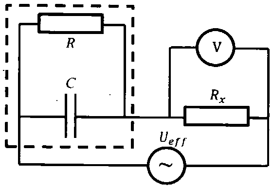

**Задача 1.** Космонавти и космически кораб

Космически кораб (който всъщност е малка космическа капсула с размер $d ~ 4 m$) с двама космонавти се движи по кръгова орбита с радиус $r$ около планета с маса $M$. И двамата космонавти са излезли от капсулата като единият (K1) е закрепен неподвижно за нея от външната ѝ страна, а другият (K2 с маса $m$) е също неподвижен спрямо капсулата, но на разстояние l от нея ($d \ll l \ll r$), като се движи по същата орбита зад нея (скоростта на космонавта К2 спрямо планетата е насочена към капсулата). Изведнъж К2 установява, че въжето, с което е бил свързан с капсулата, се е разкачило и К1 няма как да го издърпа обратно до капсулата. След като помислил, К2 решил да се завърне на капсулата по следния начин: Той изхвърлил малък предмет с маса $\mu$ ($\mu \ll m$) със скорост $v_\mu$, насочена точно към капсулата (като направлението на скоростта $v_\mu$ минава през центъра на масата на K2). Той съобразил, че по този начин така ще си промени скоростта, че ще се движи по орбита с малко по-малка голяма ос и съответно малко по-малък период. При подходящо подбрана нова орбита, точно след един период на въртене на K2, корабът щял да се намира в същата точка от пространството (т.е. така ще се завърне на кораба). Трябва да получите формула и стойност за скоростта $v_\mu$. За целта получете последователно формули и стойности за следните величини:

а) скоростта v на кораба. $M = 5,97.10^{24} \mathrm{~kg}$, $r = 6800 \mathrm{~km}$; **\[1 т.]**

б) периода $T$ на обикаляне на кораба около планетата; **\[0,5 т.\]**

в) желаната от К2 разлика $\Delta T = T - T_m$ в периодите на обикаляне на кораба и K2;$l = 200 \mathrm{~m}$; **\[0,5 т.\]**

г) разликата $x$ между диаметъра на орбитата на кораба и голямата ос на орбитата на K2; **\[1,5 т.\]**

д) относителната скорост $\Delta v_m$ на К2 спрямо кораба, веднага след като е хвърлил предмета; **\[3 т.]**

е) скоростта $v_\mu$ на хвърляне на малкото тяло, за да постигне $К2$ относителна скорост $\Delta v_m$ спрямо кораба; $\mu = 0,100 \mathrm{~kg}$, а $m = 100 \mathrm{~k}g$; **\[0,5 т.\]**

ж) Начертайте качествено траекторията на $К2$ до достигането му до кораба (в система, свързана с кораба). Отбележете параметрите на траекторията, които знаете. **\[1 т.]**

з) Ако $К2$ се е прицелил перфектно и е хвърлил малкото тяло точно към кораба и $К1$, ще може ли $К1$ да го хване (за да не правят космически боклук :) )? Обосновете отговора си количество, използвайки възможно най-простия модел. **\[2 т.]**

**Задача 2.** Черна кутия с резистор и кондензатор.

 

Черна кутия съдържа успоредно свързани резистор с неизвестно съпротивление $R$ и кондензатор с неизвестен капацитет $C$. Към тази черна кутия последователно е включен друг резистор, чието съпротивление Rx е известно и може да се регулира. Така образуваната верига е включена към източник на променливо напрежение с ефективна стойност $U_{eff}$ и честота $\nu$ (виж фигурата).

а) Получете формула за импеданса Z на веригата, изразен чрез $R$, $C$, $R_x$ и кръговата честота $\omega = 2\pi\nu$. **\[4 т.]**

За да се намерят експериментално неизвестните стойности на двата елемента в черната кутия, са направени измервания. Използван е източник с ефективна стойност на напрежението $U_{eff} = 220 \mathrm{~V}$ и честота $\nu = 50 \mathrm{~Hz}$.

С волтметър с много голямо вътрешно съпротивление се измерва напрежението $U$ върху външния за черната кутия резистор $R_x$. При различни негови стойности са получени следните стойности за $U$ (виж таблицата).

б) В листовете за отговори има празна таблица, в която са прехвърлени дадените данни за съпротивлението Rx и напрежението $U$. Добавете нови колони за стойностите на тока I във веригата и импеданса $Z$ на веригата. Изчислете техните стойности. **\[1 т.]**

| $R_x,\ \Omega$ | $U,\ \mathrm V$ |
| -------------- | --------------- |
| 50.0  | 34.2  |
| 100.0  | 63.5  |
| 150.0  | 87.6  |
| 200.0  | 107.2  |
| 250.0  | 122.9  |
| 300.0  | 135.6  |
| 350.0  | 145.9  |
| 400.0  | 154.3  |
| 450.0  | 161.2  |
| 500.0  | 167.0  |

в) Получената формула за импеданса $Z$ на веригата преобразувайте в такива променливи, че лесно да се обработва графично (в тези променливи зависимостта да е линейна). Направете колони за новите променливи и изчислете техните стойности. **\[1 т.]**

г) Начертайте данните на дадената милиметрова (графична) хартия и от параметрите на получената зависимост изчислете неизвестните стойности на съпротивлението $R$ и на капацитета $C$. **\[4 т.]**

**Задача 3.** Небесна дъга.

След дъжд, когато в небето все още има дъждовни капки, а слънцето вече ги огрява, се наблюдава небесна дъга. Явлението се състои в наблюдаването на цветни дъги от концентрични окръжности. Ъгловият радиус на дадена дъга се дефинира като ъгълът $\phi$, който сключват пристигащия от дъгата към наблюдателя светлинен лъч и направлението от наблюдателя към центъра на окръжността на дъгата ($\phi \in (0, \pi/2)$). Оказва се, че това явление (неговите параметри, като ъглови радиуси на наблюдаваните дъги, тяхното ъглово разпределение по цветове и поляризацията на наблюдаваната светлина) задоволително се наблюдава на езика на геометричната оптика, изследвайки как светлинен лъч преминава през водна капка със сферична форма.

а) Нека ъгълът на падане на лъч върху повърхността на капка (кълбо) е $\alpha$, ъгълът на пречупване е $\beta$, а ъгълът на отклонение на светлинния лъч (дължащо се на пречупване на лъча при влизане, на k на брой вътрешни отражения и на второто пречупване при излизане на лъча от капката) е $\delta$ ($\delta \in (0, \infty)$). Показателят на пречупване на водата е $n$, а на въздуха може да се приеме за единица. Получете формула за $\delta = \delta(\alpha, k, n)$ \[2 т.\]

б) Оказва се, че функцията $\delta = \delta(\alpha)$(при $k$, $n$ - фиксирани параметри) има екстремум при дадено $\alpha_\text{д}$. Знаейки стойността на $\alpha_\text{д}$, може да се пресметнат съответно $\beta_\text{д}$, $\delta_\text{д}$ и $\phi_\text{д}$. $\phi_\text{д}$ съответства на ъгловия радиус на наблюдаваната дъга. Получете формула за $\sin \alpha_\text{д} = f(k,n)$. **\[2,5 т.\]**

| $\lambda,\ \mathrm{nm}$ | $n$ | цвят |
| ----------------------- | ----- | -------- |
| 400   | 1.344 | виолетов |
| 550   | 1.334 | жълт |
| 700   | 1.331 | червен |

в) Показателят на пречупване $n$ на водата за някои дължини на вълни (за средата и двата края на видимия диапазон) е даден в таблицата. Изчислете $\alpha_\text{д}$, $\beta_\text{д}$, $\delta_\text{д}$ и $\phi_\text{д}$ (в градуси) за дадените три дължини на вълните и $k = 1$(първа дъга) и $k = 2$(втора дъга). Нарисувайте схематично двете дъги с разпределението на цветовете в тях и отбележете ъгловите им радиуси. **\\[2,5 т.\]**

г) Слънчевата светлина, която осветява водните капки, е неполяризирана. Светлината, идваща от дъгите, обаче, се оказва частично поляризирана. Частично поляризираната светлина количествено се описва с числото $\displaystyle P = \frac{I_{\max} - I_{\min}}{I_{\max}+I_{\min}}$ ($P$ се нарича степен на поляризация), където $I_{\max}$ и $I_{\min}$ са съответно максималната и минималната стойност на интензивността на светлината, която преминава през поляризатор, който последователно е завъртян на всички възможни ъгли в равнината, перпендикулярна на изследвания лъч. Изчислете степента на поляризация $P_1$ и $P_2$ за жълтата светлина, идваща съответно от първата и втората дъга. Добавете със стрелкички на схемата от подусловие в) направлението на доминиращата поляризация на светлината от дъгите. **\[3 т.]**

Полезна теория, математика и фундаментални константи: 

Гравитационна константа $G = 6,67 \cdot 10^{-11} \, \text{N} \cdot \text{m}^2/\text{kg}^2$ 

$ (1 + x)^n \approx 1 + nx, \text{ за } |x| \ll 1 $

Когато тяло с маса $m$ се движи със скорост $\vec{v}$ спрямо една неинерциална отправна система, въртяща се с ъглова скорост $\vec{\Omega}$, на тялото действа допълнителна инерчна сила, наречена Кориолисова: $\vec{F}_K = 2m\vec{v} \times \vec{\Omega}$ 

Косинусова теорема: В триъгълник със страни $a, b, c$ и ъгли срещу тези страни $a, \beta, \gamma$, е изпълнено равенството $c^2 = a^2 + b^2 - 2ab \cos \gamma$ 

Първата производна на обратната тригонометрична функция $\arcsin(x) \equiv \sin^{-1}(x)$ е $\frac{d}{dx}[\arcsin(x)] = \frac{1}{\sqrt{1-x^2}}$ 

При падане на светлинен лъч на границата на два прозрачни (непоглъщащи) диелектрика, част от него се отразява, а част от него се пречупва. Нека ъгълът на падане е $\alpha$, а ъгълът на пречупване е $\beta$. Нека интензивността на падащия ълч е $l_i$, на отразения е $l_r$, а на преминалия е $l_t$. Тогава $l_i = l_r + l_t$. Нека коефициентът на отражение е $R = \frac{l_r}{l_t}$. Ако падащата светлина е линейно поляризирана в равнината на падане (определена от падащия ълч и нормалата към повърхността), то $R_l = \left[\frac{\tan(\alpha - \beta)}{\tan(\alpha + \beta)}\right]^2$. Ако падащата светлина е линейно поляризирана в направление, перпендикулярно на равнината на падане, то $R_\perp = \left[\frac{\sin(\alpha - \beta)}{\sin(\alpha + \beta)}\right]^2$. 

При отражение и пречупване неполяризираната светлина количествено може да се опише (държи се) като два линейно поляризирани снопа светлина с равни интензивности и поляризирани в две взаимно перпендикулярни направления.