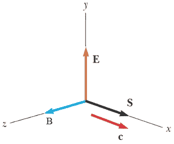
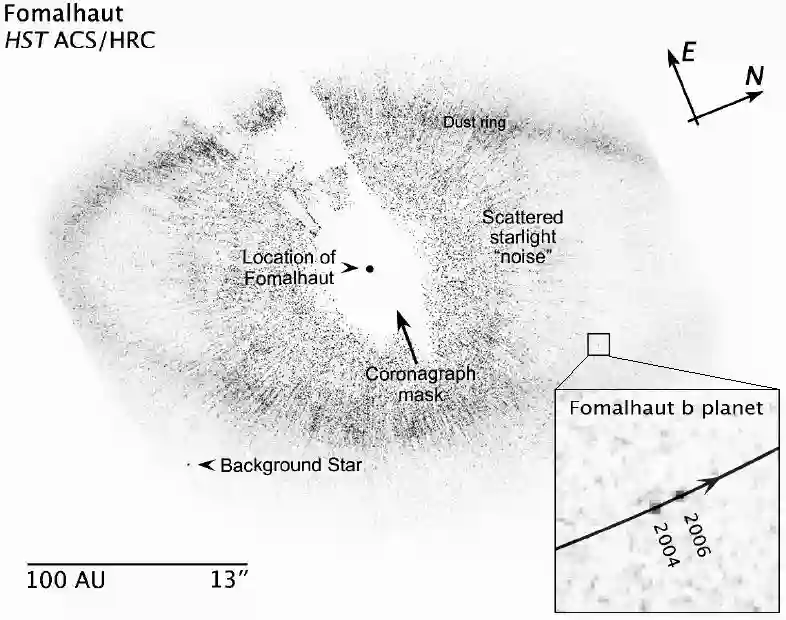

[[Състезания/esenno/st/2017|◂ 2017]] | [[Състезания/esenno/st-r/2018|решения]] | [[Състезания/esenno/st/2019| 2019 ▸]]

**Задача 1. Вектор на Пойнтинг**

Векторът на Пойнтинг $\vec{S}$ описва разпространението на електромагнитната (ЕМ) енергия в пространството. Дефинира се по следния начин. Посоката му съвпада с посоката на разпространение на енергията, а големината му е равна на енергията преминала за единица време през единица площ, перпендикулярна на посоката на $\vec S$. В тази задача ще изведете формула за $\vec S$ за монохроматична ЕМ вълна във вакуум, изразен чрез интензитета на електричното поле $\vec E$ и индукцията на магнитното поле $\vec B$. За целта следвайте стъпките, описани в долните подточки.

а) Най-напред да допуснем, че пространството е еднородно изпълнено с ЕМ енергия с плътност $\rho$, която се разпространява в определена посока, напр. в хоризонтално направление (фиг. 1), със скоростта на светлината $c$. Намерете количеството енергия ($S$), преминала за единица време през единица площ, перпендикулярна на посоката на разпространение. Полученият израз трябва да съдържа $\rho$ и $c$. \[1 т.\]

Тъй като пространството е изпълнено с електрично и магнитно поле, плътността на енергията е сума от плътността на енергията на електричното поле и тази на магнитното поле: $\rho = \rho_E + \rho_B$. За да намерите $\rho_E$, разгледайте зареден плосък кондензатор без диелектрик. Знаем, че в добро приближение на безкраен кондензатор, т.е. когато размерът на плочите е много по-голям от разстоянието между тях, електричното поле е локализирано изцяло между плочите на кондензатора, където то е еднородно. Знаем също така, че енергията на зареден кондензатор може да се интерпретира като енергия на електричното поле, което той създава. Следвайте стъпките:

б) Изведете формула за капацитета $C$ на безкраен плосък кондензатор, изразен чрез площта на плочата $A$, разстоянието между двете плочи $d$ и фундаментални константи. Като междинна стъпка получете интензитета на електричното поле в обема на кондензатора с помощта на теоремата на Гаус. \[1 т.\]

в) Изведете формула за електростатичната енергия $W_E$ на кондензатора, изразена чрез капацитета $C$ и напрежението между плочите $U$. \[1 т.\]

г) Използвайки получения резултат, изведете формула за $\rho_E$, изразена чрез интензитета $E$ и фундаментални константи. Приемете, че енергията на безкрайния кондензатор $W_E$ е съсредоточена изцяло в обема му. \[1 т.\]

Аналогично, за да намерите $\rho_B$, разгледайте соленоид, по който тече постоянен ток. В добро приближение на безкраен соленоид, когато дължината на соленоида е много по-голяма от радиуса му, полето е локализирано изцяло в обема на соленоида, където то е еднородно.Следвайте стъпките:

д) Изведете формула за индуктивността $L$ на безкраен соленоид. Като междинна стъпка изведете магнитнaтa индукция в обема на соленоида с помощта на теоремата за циркулацията. Означете дължината с $l$, площта на напречното сечение с $A$, а броя намотки на единица дължина с $n$. \[1 т.\]

е) Изведете формула за магнитната енергия $W_B$ на соленоида, изразена чрез индуктивността $L$ и тока $I$. \[1 т.\]

ж) Използвайки получения резултат, изведете формула за $\rho_B$, изразена чрез индукцията $B$ и фундаментални константи. Приемете, че енергията на безкрайния соленоид $W_B$ е съсредоточена изцяло в обема му. \[1 т.\]

з) Напишете израз за плътността $\rho$. \[1 т.\]

Разгледайте електромагнитна вълна във вакуум, разпространяваща се по оста $x$, както е показано на фиг. 2. Връзката между големините на електричното поле и магнитното поле във всеки момент е $B = \sqrt{\epsilon_0\mu_0}E$.

и) Изведете формула за големината $S$ на вектора $\vec{S}$, в която участват полетата $E$ и $B$. Използвайте резултата от подточка а), както и формулата за скоростта на светлината: $c = \frac{1}{\sqrt{\epsilon_0\mu_0}}$. \[1 т.\]

й) Изведете формула за вектора $\vec{S}$, която трябва да задава не само големината на вектора, но и посоката му. Посоките на векторите $\vec{E}$, $\vec{B}$ и $\vec{S}$ са указани на фиг. 2. \[1 т.\]

Упътване:

Теорема на Гаус: $\oint \vec{E}.\vec{dA} = \frac{q_\text{з}}{\epsilon_0} $, където интегрираме по повърхност, заграждаща заряд $q_\text{з}$.

Теорема за циркулацията: $\oint \vec{B}.\vec{dl} = \mu_0 I_\text{з}$ където интегрираме по контур, заграждащ ток $I_\text{з}$.

**Задача 2. Механика**

**Част 1**

Фигура 3 показва изображение от телескопа Хъбъл на Fomalhaut b - първата планета извън Слънчевата система, наблюдавана във видима светлина. Планетата обикаля в орбита около звездата Fomalhaut. Мащабът на по-голямото изображение е показан в долния ляв ъгъл на Фиг. 3.

а) Планетата обикаля по кръгова орбита с радиус $R_B$ и период $T_B$. За две години тя изминава разстояние $s$, което може да бъде измерено от фигурата. Изведете израз за масата $M_B$ на звездата, съдържащ $R_B$, $T_B$, масата на Слънцето $M_S$ и фундаментални константи. \[2 т.\]

б) Оценете масата на звездата в Слънчеви маси. Приемете, че орбитата на планетата е кръгова и че равнината на орбитата съвпада с равнината на изображението. Спомнете си, че Земята обикаля около Слънцето по орбита с радиус 1 астрономична единица ($R_S = 1\mathrm{\ AU}$) за 1 година ($T_S = 1\mathrm{\ Y}$). \[1 т.\]

в) Въведете означението $r = \frac{M_B}{M_S}$. Оценете относителната грешка на $r$, при положение, че относителните грешки при измерване на $s$ и $R_B$ са 10\%. Напишете долна и горна граница за $r$. \[2 т.\]

Упътване: Нека $r = \alpha X^aY^bZ^c$, където $\alpha$, $a$, $b$ и $c$ са константи, а $X$, $Y$ и $Z$ са променливи. Ако дефинираме грешката в $r$ като средноквадратично отклонение от средната стойност: $\Delta r = \sqrt{\bar{r^2}}$, относителната грешка се смята по следната формула:
$$\left(\frac{\Delta r}{r}\right)^2 = \left(a\frac{\Delta X}{X}\right)^2 + \left(b\frac{\Delta Y}{Y}\right)^2 + \left(c\frac{\Delta Z}{Z}\right)^2$$

**Част 2**

Маслена капка с маса m и пренебрежими размери e изстреляна вертикално нагоре със скорост $v_0$. Силата на съпротивлението от страна на въздуха е пропорционална на скоростта: $F = -kv$. Капката се издига до височина $h$ и след време $t_f$ пада в първоначалната точка от своята траектория. Земното ускорение е $g$. Намерете:

г) израз за скоростта $v$ на капката като функция на времето $t$; \[2 т.\]

д) времето $t_h$, за което капката се издига до най-високата точка от траекторията си; \[1 т.\]

е) максималната височина $h$. \[2 т.\]

**Задача 3. Ефект на Доплер**

**Част 1**

На фиг. 5 е показан монохроматичен източник на звук (А), който се движи праволинейно с постоянна скорост $v$. Векторът на скоростта е насочен под ъгъл $\theta$ спрямо правата, свързваща източника с приемник (В). Източникът излъчва звук с постоянна честота $f$. Ефектът на Доплер се изразява в това, че честотата $f'$, регистрирана от приемника, се различава от излъчената честота $f$. Скоростта на звука е c.

а) Изведете формула за честотата $f'$ като функция на $f$, $v$, $c$ и $\theta$. \[2 т.\]

**Част 2**

Звуковият източник преминава край приемника. Началното разстояние, от което той потегля, е огромно, така че първоначално ъгълът $\theta$ е приблизително нула. На фиг. 6 е показана регистрираната честота $f'$ като функция на времето. Скоростта на звука е 340 m/s. Изведете аналитичен и числен израз за:

б) скоростта $v$ и честотата $f$. \[1 т.\]

в) най-малкото разстояние $d$ между източника и приемника. \[3 т.\]

**Част 3**

Човек се е скрил под скална козирка с цел да се предпази от проливен дъжд. В даден момент козирката рухва и човекът започва да крещи с честота $f = 3 \mathrm{\ KHz}$. Земното ускорение е $g = 10 \mathrm{\ m/s^2}$. Изведете формула за:

г) честотата $f'$, която "чува" козирката. \[2.5 т.\]

д) честотата $f''$ на отразения от козирката звук, който чува човекът. \[2.5 т.\]

