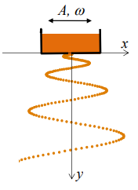
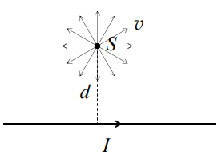

[[Състезания/esenno/st/2018|◂ 2018]] | [[Състезания/esenno/st-r/2019|решения]] | [[Състезания/esenno/st/2022| 2022 ▸]]

**Задача 1. Падащ пясък**

Кутия, пълна с пясък, трепти хармонично в хоризонтално направление с амплитуда $A$ и кръгова честота $\omega$ (фиг. 1). Пясъкът изтича от малък отвор в дъното на кутията. Можете да приемете, че песъчинките се отделят една след друга, без да се удрят помежду си. Съпротивлението на въздуха се пренебрегва. Земното ускорение е $g$.

1) Падащият пясък оформя специфична вълниста струя, както е показано на фиг. 1. Получете уравнението $x = x(y)$, което описва формата на струята в момента, когато кутията минава през равновесното си положение, движейки се надясно. Началото на координатната система съвпада с положението на отвора в този момент. **[6 т]**

2) Кутията се намира на височина $H$ над пода. Приемете, че падащите песъчинки залепват за пода, без да отскачат от него. Колко е дължината $L$ на образуваната върху пода пясъчна следа? **\[4 т]**

**Задача 2. Магнитен капан**

Източник $S$ на положителни йони с еднаква маса $m$ и еднакъв заряд $q$ се намира на разстояние $d$ от праволинеен проводник, по който тече ток $I$(фиг. 2). Йоните се излъчват с еднаква по големина скорост $v$ във всички възможни посоки в равнината, в която лежат източникът и проводникът.

1) Определете минималното ($r_{\min}$) и максималното ($r_{\max}$) разстояние до проводника, които може да бъдат достигнати от йоните. **\[5 т]**

2) На общ чертеж изобразете качествено траекториите на йоните, достигащи съответно минимално и максимално разстояние до проводника. **\[2 т]**

3) Ако скоростта на йоните е толкова малка, че $|r_{\max} - r_{\min}| \ll d$, движението на йоните може да се разглежда приблизително като обикаляне по окръжност, чийто център бавно се премества с определена "дрейфова" скорост $v_d$ ($v_d \ll v$) успоредно на проводника. Получете приблизителен израз за дрейфовата скорост на йон, излъчен перпендикулярно на проводника. **\[3 т]**

**Задача 3. Топлинна леща**

При падане на интензивен лазерен сноп върху плоска полупрозрачна пластинка е възможно преминалата светлина да се "самофокусира" в определена точка зад пластината. Този ефект, наречен "топлинна леща", се дължи на неравномерното загряване на пластината и се наблюдава във вещества, чийто показател на пречупване нараства при повишаване на температурата. 

Тънка кръгова пластинка с радиус $a = 5.0 \mathrm{\ mm}$ и дебелина $b = 0.5 \mathrm{\ mm}$ се намира в топлинен контакт с кръгова метална рамка, чиято температура се поддържа постоянна и равна на стайната температура $T_1$ (фиг. 3). Материалът на пластинката има коефициент на топлопроводност $k = 1.0 \mathrm{\ W.m^{-1}.K^{-1}}$ и показател на тречупване, който зависи от температурата по закона:
$$n(T) = n_1 + \gamma(T-T_1)$$
където $n_1 = 1.50$ е показателят на пречупване на материала при стайна температура, а $\gamma = 2.5 \times 10^{-4} \mathrm{\ K^{-1}}$ е т.нар. температурен коефициент на показателя на пречупване, характерен за дадения материал. Върху пластината пада нормално успореден лазерен сноп с интензитет $I = 10 \mathrm{\ mW.mm^{-2}}$, който е постоянен по цялата осветена повърхност на пластинката. Половината от падащата светлинна енергия се поглъща от материала на пластината. Топлообменът на пластината с околния въздух се пренебрегва.

1) Получете функционалната зависимост $T(r)$ на температурата $T$ на пластината от разстоянието $r$ до нейния център. Колко е разликата $\Delta T$ между температурата в центъра на пластината и по нейната периферия? **\[5 т]**

2) Ако приемете, че изменениeто на показателя на пречупване на пластината поради нейното загряване е сравнително малко, получете приблизителен израз и пресметнете числено фокусното разстояние $f$ на тази леща. **\[5 т]**
