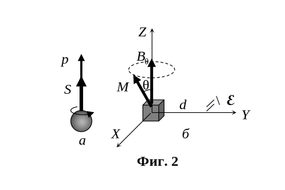
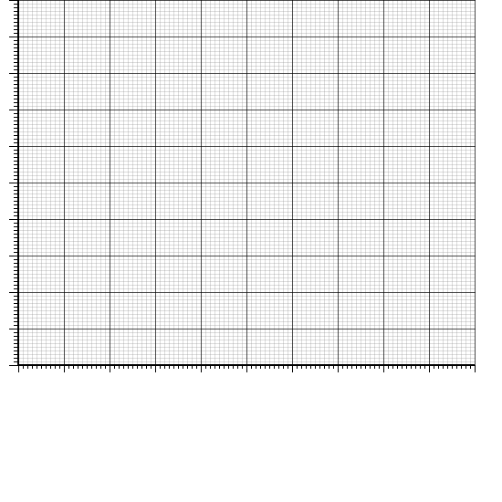

[[Състезания/esenno/st/2019|◂ 2019]] | [[Състезания/esenno/st-r/2022|решения]] | [[Състезания/esenno/st/2023| 2023 ▸]]

**И в трите задачи можете да приемете като дадени следните физични константи:**

земно ускорение. $g = 9.80 \mathrm{\ m/s^2}$:

число на Авогадро, $N_A = 6.02 \times 10^{23}\mathrm{\  mol^{-1}}$;

константа на Планк, $h = 6.63 \times 10^{-34} \mathrm{\ J.s}$;

скорост на светлината във вакуум, $c = 3.00 \times 10^8 \mathrm{\ m/s}$;

елементарен електричен заряд, $e = 1.60 \times 10^{-19} \mathrm{\ C}$.

редуцирана константа на Планк, $\hbar = h/(2\pi) = 1.05 \times 10^{-34} \mathrm{\ J.s}$;

електрична проницаемост на вакуума, $\varepsilon_0 = 8.85 \times 10^{-12} \mathrm{\ F/m}$; 

магнитна проницаемост на вакуума. $\mu_0 = 4\pi \times 10^{-7} \mathrm{\ H/m}$;

**Задача 1.** Преобръщане на пръчка.

Тънка еднородна пръчка с дължина $l = 10 \mathrm{\ cm}$ е поставена върху хоризонтална маса, както е показано на фиг. 1 а. Центърът С на пръчката е отместен на разстояние $x = 1 \mathrm{\ cm}$ навън спрямо ръба на масата. Първоначално пръчката е в покой. Поради нарушеното равновесие, пръчката започва да се преобръща около ръба на масата.

При какъв ъгъл $\alpha$ между пръчката и хоризонта (вж. фиг. 1 б) пръчката ще започне да се хлъзга спрямо ръба на масата? **\[10.0 T]**

Коефициентът на триене между пръчката и масата е $\mu = 0.50$.
 

**Задача 2.** Ядрен магнитен резонанс

 

Протонът може да бъде оприличен (само илюстративно) на малко кълбо, въртящо се около собствената си ос (фиг. 2, а). Това въртене се нарича спин и отговаря на спинов момент на импулса $\vec S$, Наричан накратко също спин, с големина:
$$ S = \frac{\hbar}{2} $$
където $\hbar = h/(2\pi)$ с редуцираната константа на Планк. За разлика от въртящо се кълбо обаче протонът не може да ускорява или забавя въртенето си, т.е. неговият спин може да се изменя само по посока, но не и по големина. Поради спина протонът е еквивалентен на кръгов ток и притежава собствен магнитен момент $p_m$ с големина:
$$ p_m = 1.40 \times 10^{-26} \mathrm{\ A.m^2}. $$
Векторът на магнитния момент на протона е еднопосочен с вектора на спиновия му момент (вж. фиг. 2, а).

Кристалче захар (т.е. захароза с химична формула $C_{12}H_{22}O_{11}$) с маса $m = 1.00 \mathrm{\ mg}$ се намира в еднородно външно магнитно поле с индукция $B_0 = 5.00 \mathrm{\ T}$ в посока на оста $Z$ на координатната система. Можете да разглеждате кристалчето като материална точка в центъра на координатната система. В състояние на равновесие магнитните моменти на всички протони във водородните атоми са ориентирани по посока на магнитното поле. Приемете, че ядрата на въглерода и кислорода нямат магнитен момент.

а) Пресметнете големината $M$ на общия магнитен момент и $L$ на общия момент на импулса на кристалчето. **\[2.0 т]**

б) Върху кристалчето за кратко е приложено допълнително магнитно поле с индукция по оста $X$. При това магнитните моменти на протоните се "накланят" в една и съща посока в равнината $XZ$, под ъгъл $\theta = 30^{\circ}$ спрямо оста 2 (фиг. 2, б). Определете големината и посоката на общия въртящ момент $\vec T$, действащ на протоните в кристалчето, след като допълнителното магнитно поле бъде изключено? **\[1.5 т]**

в) След изключване на допълнителното магнитно поле, магнитният момент на кристалчето започва да прецесира, т.е. векторът $\vec M$ описва" конична повърхност около вектора $\vec B_0$, както е илюстрирано на фиг. 2, б. Получете израз за ъгловата скорост $\omega$ на прецесията и пресметнете числената й стойност. **\[3.0 т]**

г) На разстояние $d = 5.0 \mathrm{\ cm}$ по оста $Y$ се намира единична кръгова намотка с площ на напречното сечение $A = 1.0 \mathrm{\ cm^2}$ (вж. фиг. 2, 6). Равнината на намотката e перпендикулярна на оста $Y$. Определете ефективната стойност $\varepsilon_{\mathrm{eff}}$ на индуцираното в намотката ЕДН поради прецесията на магнитния момент на кристалчето. **\[3.5 т]**

**Задача 3.** Сапунен мехур

От сапунен разтвор с показател на пречупване $n = 1.35$ е издут сферичен мехур. Мехурът е осветен с естествена разсеяна светлина и е сниман през цветен филтър, който пропуска монохроматична светлина с дължина на вълната $\lambda = 550 \mathrm{\ nm}$. Получената снимка е показана на фиг. 3. Приемете, че мехурът има постоянна (неизвестна) дебелина а по цялата си повърхност.
Като правите измервания по снимката, определете дебелината $d$ на сапунения мехур. Приемете, че дебелината на мехура е много по-малка от неговия радиус R и фотоапаратът се намира от мехура на разстояние, много по-голямо от $R$. Ако решението налага, можете да чертаете графика на координатната мрежа, дадена под снимката. **В този случай предайте този лист заедно с останалите листа от вашето решение.** **\[10.0 т]**