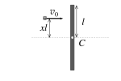
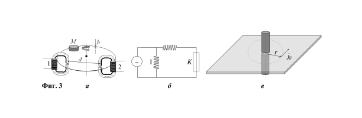

**Задача 1. Последователни удари**

Тънка еднородна пръчка с маса $m$ и дължина $2l$ се намира в покой върху гладка хоризонтална повърхност (фиг. 1). В пръчката, на разстояние $xl (0\leq x\leq1)$ от центъра ѝ С, се удря малко топче (материална точка) със същата маса $m$ и начална скорост $v_0$, перпендикулярна спрямо пръчката. Ударът между топчето и пръчката е идеално еластичен. Силата на тежестта и силата на триене не се отчитат.

а) Получете изрази за скоростта $v_1$ на топчето, скоростта $v_C$ на центъра на пръчката и ъгловата ѝ скорост $\omega$ в момента непосредствено след удара. **\[7.0 т]**

б) При определена стойност $x_0$ на параметъра пръчката и топчето се удрят втори път, след което пръчката остава в покой. Намерете $x_0$ и преместването $d$ на центъра на пръчката между двата удара. **\[3.0 т]**
*Полезна формула.* Инерчният момент на еднородна пръчка с маса $M$ и дължина $L$ спрямо ос, минаваща през центъра ѝ, е $1/12 ML^2$.

**Задача 2. Неустойчивост на Плато-Рейли**

Течност, изтичаща от кръгов отвор, оформя струя, която на определено разстояние от отвора се раздробява спонтанно на отделни капки. Това явление се нарича неустойчивост на Плато-Рейли по името на френския физик Плато, който го е изследвал експериментално, и английския физик Рейли, който го е обяснил теоретично.

а) Според теорията на Рейли неустойчивостта на струята се дължи на повърхностното напрежение на течността, като гравитацията и вискозитета на течността не се отчитат. Затова в предложения от Рейли модел се разглежда много дълъг цилиндричен стълб течност с радиус , който е неподвижен в състояние на безтегловност (фиг. 2, а). Това не е ограничение на общността, защото всяка струя течност би изглеждала неподвижна за наблюдател в отправна система, движеща се със скоростта на струята. Рейли показал, че струята се разпада на капки поради малки случайни нарушения на идеалната ѝ цилиндрична форма, които обикновено възникват при изтичането ѝ от изходния отвор.

Всяко нарушение на цилиндричната форма може да се представи като суперпозиция на хармонични вълни по дължината на стълба течност, както е показано на фиг. 2, б. Силите на повърхностно напрежение свиват още повече стеснените участъци, докато уширените участъци допълнително се раздуват. След определено време струята се разпада на отделни капки. Като използвате метод на размерностите, получете израз за посредством , повърхностното напрежение и плътността на течността. **\[2.0 т]**

б) Да разгледаме конкретна вълна с дължина $\lambda$ и амплитуда $A\ll r_0$, която води до модулация на радиуса на стълба течност от вида:
$$r(x) = r_0 + A\sin(kx),$$
където $x$ е координата по оста на струята, както е показано на фиг. 2, б.

б1. Получете връзка между параметъра $k$ и дължината $\lambda$ на вълната. **\[1.0 т]**

б2. Като вземете предвид, че течността е неподвижна, получете израз за налягането $p_\text{ш}$ в най-широката и $p_\text{т}$ в най-тясната част на струята. **\[2.0 т]**

б3. Колко е минималната дължина $\lambda_{\min}$ на вълната, при която стълбът течност е неустойчив, т.е. амплитудата на вълната нараства с времето, докато струята се разпадне на капки? **\[2.0 т]**

б4. Колко е минималният радиус $r_{\min}$ на получените капки, ако приемете, че те имат сферична форма? **\[1.0 т]**

в) На фиг. 2, в е снимана струя дестилирана вода, която изтича от отвор с радиус $r_0 = 1.0~\mathrm{mm}$ с начална скорост $v_0 = 5.0~\mathrm{cm/s}$, а на фиг. 2, г - струя сапунен разтвор, изтичаща със същата скорост от отвор със същия радиус. Като използвате данни от снимките, оценете стойността на безразмерния коефициент $C$ в получения от вас израз за времето и определете приблизително повърхностното напрежение $\sigma_1$ на сапунения разтвор. **\[2.0 т]**

**Упътване**
- Подусловията може да бъдат решавани и в ред, различен от дадения в задачата.
- Според формулата на Лаплас, налягането под изкривена повърхност на течността се дава с израза:
$$p=\sigma(1/R_1+1/R_2),$$
където $R_1$ и $R_2$ са радиусите на кривината в две взаимно перпендикулярни сечения на повърхността, както е илюстрирано на фигурата по-долу. За изпъкнало сечение $R>0$, а за вдлъбнато $R<0$.
- За радиуса $R$ на кривината на графиката на функцията $y(x)$ в локалния минимум/максимум е в сила:
$$1/R = -y''(x)$$

**Полезни данни**
Земно ускорение, ;
Плътност на водата и на сапунения разтвор, ;
Повърхностно напрежение на дестилираната вода, .

**Задача 3. Електромер за променлив ток**

На фиг. 3, а е илюстрирано принципното устройство на индукционен електромер - уред за отчитане на консумирана електрична енергия в променливотокови вериги. На фиг. 3, б е показана еквивалентната схема на свързване на електромера в електрическата мрежа. *Напрежителната намотка* 1 е свързана непосредствено към източник на променливо напрежение $U(t)$ с кръгова честота $\omega$ и амплитуда $U_{\max}$:
$$U(t) = U_{\max}\sin(\omega t)$$
Токовата намотка 2 е свързана последователно към консуматора $K$ на електрична енергия. Намотките имат съответно индуктивност $L_1$ и $L_2$, брой навивки $N_1$ и $N_2$ и пренебрежимо съпротивление. Тънък алуминиев диск с дебелина $b$ и със специфично съпротивление $\rho$ може да се върти без триене около вертикална ос, като минава през тънки прорези в сърцевините на намотките. Постоянният магнит $M$ играе роля на "магнитна спирачка", чието действие няма да бъде разглеждано по-нататък. Приемете, че сърцевините на намотките са "идеални магнитопроводи", т.е. магнитните индукционни следват сърцевината по цялата ѝ дължина, като пресичат минаващия през процепа диск, както е илюстрирано с пунктираните криви на фиг. 3, а.

а) Получете израз за тока $I_1(t)$ в напрежителната намотка като функция на времето. **\[2.5 т]**

б) Поради променливия ток в напрежителната намотка, в диска се индуцират кръгови токове - т.нар. токове на Фуко. Получете израз за моментната стойност $j_F(t,r)$ на плътността* на токовете на Фуко на разстояние $r$ от центъра на процепа, през който минава дискът (фиг. 3, в). Разгледайте само разстояния $r$, по-големи от радиуса на процепа. Приемете, че хоризонталните размери на алуминиевия диск са толкова големи, че можете да го разглеждате като безкрайна равнина. **\[3.5 т]**

в) Взаимодействието между токовете на Фуко и магнитното поле на токовата намотката 2 поражда сила, която упражнява въртящ момент върху алуминиевия диск. Докажете, че средната сила $\bar F$, действаща на алуминиевия лист, е пропорционална на средната мощност $\bar P$, която се отделя в консуматора:
$$\bar F = k\bar P$$
и изразете константата $k$ чрез дадените в условието параметри и разстоянието между центровете на прорезите в двете намотки. Приемете, че диаметърът на прорезите е много по-малък от $d$ (т.е. намотките са безкрайно тънки ☺). **\[4.0 т]**

* По определение плътността на тока, $\vec j$, е вектор по допирателната към токовата линия, минаваща през дадена точка (вж. фиг 3, в). Големината на е равна на тока през единица площ, перпендикулярна на токовата линия. Единицата за $j$ е А/m$^2$. Съответно, токът през малка ориентирана площ $d\vec S$ е $dI = \vec j\cdot d\vec S$. Законът на Ом в т.нар. *диференциална форма* гласи, че в дадена точка от проводника $\vec j = \vec E/\rho$, където $\vec E$ е интензитетът на електричното поле в тази точка, а $\rho$ е специфичното съпротивление на материала.
