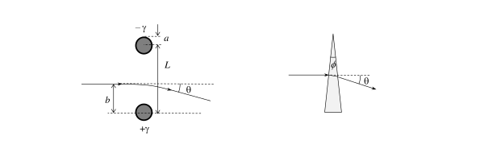

**Задача 1. Трептяща гира**

Две топки с маса $m_1 = 1.00\ \mathrm{kg}$ и $m_2 = 2.00\ \mathrm{kg}$ съответно са
свързани с недеформирана пружина с коефициент на еластичност $k = 150\ \mathrm{N/m}$ . Топките се движат успоредно на пружината с еднаква скорост $v_0 = 0.30\ \mathrm{m/s}$ към стена, перпендикулярна на посоката им на движение, както е показано на Фиг. 1. След като топката 1 се удари в стената, тя отскача от нея абсолютно еластично в посока,
противоположна на първоначалната посока на движение. Силата на тежестта не се отчита.
а) Намерете по абсолютна стойност максималната деформация $\Delta l$ на пружината след
удара. Приемете, че дължината на пружината е достатъчно голяма, така че топките не
се удрят помежду си. **\[3.5 т]**

б) Колко време след удара със стената топките се доближават на минимално разстояние
една до друга? **\[3.0 т]**

в) Колко време след първия удар със стената топката 1 се удря в стената за втори път?

В тази подточка не е нужно да получите аналитичен отговор, а единствено числена
стойност с точност до стотна от секундата. **\[3.5 т]**

**Задача 2. Електростатична призма**

За получаване на образ на субмикронни обекти, в електронните микроскопи се изпозват снопове от ускорени електрони. Затова в електронните микроскопи има електрични и магнитни системи, например електростатични или магнитни лещи, които отклоняват електронния сноп, както съответните оптични системи в светлинен микроскоп отклоняват светлинните лъчи. В тази задача ще анализирате проста електростатична система, която отклонява електронен сноп, подобно на призма. При решението на задачата не е нужно да се отчитат релативистки ефекти.

а) Безкрайно дълга права нишка е заредена положително с постоянна линейна плътност $\gamma$ на заряда.$^1$ Колко е интензитетът $E(r)$ на електричното поле на разстояние r от
нишката? **\[1.5 т]**

б) На фиг. 2а е показано напречното сечение на две дълги успоредни праволинейни жички с радиус $a$ всяка, и разстояние $L$ между осите им ($L\gg a$). Жичките са свързани към източник на напрежение $U$, при което се зареждат с противоположен по знак заряд с линейна плътност $+\gamma$ и $-\gamma$ съответно. Изразете $\gamma$ като функция на дадените параметри. В крайния отговор можете да пренебрегнете a в сравнение с $L$, там където е
възможно. **\[2.0 т]**
$^1$ Линейната плътност $\gamma$ се дефинира като заряд на единица дължина от нишката, т.е. $dq/dl$, и се измерва
с кулони върху метър (C/m).

в) Сноп електрони, предварително ускорени от електрично напрежение $V$, e насочен перпендикурярно на равнината, образувана от двете жички, към точка на разстояние $b$ ($a<b<L$) от оста на положително заредената жичка (вж. фиг. 2а). Източникът на електрони се намира от жичките на разстояние, много по-голямо от $L$. Може да приемете, че $V\gg U$, така че електричното поле отклонява преминалите между жичките
електрони на много малък ъгъл $\theta$ спрямо началната им посока на движениe, т.е. $\theta\ll1\ \mathrm{rad}$. Получете приблизителен израз за чрез дадените параметри. **\[3.5 т]**

*Упътване.* Задачата може да бъде решена по метода на последователните приближения, който се състои в следното. В най-грубо (т.нар. *нулево*) приближение напълно се пренебрегва електричната сила, действаща на електроните, и се приема, че те се движат практически равномерно по права линия, пресичаща равнината между двете жички на разстояние $b$ от оста на положително заредената жичка. Електричната сила се отчита в следващото (т.нар. първо) приближение. За целта се разглежда равномерно и праволинейно движещ се електрон, за който се пресмята импулса на действащата му електросктатичната сила, а оттам и малката промяна на скоростта, дължаща се на тази сила.

г) Електричното поле на жичките отклонява електронния сноп така, както призма с малък ъгъл при върха отклонява лъч светлина. Колко дъгови минтути трябва да бъде ъгълът при върха на стъклена призма с показател на пречупване $n = 1.50$, така че лъч светлина да се отклони на същия ъгъл , както електронният сноп, минал между жичките (фиг. 2б). Параметрите на електростатичната призма са $a = 0.100\ \mathrm{mm}$; $L = 1.00\ \mathrm{cm}$; $U = 100 V$; $V = 10.0 kV$. Приемете, че светлинният лъч пада под малък ъгъл спрямо нормалата към страничната повърхност на призмата. **\[3.0 т]**

**Задача 3. Раждане на електрон-позитронна двойка**

Позитронът е античастицата на електрона - има същата маса като електрона, но противоположен заряд. При взаимодействие на електрон и позитрон е възможна т.нар. анихилация, при която двете частици изчезват и се появяват два високоенергетични фонтона ($\gamma$-кванти). Обратният процес теоретично е възможен, но на практика е малковероятен. Затова при облъчване на вещество с $\gamma$-кванти, електрон-позитронни двойки възникват при взаимодействие на фотоните със заредени частици - атомни ядра или електрони от електронната обвивка на атомите. Може да приемете, че преди взаимодействието с $\gamma$-кванта заредената частица е неподвижна.

а) Получете израз за минималната енергия $E_\gamma$ на $\gamma$-квант, взаимодействащ с частица с маса $M$ в покой, така че фотонът да изчезне и да се роди двойка електрон и позитрон. **\[7.0 т]**

б) Пресметнете $E_\gamma$ в мегаелектронволти при взаимодествие на фотона с: 1) тежко атомно ядро ($M\gg m_e$) и 2) с електрон ($M=m_e$), където $m_e$ е масата на електрона в покой. **\[3.0 т]**

**Физични константи, които можете да използвате във всички задачи:**

Земно ускорение
Гравитационна константа
Маси на частиците
 - електрон
 - протон
 - неутрон
Елементарен електричен
заряд
Константа на Кулон
Електрична константа
Магнитна константа
Скорост на светлината
Константа на Планк
Редуцирана константа на Планк

Някои таблични интеграли: