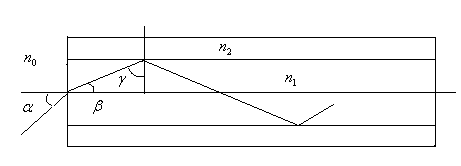

1. Във върховете на равностранен триъгълник със страна a = 6 cm са разположени заряди
 q1 = 6.10 -9 C , q 2 = q3 = -8.10 -9 C . Определете направлението и големината на силата
 действаща на заряд q = 6,67.10 -9 C , намиращ се в центъра на триъгълника.
 N $\neg$ m2
 Коефициентът на пропорционалност в закона на Кулон е k = 9.10 9 . Електричната
 C2
 C2
 константа е $\varepsilon$ 0 = 8,85.10 -12 .
 N $\neg$ m2

а) Направете чертеж на който покажете силите действащи върху заряда q . Определете
направлението на резултантната сила действаща върху заряда q . (2 точки)
б) Определете разстоянието между заряда q и останалите заряди (1 точка)
в) Определете големините на силите действащи върху заряда q . (2 точки)
г) Сравнете големините на силите F2 + F3 и F2 . (2 точки)
д) Намерете големината на резултантната сила действаща върху заряда q (3 точки)

2. Кух съд има цилиндрична форма, маса m = 10 kg и площ на напречното сечение S = 0,4 m 2 .
 Съдът плава (вертикално изправен) във вода със плътност $\rho$ = 1000 kg m 3 . Приемете земното
 ускорение за g = 10 m s 2 .

а) Опишете, пресметнете и сравнете силите действащи на съда в равновесие. Приемете, че обема
на потопената част на съда е V . (3 точки)

 Нека в резултат на действащо вертикално надолу кратко във времето външно въздействие съда
 се потапя на дълбочина x , след което се освобождава. Възникват вертикални хармонични
 трептения.
б) Определете посоката и големината на връщащата сила (3 точки)
в) Определете периода на възникналите вертикални хармонични трептения на съда. (3 точки)
г) Пресметнете честотата на хармоничните трептения. (1 точка)

3. Оптично влакно се състои от цилиндрична сърцевина с радиус а и показател на пречупване
 n1 = 1,500 и обвивка с пръстеновидно напречно сечение с показател на пречупване n2 = 1,414 .
 Краищата на влакното са перпендикулярни спрямо оста му и граничат с въздух ( n0 = 1 ). В
 единия край (срез) на влакното (виж Фиг. 1), пада светлинен лъч под ъгъл $\alpha$ спрямо оста му.

 Фиг. 1 схема на движението на лъча падащ върху оптичното влакно

а) Определете синуса на ъгъла на пречупване $\beta$ на падащия лъч в сърцевината на влакното.
 (1 точка)
б) Пресметнете синуса на граничния ъгъл $\gamma$ 0 на пълно вътрешно отражение за границата между
сърцевината и обвивката на оптичното влакно. (1 точка)
в) Напишете условието за ъгъла $\beta$ (спрямо оста на влакното) разпространяването под който
позволява реализирането на пълно вътрешно отражение на границата между сърцевината и
обвивката на оптичното влакно. Изразете условието чрез показателите на пречупване на
сърцевината и обвивката на оптичното влакно (1 точка)
г) Напишете условието за максималния ъгъл $\alpha$ MAX на падане на светлинен лъч върху сърцевината
на влакното, позволяващо реализирането на пълно вътрешно отражение на границата между
сърцевината и обвивката на оптичното влакно. Изразете условието чрез показателите на
пречупване на сърцевината и обвивката на оптичното влакно. (2 точки)

Нека приемем, че условието позволяващо разпространението на оптичния лъч в сърцевината на
влакното като резултат от последователно реализиращи се пълни вътрешни отражения е
изпълнено, като ъгъла на падане на лъча върху обвивката е $\gamma$ . Да приемем също така, че
дължината на влакното е L .
д) Пресметнете пътя S изминат от лъча преминавайки през влакното. (2 точки)
е) Пресметнете времето t необходимо на лъча за да достигне другия край на влакното. Приемете,
че скоростта на светлината във вакуум е с. (1 точка)

Нека разгледаме дисперсионното разширение на оптичен импулс разпространяващ се във
влакното. Оптичният импулс можем да разглеждаме като съвкупност от оптични моди. Всяка от
модите можем да представим с оптичен лъч, който се разпространява в сърцевината на влакното
по зигзагообразна траектория поради многократните вътрешни отражения на границата между
сърцевината и обвивката. Дисперсионното разширение на импулса при преминаване през влакното
можем да оценим чрез разликата във времената на преминаване на най-бавната (оптичен лъч
изминал най-дълъг път) и най-бързата (оптичен лъч изминал най-къс път) моди.

ж) Получете оценка за дисперсионното разширение на импулса при преминаване през влакното.
 (2 точки)

 2
