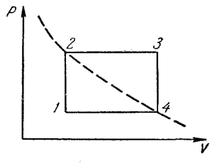
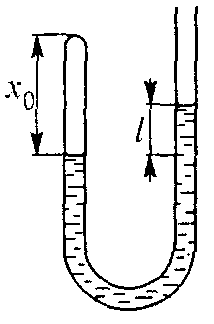

Задача 1. Топлинен двигател
На p,V - диаграмата е показан работният цикъл на топлинен двигател с работно
вещество определена маса въздух, която се разглежда като идеален газ. Той включва
два изохорни (1-2 и 3-4) и два изобарни (2-3 и 4-1) процеса. Минималната температура
 на газа е T1 , а максималната - T2 . Състоянията 2 и 4 лежат на
 една изотерма.
 а) Намерете температурата T на изотермата 2-4.
 б) Определете извършената от газа работа A за един работен
 цикъл. Резултатът изразете чрез минималната T1 и максимал-
 ната T2 температура на газа и газовата константа B .

 в) Пресметнете КПД $\eta$ на работния цикъл, ако е известно че вътрешната
енергия на газа в дадено състояние се дава с израза U = (5 / 2) BT .

 г) Определете допустимите стойности на $\eta$ за произволни T1 и T2 .

Задача 2. Трептящи системи

Част А: Тяло с маса m = 4 kg , което е прикачено към пружина с коефициент на
 k
 F
 m

еластичност k = 25 N/m , се намира в покой върху гладка хоризонтална равнина. В
даден момент върху тялото започва да действа хоризонтална постоянна сила F = 5 N .

 а) Намерете изминатото от тялото разстояние s до първото му спиране след
началото на движението.

 б) Определете времето t за изминаване на разстоянието s .

Част Б: (Заикин 1.72)

Живак с маса m = 16 g е налят в тръбичка със сечение S = 0,05 cm2 , която е запоена от едната страна. Разликата на нивата на живака в двете
 колена е l = 2 cm , а височината на въздушния стълб в запоения
 край е x0 = 4 cm . Намерете периода T на хармоничните
 трептения на живака в тръбичката, като приемете че процесите на
 свиване и разширение на газа са изотермни. Плътността на живака
 е $\rho$ = 13,6 g/cm3 , земното ускорение g = 9,8 m/s 2 , а атмосферното
 налягане - p0 = 1 atm $\approx$ 1,0.10 5 Pa .
 
Задача 3. Фотоефект. Топлинно лъчение

Част А: При последователно осветяване на повърхността на метал със светлина с
дължина на вълната $\lambda_1$ = 0,35 $\mu$m и $\lambda$ 2 = 0,54 $\mu$m е установено, че съответните
максимални скорости на фотоелектроните се различават една от друга $\eta$ = 2 пъти.

 а) Намерете отделителната работа A на метала в единици eV.

 б) Определете възможните стойности на дължината на вълната $\lambda$ на светлината,
при облъчване с която ще се наблюдава фотоефект за дадения метал.

Полезни константи: константа на Планк h = 6,63.10 -34 J.s , скорост на светлината във
вакуум c = 3.10 8 m/s , елементарен заряд e = 1,6.10 -19 C .

Част Б: Слънцето излъчва като абсолютно черно тяло с температура T = 5700 K .
Слънчевата светлина попада върху медна сфера, намираща се на Земята, като сферата
се разглежда също като черно тяло. Диаметърът на Слънцето се вижда от Земята под
ъгъл $\alpha$ = 0,5o . Каква ще бъде равновесната температура на медната сфера, достигната
като резултат само на поглъщането на слънчева светлина и излъчването на топлинно
лъчение (влиянието на Земята върху сферата се пренебрегва).

 Всяка задача се оценява максимално с 10 точки.
