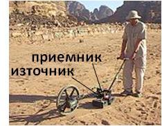
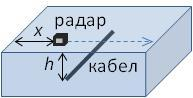

[[Състезания/proletno/10/2018|◂ 2018]] | [[Състезания/proletno/10r/2019|решения]] | [[Състезания/proletno/10/2021| 2021 ▸]]

Задача 1. Опити с монета

 В тази задача ще обясните два опита, които може да бъдат направени с монета.
И в двете подточки се разглежда монета от 5 ст. с маса и дебелина
 . Плътността на сплавта, от която е изработена монетата, е ,а
специфичният ѝ топлинен капацитет - . . Приемете, че монетата е
идеален цилиндър, т.е. можете да пренебрегнете релефните надписи и образи по
повърхността ѝ.
 Двете подточки са независими и може да бъдат решавани в произволен ред.
а) Монетата е поставена върху гладък лед с хоризонтална повърхност. Най-малко до
каква начална температура t1 (в градуси Целзий) трябва да бъде загрята монетата, така
че след достатъчно дълго време да се окаже изцяло замръзнала в леда? \[4,0 т\]
Приемете, че температурата на леда е малко под 0$^\circ$С. Плътността на леда е
$\rho_1$ = 900 kg/m3, а специфичната му топлина на топене - .
б) Монетата е поставена върху гърлото на бутилка. Можете да приемете, че отворът на
гърлото има практически същия диаметър като диаметъра на монетата. Ако обхванете
бутилката с ръце или я потопите в топла вода, е възможно след известно време
монетата да подскочи леко. С колко трябва да се повиши температурата на въздуха в
бутилката, така че да се наблюдава това явление? \[6,0 т\]
Преди монетата да бъде поставена, температурата на въздуха в бутилката е ,
а налягането му - , е равно на външното атмосферно налягане.
Земното ускорение е g = 9,8 m/s2.

Задача 2. Земен радар

 
 Земният радар е уред за откриване на метални
предмети, заровени под земната повърхност (фиг. 2, а).
Върху подвижна платформа са монтирани източник на
кратки радиосигнали и приемник на отразените от
металния предмет вълни. Можете да приемете, че
източникът и приемникът имат пренебрежими размери,
намират се практически в една точка и се допират до
земната повърхност. Земните радари работят в честотния
интервал от 10 MHz до 2,5 GHz, в който поглъщането на Фиг. 2, а
радиовълните от почвата е най-малко.

 В правоъгълен училищен двор трябва да бъде открит подземен кабел, успореден
на две от срещуположните страни на двора. За целта от едната към другата страна на
двора, перпендикулярно на кабела, се премества земен радар (фиг. 2, б), с който се
регистрира времето t между излъчването на радиосигнала и приемането на отразените
от кабела вълни на различни разстояния x от края на двора. На фиг. 2, в е дадена
графика на зависимостта на t от разстоянието x.

 Фиг. 2, б

 Фиг. 2, в

а) Като използвате наличните данни, определете дълбочината h, на която е заровен
кабелът, и скоростта u на радиовълните в почвата. \[5,0 т\]

б) След като местоположениeто на кабела било установено, на разстояние d = 50 cm от
него на същата дълбочина h бил заровен втори кабел. Оказало се, че когато радарът се
намира вертикално над единия от двата кабела, приемникът не регистрира отразени
вълни.
- На какво явление се дължи дължи този факт? Дайте кратко обяснение.
- Определете възможните честоти $\nu$ на радиовълната, при които радарът не регистрира
отразените от кабелите вълни. \[5,0 т\]

Задача 3. Трупчета и пружини

Две еднакви трупчета с маса m = 100 g всяко и три еднакви пружини с коефициент на
еластичност k = 100 N/m всяка са свързани, както е mоказано на фиг. , а. Краищата на
първата и на последната пружина са закрепени неподвижно. В състояние на равновесие
на трупчетата пружините не са деформирани. Триенето между трупчетата и
повърхността, по която се движат, се пренебрегва. Пресметнете честотата $\nu$ на
трептене и максималната скорост vmax на трупчетата в следните два случая:

а) Двете трупчета са отклонени на еднакви разстояния x = 1 cm в една и съща посока,
след което са оставени да трептят с нулева начална скорост (фиг. , б). \[3,5 т\]

б) Трупчетата са отклонени на еднакви разстояния x = 1 cm в противоположни посоки,
след което са оставени да трептят с нулева начална скорост (фиг. , в). \[6,5 т\]

 а

 б

 в
Фиг. 3

 2
