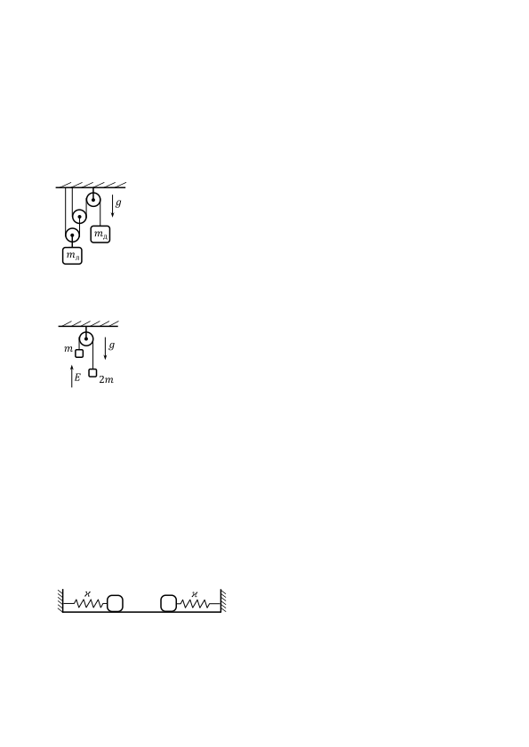

[[Състезания/proletno/10/2024|◂ 2024]] | [[Състезания/proletno/10r/2025|решения]]

Задача 1. Макари и трупчета

Част I Две трупчета с маси mл = 0,8 kg и mд = 0,1 kg са окачени на три
g безмасови макари свързани с две безмасови неразтегливи нишки, както е
показано на фигурата вляво. Лявото трупче виси от оста на подвижна
макара, през която е прекарана лявата нишка, чийто десен край е закачен
mд за оста на другата подвижна макара. Дясното трупче виси от десния край
на дясната нишка, която е прекарана през две макари - подвижна и
mл
неподвижна. Трупчетата са оставени да се движат свободно под действие
на силата на тежестта. Може да използвате, че земното ускорение е g $\approx$ 10 m/s2 .
Съпротивлението на въздуха да се пренебрегне.
а) На колко са равни ускоренията aл и aд на трупчетата? \[3,5 т.\]
б) Определете силите на опън Tл и Tд на двете нишки. \[1 т.\]

Част II Две малки трупчета с неизвестни маси m и 2m са окачени на
безмасова неразтеглива непроводяща нишка, прекарана през безмасова
m g неподвижна макара, както е показано на фигурата вляво. Системата се
намира в еднородно електрично поле с интензитет E = 106 N/C, насочен
E 2m нагоре. В началото трупчетата са заредени с равни по големина
разноименни заряди и се движат равномерно. В даден момент допираме
заредени тела до трупчетата, така че техните заряди запазват своята големина, но си сменят
знака. След това силата на опън на нишката намалява с 2 N, а системата започва да се движи
ускорително. Приемете, че земното ускорение е g $\approx$ 10 m/s2 . Съпротивлението на въздуха и
привличането между трупчетата да се пренебрегнат.
а) Намерете големината на ускорението a на трупчетата. \[3,5 т.\]
б) На колко е равна масата m? Каква е първоначалната сила на опън Tнач на нишката? \[1,5 т.\]
в) Определете големината q на зарядите на трупчетата. \[0,5 т.\]

Задача 2. Електростатика

Част I Интензитетът на електричното поле над земната повърхност е насочен вертикално
надолу и големината му е E $\approx$ 150 N/C. Малко топче има отрицателен заряд с големина q =
4 mC и първоначално е неподвижно. Топчето развива скорост с големина v = 2 m/s, след
като изминава разстояние s = 1 m. Намерете масата m на топчето, като разгледате всички
възможни случаи. Земното ускорение е g $\approx$ 10 m/s2 . Съпротивлението на въздуха да се
пренебрегне. \[3 т.\]

Част II Две еднакви малки теглилки са закачени на
еднакви изолирани безмасови пружини по начина,
показан на фигурата вляво. Коефициентът на
еластичност на пружините е $\kappa$. В началото теглилките не са заредени и разстоянието между
тях е l0 . Дадено е, че след като лявата теглилка е заредена положително с неизвестен заряд
q, а дясната теглилка е заредена отрицателно със заряд с неизвестна големина Q (q < Q),
равновесното разстояние между теглилките става l1 . След това теглилките са свързани
помежду си с тънък незареден проводник за много кратко време, при което техните заряди
почти мигновено стават еднакви по знак и големина. Новото равновесно разстояние между
теглилките е l2 . Константата на Кулон е k. Триенето се пренебрегва.
а) Определете големините на зарядите q и Q преди свързването. \[6 т.\]
б) На колко е равна сумарната сила, която действа на всяка една от теглилките,
непосредствено след свързването? \[1 т.\]

Задача 3. Електрически вериги

Част I Четири резистора и една идеална батерия са свързани по начина,
показан на фигурата вляво. Съпротивленията на три от резисторите са
известни: R1 = 100 $\Omega$, R2 = R3 = 200 $\Omega$. Електродвижещото напрежение
на батерията е $\mathcal E$ = 12 V. Мощността на четвъртия резистор е Px =
60 mW. Намерете съпротивлението Rx на четвъртия резистор. \[6,5 т.\]

Част II Кондензатор и резистор със съпротивление R = 20 $\Omega$ са свързани
успоредно на батерия с неизвестно вътрешно съпротивление. След това
$\mathcal E$ кондензаторът и резисторът са свързани последователно на батерията,
при което зарядът на кондензатора нараства с пет процента. Определете
вътрешното съпротивление r на батерията. \[3,5 т.\]
