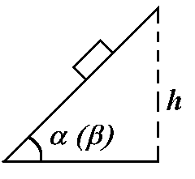

Задача 1. Тяло се спуска по наведена равнина.

 Ако едно тяло се спусне по наведена равнина с ъгъл на
наклона $\alpha$, то неговото движение е равномерно (Фигура 1).
 1) Направете чертеж със силите, действащи на тялото \[1т\].
 2) Определете коефициента на триене при хлъзгане на тялото
по наведената равнина \[2 т.\].
 Същото тяло се спуска по същата наведена равнина без
начална скорост, но при друг ъгъл на наклона $\beta$ ($\beta$ > $\alpha$) от височина h.
 3) Определете ускорението, с което тялото се движи в този
случай. \[3 т.\].
 4) Определете времето, за което тялото ще се спусне по Фигура 1.
наклонената равнина в този случай \[2 т.\].
 5) Определете работата на силата на триене при двата ъгъла: $\alpha$ и $\beta$ \[2 т.\].

Задача 2. Верига от резистори и волтметър

 В схемата на Фигура 2 електродвижещото напрежение на
акумулатора (с вътрешно съпротивление 0) е U = 100 V. Трите
съпротивления имат съответни числени стойности: R1 = 100 $\Omega$, R2
= 200 $\Omega$, R3 = 300 $\Omega$. Съпротивлението на волтметъра е RV = 2000
$\Omega$. Определете:
 1) общото съпротивление на цялата електрична верига
 \[2 т.\];
 2) токът I, който протича през съпротивлението R1 \[2 т.\];
 3) показанието на волтметъра \[2 т.\];
 4) токът I23, който протича през съпротивленията R2 и R3.
 \[1 т.\];
 5) мощността на електричния ток, която се отделя в трите Фигура 2.
 съпротивления \[3 т.\].

Задача 3. Събирателна леща

 Подвижна леща с фокусно разстояние F = 16 cm дава рязко изображение на неподвижен
предмет върху неподвижен екран при две нейни положения 1 и 2. Разстоянието между тези две
положения на лещата е l = 60 cm.
 1) Направете подходящ чертеж \[1 т.\];
 2) Определете разстоянието L от предмета до екрана \[6 т.\];
 3) Определете разстоянията (а1 и а2) между предмета и лещата в двата случая \[2 т.\];
 4) Определете отношението W между размерите на образите в двата случая \[1 т.\].
