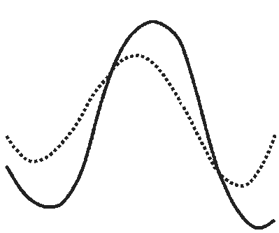
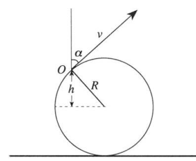

[[Състезания/proletno/11r/2010|решения]] | [[Състезания/proletno/11/2011| 2011 ▸]]

Задача 1. Велосипед в калта

Велосипед се движи върху кална повърхност. Предното колело и задното колело правят отделно следи в калта, както е показано на Фигура 1а.

 Фигура 1a Фигура 1б

а) Коя от следите е направена от предното колело и коя от задното колело? Обосновете отговора си. \[3т\]
б) Използвайки следите от Фигура 1а, определете в каква посока се движи велосипедът. Обосновете отговора си. \[3т\]

в) Ако задното колело има радиус R и се върти със скорост v спрямо оста на колелото (виж Фигура 1б), то намерете максималната височина ( H ), до която стигат пръските кал от колелото. \[4т\]

Упътване: За решението на условия а) и б) можете да ползвате всякакви чертожни инструменти.
При решаването на условие в) пренебрегнете съпротивлението на въздуха и отчетете, че калта може да се отделя при различни височини h от колелото (виж Фигура 1б ), които височини отговарят на различни ъгли $\alpha$ спрямо вертикалата (калта излита винаги по допирателна на колелото, виж Фигура 1б ).

Задача 2. Фотоелектричен ефект

Лазер с дължина на вълната $\lambda$ се фокусира върху плосък фотокатод от вакуумния
елемент, показан на Фигура 2. Между катода и анода на вакуумния елемент се подава постоянно напрежение U . Разстоянието между катода и анода е L и те са успоредни един на друг, както е показано на Фигура 2. Ако работата, необходима да се избие електрон от повърхността на метала е A , масата на електрона е m , а зарядът на електрона е e , то намерете:

а) При каква максимална дължина на вълната $\lambda_0$ , все още ще се излъчват електрони от
катода (червената граница). \[1.5т\]

б) Максималната скорост V1 , с която фотоелектроните се отделят от фотокатода (
при осветяване с лазера с дължина на вълната $\lambda$ ).\[1.5т\]

в) Максималната скорост V2 , с която електроните, избити от катода, достигат
анода.\[3т\]

г) Радиуса R на петното, в което попадат електроните върху анода. \[4т\]

 Фигура 2

Упътване: При решаването на задачата използвайте уравнението на Айнщайн за
фотоефекта. За условие г) приемете, че плочите на двата успоредни електрода образуват плосък кондензатор. Интензитетът на електричното поле E между плочите на плосък кондензатор е свързан с потенциала между двата електрода посредством равенството
 U
E = . Приемете също, че лазерът се фокусира върху катода в точка с пренебрежими
 L
размери.

Задача 3. Мънисто върху тел
 Гладка тел е огъната под формата на част от окръжност, както е показано на Фигура 3а.
Уравнението на окръжността се задава като ( y - R ) + x 2 = R 2 . На телта е намушено мънисто М (топче с дупка), което може да се хлъзга по телта с пренебрежимо малко триене.
 y y

 M M
 y0 g
 g

 x 2 + y 2 = 2Ry

 O O
 x0 x
 x
 Фигура 3а$\omega$Фигура 3б

а) Ако топчето първоначално е поставено на височина y0 върху телта и се пусне да се хлъзга свободно по телта, то пресметнете скоростта на топчето, когато то се намира в най-ниската точка с координати x = 0, y = 0 \[2т\].

б) За предишната подточка определете проекциите v y и vx на скоростта на топчето като функция на координатата y \[4т\].

в) Ако телта се върти равномерно в кръг около вертикалната ос Оy с ъглова скорост$\omega$> (Фигура 3б), то намерете координатите x0 и y0 на устойчивото равновесно положение на топчето \[4т\].