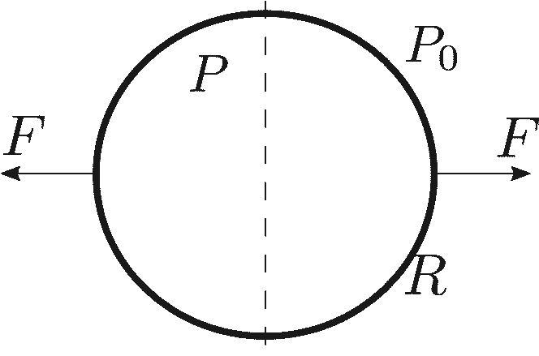
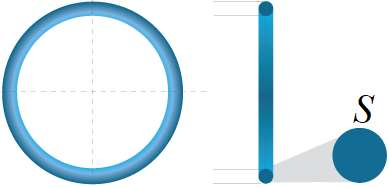

[[Състезания/proletno/11/2018|◂ 2018]] | [[Състезания/proletno/11r/2019|решения]] | [[Състезания/proletno/11/2021| 2021 ▸]]

**Задача 1. Механика**

Кубче с маса m се удря със скорост v под ъгъл $\alpha$ спрямо неподвижна стена. Кубчето е ориентирано така, че не се завърта в резултат от удара. Коефициентът на триене между двете тела е $\mu$. На кубчето действат само реакцията на опората N и силата на триене f от страна на стената. Приемете, че по време на удара тези сили са постоянни, и че ударът продължава време Т. Приемете също, че ударът е еластичен, ако тялото се удари перпендикулярно на стената.

а) Изразете силата на триене f, действаща на кубчето по време на удара, чрез реакцията на опората N. \[1т.\]

б) Намерете връзка между промяната на проекциите на импулса, $\Delta$P и $\Delta$P , които се пораждат вследствие на двете сили по време на удара. \[1т.\]

в) Изразете $\Delta$P чрез m, v и $\alpha$. \[2т.\]

г) Каква е скоростта на кубчето след удара? \[2т.\]

д) Намерете ъгъла на отражение $\beta$. \[2т.\]

е) При каква стойност на $\mu$ ($\mu$кр ) имаме $\beta$ = 0? \[1т.\]

ж) Какво ще се случи, ако $\mu$ > $\mu$кр ? \[1т.\]

**Задача 2. Електростатика**

Електричният потенциал в центъра на куб, равномерно зареден с обемна плътност на заряда $\rho$ и със страна а, е $\varphi$ (а) = , където c $\approx$ 0.1894 и $\rho$ = $\Delta$ . Намерете потенциала:

а) на връх на този куб, $\varphi$ (а); \[3т.\]

б) на върха на пирамида с квадратна основа със страна а, височина а/2 и заряд с равномерно разпределена обемна плътност $\rho$, $\varphi$ (а); \[3т.\]

в) на квадратна пластина със страна а, повърхнинна зарядова плътност $\sigma$ ($\sigma$ = $\Delta$ ) на височина а/2 над центъра на пластината, $\varphi$ (а); \[3т.\]

г) на куба на далечно разстояние r, много по-голямо от страната му а, $\varphi$ (а). \[1т.\]
В горните подточки напишете отговор, съдържащ $\rho$, а, $\epsilon$ и числени константи.

Упътване: Разгледайте куба като съставен от няколко на брой по-малки идентични фигури.

**Задача 3. Сили, налягане и механично напрежение**

а) Тяло е съставено от две долепени полусфери с радиус R. Равнината на контакт е обозначена с пунктир. Вътре налягането е P, а вън е P , като P > P. Каква сила F трябва да се приложи, така че полусферите да се разделят. \[2т.\]

В следващите три подточки се използва понятието механично напрежение, което е силата на опън за единица площ и се измерва в паскали.

б) Тялото е поставено във вакуум, а полусферите са залепени със смола, която се скъсва при механично напрежение $\sigma$. Намерете граничното вътрешно налягане Р, при което полусферите ще се разделят. Дебелината на полусферите е d, като d $\ll$ R. \[2т.\]

в) Тънък пръстен с маса m и радиус R се върти с ъглова скорост $\omega$ около ос, която минава през центъра му и е перпендикулярна на равнината на пръстена. Намерете механичното напрежение, ако напречното сечение на пръстена е S. \[2т.\]

г) Пръстенът се върти около ос, минаваща през негов диаметър. Намерете напрежението в точките от пръстена, лежащи на оста. \[2т.\]

д) Намерете разстоянието между центъра на пръстена и центъра на масата на полупръстена. \[2т.\]

Упътване: за малки ъгли приемете, че sin $\theta \approx \theta$ и tan $\theta \approx \theta$.