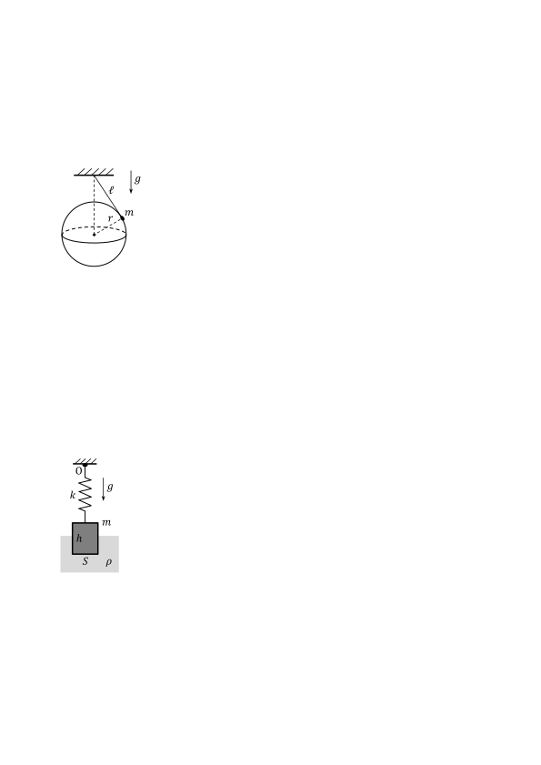
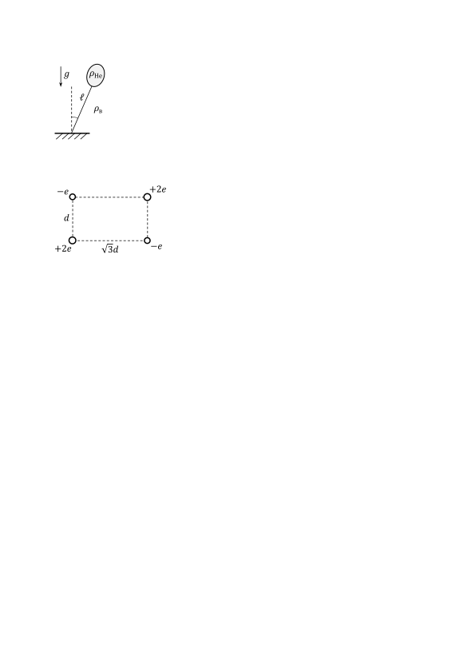

[[Състезания/proletno/11/2022|◂ 2022]] | [[Състезания/proletno/11r/2023|решения]] | [[Състезания/proletno/11/2024| 2024 ▸]]

Задача 1. Тяло върху кълбо (задачата се състои от две независими части)

Част I Малко тяло с маса m = 50 g е окачено на безмасова неразтеглива нишка с дължина l = 40 cm. Тялото се намира върху гладко кълбо с радиус r = 30 cm, като центърът на кълбото е  вертикално под точката на окачване на нишката, както е показано на фигурата вляво. Дадено е също така, че нишката е по допирателна към повърхността на кълбото. Приемете, че земното ускорение е g = 10 m/s 2 .

а) Намерете големините на силата на опън T на нишката и силата на натиск N на тялото върху кълбото. \[2 т.\]

б) Каква трябва да бъде ъгловата скорост $\omega$ на въртене на тялото около вертикалната ос през
центъра на кълбото, така че силата на опън да е двойно по-голяма от силата на натиск? \[3 т.\]

в) Определете максималната ъглова скорост $\omega$max , при която тялото все още се намира върху
кълбото. \[1,5 т.\]

Част II Малко тяло е поставено в непосредствена близост до най-високата точка на
неподвижно кълбо с радиус R = 60 cm, след което тялото започва да се хлъзга без триене по
повърхността на кълбото под действие на силата на тежестта. Определете на каква височина
h спрямо центъра на кълбото тялото ще се изплъзне от повърхността на кълбото. Каква е
големината на скоростта v на тялото в този момент, ако земното ускорение е g = 10 m/s 2 ?
\[3,5 т.\]

Задача 2. Хармонични трептения (задачата се състои от две независими части)

Част I Трупче на пружина

 Правоъгълно трупче с маса m = 0,5 kg е окачено на безмасова пружина с
 O коефициент на еластичност k = 0,2 kN/m. Първоначално системата се
 g намира в равновесие, като трупчето е наполовина потопено във вана с вода.
 k Трупчето е натиснато надолу така, че 2/3 от обема му е под водата. След
 това то е пуснато и започва да извършва вертикални хармонични трептения.
 m Напречната площ на ваната е много по-голяма от напречната площ на
 h трупчето, която е S = 40 cm2 . Височината на трупчето е h = 8 cm.
 Плътността на водата е $\rho$ = 1 g/cm3 . Може да приемете, че земното
 S $\rho$ ускорение g = 10 m/s2 . Съпротивлението на въздуха и визкозитетът на
 водата да се пренебрегнат.

а) Определете с колко е разтегната пружината в равновесното състояние на системата. \[2 т.\]

б) Колко е периодът T на трептенията на трупчето? \[2 т.\]

в) Определете максималната скорост vmax на трупчето по време на движението му. \[1,5 т.\]

г) Намерете големината на минималната сила Fmin , приложена в точката на окачване на
пружината (т. O), по време на трептенето. На колко е равна големината на максималната сила
Fmax в точката на окачване? \[2 т.\]

Част II Люлеещ се балон

 Малък балон, пълен с хелий, е окачен за пода на безмасова неразтеглива
 g $\rho$He нишка, както е показано на фигурата вляво. Балонът е направен от материал
 с пренебрежима маса. При отклоненение на нишката на малък ъгъл спрямо
 l вертикалата системата започва да трепти хармонично. Намерете периода T
 $\rho$в на трептенията, ако знаете, че плътността на хелия е $\rho$He = 0,18 kg/m3 , а
 плътността на въздуха е $\rho$в = 1,2 kg/m3. Дължината на махалото е l = 2 m.
 Земното ускорение приемете за g = 9,8 m/s2 . Съпротивлението на въздуха
 да се пренебрегне. \[2,5 т.\]

Задача 3. Електростатика

 +2e Два положителни заряда с големина +2e и два отрицателни заряда -e са разположени във върховете на правоъгълник с ширина d = 2 cm и дължина $\sqrt$3d, както е показано на фигурата вляво. Елементарният електричен заряд има големина e = 1,6 $\times$ 10-19 C. Константата в закона на Кулон е k = 9 $\times$ 109 Nm2 /C2 .

а) Намерете големината на сумарната сила F, с която останалите заряди действат на долния десен заряд от системата. \[4,5 т.\]

б) На колко е равен потенциалът $\varphi$ в центъра на правоъгълника? \[1,5 т.\]

в) Определете работата A, която трябва да се извърши, за да може горните два заряда да си
разменят местата. \[4 т.\]
