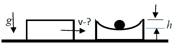
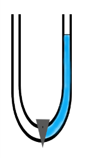
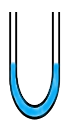
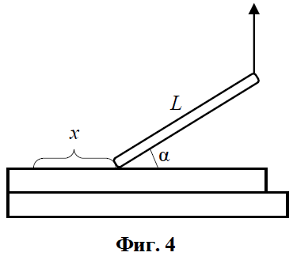
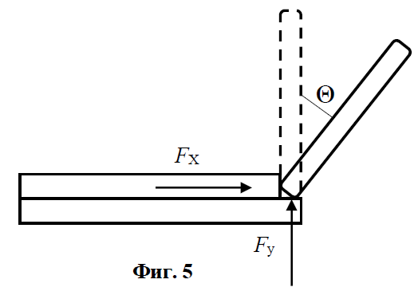
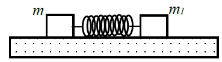

Задача 1.

Част 1. Стар вагон, пълен с тухли, се движи по хоризонтални гладки релси със скорост v.
Масата на вагона с целия товар е равна на М, а масата на една тухла е m. По време на
движение една от тухлите изпада от вагона през дупка в пода.
Намерете скоростта на вагона u след като тухлата е изпаднала от него. (0,5 т)

 Част 2. Върху гладки релси, със скорост v и маса m, се
 движи вагон.Той се удря в неподвижна товарна платформа,
 която има маса M (M = 2m). В платформата е направена
 Фиг. 1 гладка сферична вдлъбнатина с дълбочина h = 5 mm. В
 платформата е поставена масивна топка с маса m1 = 0,1m.
А) На колко е равна скоростта на топката v1, непосредствено след удара на вагона в
платформата? (0,5 т)
Б) Изразете скоростта на платформата u (веднага след удара) чрез скоростта на вагона v. (3
т)
В) Намерете скоростта на вагона v, ако е известно, че това е минималната скорост, при
която топката m1 изскача от платформата. Триене няма. (5 т)

Част 3. Обяснете парадокса. Къде изчезна потенциалната енергия?
 В U-образна тръба със затворен кран е налята течност в едното коляно
 до височина h. Ясно е, че потенциалната енергия на течността е mgh/2.
 След като се отвори крана, течността ще извърши няколко трептения
 в тръбата и най-накрая ще спре, като ще има една и съща височина h/2
 в двете колена. Ясно е, че потенциалната енергия на водата в този
 случай ще бъде mgh/4. Къде е "изчезнала" част от потенциалната
 енергия на течността? (1 т)
 
Задача 2. Пакостите на Том Сойер в час по физика

Част 1. Игра с макара и конец

Том Сойер е герой на Марк Твен, известен със своите пакости. Том си играе в час по
физика с макара, върху която е намотан конец. Вътрешният радиус на макарата е r, а
външният - R. Макарата е поставена върху хоризонтална опора. Том дърпа конеца в
хоризонтална посока със скорост v и бързо пресмята скоростта u на оста на макарата. При
търкалянето си върху опората макарата не приплъзва. Разгледайте и двата случая от фиг.
3а и 3б, показани на чертежа.

А) С каква скорост u и в каква посока ще се движи оста на макарата? (2,5 т)
Б) Ще се навива или ще се развива конецът от макарата? (1 т)

Част 2. Игра с тънка пръчка

Том Сойер пак си играе в часа по физика, но този път с еднородна тънка пръчка с дължина
L.
 А) Том поставя тънката пръчка върху гладкия чин. Единият край на
 пръчката е завързан за конец. Том започва бавно да вдига конеца
 вертикално нагоре и по този начин повдига пръчката. Когато ъгълът
 между пръчката и повърхността на чина става равен на $\alpha$
 вертикалния конец се скъсва. На какво разстояние x ще се отмести
 при падането си долния край на пръчката? Триене няма. (1 т)

Том Сойер решава да закрепи пръчката на ръба на чина.
Профилът на ръба на чина и мястото на поставяне на
пръчката са показани на чертежа. Той поставя пръчката
почти вертикално и я пуска. При падането си пръчката
образува променящ се ъгъл $\theta$ спрямо вертикалата.

 Б) Изразете чрез ъгъла $\theta$ и L ъгловата скорост $\omega$,
нормалното an и тангенциалното ускорение a$\tau$ на центъра на масата на пръчката.
Инерчният момент на пръчката около ос на въртене, минаваща през нейният край, е I =
mL2/3. (2,5 т)
В) Ръбовете на масата действат върху пръчката с две сили - хоризонтална FX и вертикална
сила FB. Изразете големините на двете сили чрез ъгъл $\theta$ и намерете стойността на ъгъла $\theta$
между пръчката и вертикалата в момента, в който пръчката се откъсва от ръба на масата. (3
т)

Задача 3. Пружини, ускорения и трептене

Част 1.

А) Ученик закача на единия край на пружина с коефициент на еластичност k теглилка с
маса m, а на другия край - теглилка с маса m1 = 2m. Той държи с ръка горната теглилка m1
и по този начин теглилките и пружината са във вертикално положение. Намерете
ускоренията а и а1 на теглилките веднага след като се пуснат. (3 т)

Част 2.

 Две теглилки с маси m1 и m2 са свързани с помощта на
 пружина с коефициет на еластичност k и са поставени върху
 гладка хоризонтална равнина (Фиг. 6). Теглилките малко се
 Фиг. 6 приближават една към друга, т.е. пружината се свива и после
 се пускат.
А) Намерете на какви разстояния x и y се намират от центъра на масите т.О съответно m1 и
m2, ако дължината на пружината е l. Определете характера на движението на т.О (в покой,
равномерно, с постоянно ускорение, с променливо ускорение). (3 т)
Б) Изразете периодите Т1 и Т2 на трептене на теглилките чрез m1, m2 и k. (4 т)
Жокер: Коефициентът на еластичност k на пружина е обратнопропорционален на
дължината ѝ l.
