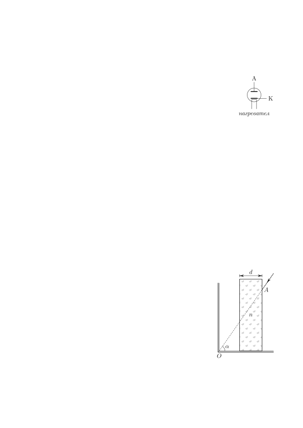

[[Състезания/proletno/11/2024|◂ 2024]] | [[Състезания/proletno/11r/2025|решения]]

Задача 1. Ламповият диод представлява електровакуумно устройство, състоящо се
от два електрода (катод и анод), поставени във вакуумиран стъклен цилиндър. Към А
катода има нагревател, който по време на работа го нагрява, вследствие на което
около катода се отделят електрони, формиращи електронен облак (термоелектронна
емисия). В зависимост от посоката (поляритета) на приложеното към електродите К
напрежение U през диода може да протича ток I.

1.1. Ако имате източник на постоянно напрежение, към кой от полюсите му трябва нагревател
да вържете анода (A), за да протича ток във веригата? Обосновете отговора си в
рамките на едно изречение. (1 т.)

1.2. Зависимостта на тока през диода от приложеното напрежение има вида I = cU n , където c и n са неизвестни константи. Определете c и n, като използвате описания по-долу модел за механизма на термоелектронната емисия. Диодът се разглежда като плосък кондензатор с площ на плочите S и разстояние между тях d. При подаване на напрежение известна част a от заряда на повърхността на катода се отделя в обема, затворен между двата електрода и преминава от катода до анода. Приемете, че зарядите в обема на кондензатора са достатъчно малко, така че не променят полето му. Началната скорост на отделените от катода заряди е много малка. Масата на електрона m, както и зарядът му e, са известни. (5.5 т.)

1.3. Колко пъти ще се увеличи силата, действаща на анода в следствие на ударите на зарядите
идващи от катода, ако увеличим напрежението три пъти? Приемете, че при удара зарядите отдават цялата си енергия. (3.5 т.)

Задача 2. Куче си играе с водна пръскалка, като се опитва да прескочи водата, без да се намокри. Да приемем, че пръскалката е поставена на земята и има много малък отвор, от който водата излиза със скорост v и се разпръсква във всички посоки. Кучето скача от най-отдалечената точка, до която достига водата, като траекторията му преминава над пръскалката. Каква трябва да бъде минималната му начална скорост u и под какъв ъгъл $\alpha$ трябва да е насочена, за да не се намокри кучето при скока? (10 т.)

Задача 3. Следващите подусловия са независими.

3.1. На фигурата вдясно са показани две плоски огледала, сключващи прав ъгъл. Пред едното огледало има прозрачна плоскопаралелна пластина с дебелина d и показател на пречупване n. Пластината е успоредна на вертикалното огледало. В точка A от пластината влиза лъч, които е насочен към пресечната точка на огледалата т. O и сключва ъгъл $\alpha$ с хоризонта. Лъчът преминава през пластината, отразява се последователно от двете огледала, отново преминава през пластината и излиза от нея в т. B, която се намира на същата стена, както т. A. Направете чертеж, показващ хода на лъча и положението на т. B. (2.5 т.) Намерете дължината на отсечката AB. (3.5 т.)

3.2. Успореден сноп светлина с ширина h, пада под ъгъл $\alpha$ върху хоризонтална плоскопаралелна пластинка. Снопът съдържа два еднакво широки (с ширина h) монохроматични снопа светлина с дължини на вълните, съответно $\lambda_1$ и $\lambda_2$ . Показателите на пречупване на пластината за тези дължини на вълните са съответно n1 и n2 (n1 > n2 ). Определете минималната дебелина на пластинката d, при която двата снопа няма да се препокриват, след като излязат от нея. Изразете крайния отговор за d само чрез h, sin $\alpha$, cos $\alpha$ и показателите на пречупване за двете дължини на вълната (без да използвате обратни тригонометрични функции като arcsin, arctan и др.). (3 т.) Направете чертеж, показващ хода на лъчите през пластината. (1 т.)
