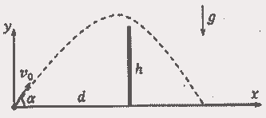
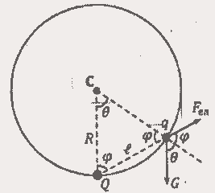
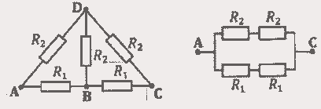
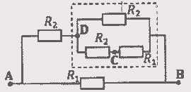

[[Състезания/proletno/11/2017|◂ 2017]] | [[Състезания/proletno/11/2018|условия]] | [[Състезания/proletno/11/2019| 2019 ▸]]

**Задача 1. Прехвърляне на стена**

**а)** В координатната система на фигурата вляво законът за движение на снаряда е: $x(t) = v_0 \cos \alpha \cdot t$, $y(t) = v_0 \sin \alpha \cdot t - \frac{gt^2}{2}$, където $t$ е изминалото време от изстрелването на снаряда. \[1 т.\] Търсените разстояния се определят от траектории, които минават точно над ръба на стената, т.е. снарядът трябва да прелети през точката с координати $(d, h)$. \[0,5 т.\] Това условие води до следните две уравнения: $v_0 \cos \alpha \cdot t = d$ и $v_0 \sin \alpha \cdot t - \frac{gt^2}{2} = h$. \[0,5 т.\] Като изключим $t$ от уравненията, получаваме уравнение за ъглите на изстрелване на снаряда, при които той минава точно над ръба: $d \operatorname{tg} \alpha - \frac{gd^2}{2v_0^2 \cos^2 \alpha} = d \operatorname{tg} \alpha - \frac{gd^2}{2v_0^2} (1 + \operatorname{tg}^2 \alpha) = h$. \[1 т.\] Това е квадратно уравнение с корени $\operatorname{tg} \alpha_1 = \frac{v_0^2 + \sqrt{v_0^4 - g(2hv_0^2 + gd^2)}}{gd}$, $\operatorname{tg} \alpha_2 = \frac{v_0^2 - \sqrt{v_0^4 - g(2hv_0^2 + gd^2)}}{gd}$. \[1 т.\] По-големият корен съответства на $x_{\min}$, а по-малкият – на $x_{\max}$. Търсените разстояния се намират, като знаем общото време на полета $t_{\text{total}} = \frac{2v_0 \sin \alpha}{g}$ и го заместим в $x(t)$, откъдето $x_{\min} = \frac{2v_0^2 \sin \alpha_1 \cos \alpha_1}{g} = \frac{2v_0^2 \operatorname{tg} \alpha_1}{g(1 + \operatorname{tg}^2 \alpha_1)} = \frac{d \left[ gd^2 + h \left( v_0^2 + \sqrt{v_0^4 - g(2hv_0^2 + gd^2)} \right) \right]}{g(d^2 + h^2)} \approx 31 \text{ m.}$ \[1,5 т.\]
Аналогично $x_{\max} = \frac{2v_0^2 \sin \alpha_2 \cos \alpha_2}{g} = \frac{2v_0^2 \operatorname{tg} \alpha_2}{g(1 + \operatorname{tg}^2 \alpha_2)} = \frac{d \left[ gd^2 + h \left( v_0^2 - \sqrt{v_0^4 - g(2hv_0^2 + gd^2)} \right) \right]}{g(d^2 + h^2)} \approx 61 \text{ m.}$ \[1,5 т.\]

**б)** С увеличаване на разстоянието между оръдието и стената съответното $x_{\min}$ нараства, тъй като снарядите трябва да се изстрелват под по-малки ъгли спрямо хоризонта. От друга страна съответното $x_{\max}$ намалява, тъй като оръдието се отдалечава от стената. По този начин $x_{\min}$ и $x_{\max}$ клонят към една обща стойност, която съответства на търсеното $d_{\max}$. \[0,5 т.\] Тъй като $x_{\min}$ и $x_{\max}$ се определят от ъгъла на изстрелване, който се получава като решение на квадратно уравнение, горното условие е еквивалентно на съществуването на двоен корен на квадратното уравнение, т.е. дискриминантата на уравнението трябва да е равна на нула: $v_0^4 - g(2hv_0^2 + gd_{\max}^2) = 0$. \[0,5 т.\] Оттук $d_{\max} = \frac{v_0}{g} \sqrt{v_0^2 - 2gh} \approx 41 \text{ m.}$ \[1 т.\] Съответното $\alpha_{d\max} = \operatorname{arctg} \left( \frac{v_0^2}{gd_{\max}} \right) = \operatorname{arctg} (v_0 / \sqrt{v_0^2 - 2gh}) \approx 57^\circ$. \[1 т.\]

**Задача 2. Заряди върху окръжност**

**а)** На топчето действа сила на тежестта $G = mg$, насочена вертикално надолу. \[0,5 т.\] Нека да означим разстоянието между зарядите с $\ell = 2R \sin(\theta/2)$. \[0,5 т.\] Електричната сила, която действа на топчето, има големина $F_{e\ell} = \frac{kqQ}{\ell^2} = \frac{kqQ}{4R^2 \sin^2(\theta/2)}$ и посока, означена на фигурата вляво. \[0,5 т.\] За да бъде топчето в равновесие, трябва тангенциалните на окръжността компоненти на двете сили да са равни по големина: $G \sin \theta_{eq} = mg \sin \theta_{eq} = F_{e\ell} \sin \varphi_{eq} = \frac{kqQ \sin \varphi_{eq}}{4R^2 \sin^2(\theta_{eq}/2)}$, където $\varphi_{eq}$ е равновесната стойност на ъгъла $\varphi$, означен на чертежа по-горе. \[1 т.\] Центърът на окръжността и двата заряда образуват равнобедрен триъгълник, откъдето следва, че $\varphi = 90^\circ - \frac{\theta}{2}$, а оттук $\sin \varphi = \cos(\theta/2)$. \[0,5 т.\] По този начин горното равенство на тангенциалните компоненти придобива следния вид: $\sin^3(\theta_{eq}/2) = \frac{kqQ}{8mgR^2}$. \[0,5 т.\] Окончателно $\theta_{eq} = 2 \arcsin \left( \frac{1}{2} \sqrt[3]{\frac{kqQ}{mgR^2}} \right) = 60^\circ$. \[1 т.\]

**б)** Търсената големина на силата на реакция от страна на окръжността е $N_{eq} = mg \cos \theta_{eq} + \frac{kqQ \cos \varphi_{eq}}{4R^2 \sin^2(\theta_{eq}/2)} = mg \cos \theta_{eq} + \frac{kqQ}{4R^2 \sin(\theta_{eq}/2)} = \frac{1}{2} (mg + \frac{kqQ}{R^2}) = 0,5 \text{ N.}$ \[2 т.\]

**в)** Нека да отчитаме височината на издигане на топчето спрямо най-долната точка от окръжността, т.е. $h = R(1 - \cos \theta)$. \[0,5 т.\] Гравитационната потенциална енергия на топчето има големина $mgh = mgR(1 - \cos \theta)$. \[0,5 т.\] Кулоновата потенциална енергия на топчето е $E = \frac{kqQ}{2R \sin(\theta/2)}$. \[0,5 т.\] От закона за запазване на пълната механична енергия следва, че $2mgR + \frac{kqQ}{2R} = \frac{mv_{eq}^2}{2} + mgR(1 - \cos \theta_{eq}) + \frac{kqQ}{2R \sin(\theta_{eq}/2)} = \frac{mv_{eq}^2}{2} + \frac{mgR}{2} + \frac{kqQ}{R}$, откъдето $v_{eq} = \sqrt{3gR - \frac{kqQ}{mR}} \approx 7,7 \text{ m/s.}$ \[2 т.\]

**Задача 3. Електрическа верига**

**а)** Дадената електрическа верига е симетрична спрямо отсечката BD и при подаване на напрежение между точките A и C няма да има напрежение между B и D. \[0,5 т.\] В такъв случай няма да протече ток през средния резистор (балансиран Уитстонов мост) и той може да бъде откачен от веригата. Получава се еквивалентната схема, показана на фигурата по-горе вдясно. \[1 т.\] Съпротивлението, което ще се измери между точките A и C, е равно на $R_{AC} = \frac{2R_1 R_2}{R_1 + R_2} = 1,5 \text{ k}\Omega$. \[1 т.\]

**б)** В този случай веригата може да се представи като система от последователно и успоредно свързани резистори с еквивалентна схема, която е показана на фигурата вляво. \[2 т.\] Търсеното съпротивление е $R_{AB} = \frac{R_1 \left( R_2 + \frac{R_2(R_1 + R_2)}{R_1 + 2R_2} \right)}{R_1 + R_2 + \frac{R_2(R_1 + R_2)}{R_1 + 2R_2}} = \frac{R_1 R_2 (2R_1 + 3R_2)}{(R_1 + R_2)(R_1 + 3R_2)} \approx 0,83 \text{ k}\Omega$. \[2 т.\]

**в)** За да определим напрежението между точките C и D, трябва да намерим тока, който протича между двете точки. \[0,5 т.\] Общият ток, който протича през частта от веригата, оградена с пунктирана линия, е $I = \mathcal{E} / \left( R_2 + \frac{R_2(R_1 + R_2)}{R_1 + 2R_2} \right)$. \[1 т.\] Търсеният ток $I_{CD} = \frac{I R_2}{R_1 + 2R_2} = \frac{\mathcal{E}}{2R_1 + 3R_2}$. \[1 т.\] Окончателно получаваме $U_{CD} = I_{CD} R_2 = \frac{\mathcal{E} R_2}{2R_1 + 3R_2} \approx 1,6 \text{ V.}$ \[1 т.\]