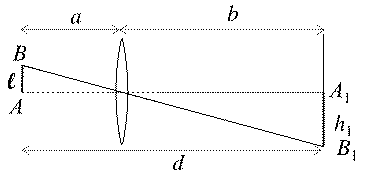
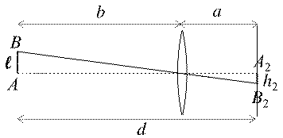

**Задача 1. Механична предавка**

а) Нека $m_1$ и $m_2$ са съответно масата на горния и на долния цилиндър. Тъй като цилиндрите имат обща ос, общият им инерчен момент е:
(1) $I = \frac{1}{2}m_1R^2 + \frac{1}{2}m_2(2R)^2 = \frac{1}{2}(m_1 + 4m_2)R^2$. **(0.5 т)**

Понеже двата цилиндъра са изработени от еднакъв материал, техните маси са пропорционални на съответните им обеми:
(2) $m_1/m_2 = V_1/V_2$ или еквивалентно $m_1 = \rho V_1; m_2 = \rho V_2$. **(0.5 т)**
където $\rho$ е плътността на материала. Като вземем предвид, че:
(3) $V_1 = \pi R^2h$ и $V_2 = \pi(2R)^2h$,
намираме:
(4) $m_1/m_2 = 1/4$,
откъдето следва:
(5) $m_1 = m_0/5$ **(0.5 т)**
(6) $m_2 = 4m_0/5$, **(0.5 т)**
където $m_0$ е общата маса на детайла. Така, за общия инерчен момент на тялото получаваме:
(7) $I = \frac{17}{10}m_0R^2$. **(0.5 т)**

б) Ясно е, че макарите се въртят в противоположна посока. Затова, ако едната теглилка се спуска, другата се изкачва. Предполагаме, че се спуска теглилката 1. Ако предположението ни не е вярно, ще получим съответното ѝ ускорение отрицателно. Проектираме действащите върху дадена теглилка сили в посоката, в която се движи съответната макара. От II принцип на механиката следва:
(8) $ma_1 = mg - T_1$ **(0.5 т)**
(9) $ma_2 = T_2 - mg$ **(0.5 т)**

Прилагаме уравнението за въртене на твърдо тяло около постоянна ос за всяка от макарите:
(10) $I\epsilon_1 = 2RT_1 - 2Rf$ **(0.5 т)**
(11) $I\epsilon_2 = 2Rf - RT_2$ **(0.5 т)**
където $\epsilon_1$ и $\epsilon_2$ са съответните ъглови ускорения на макарите, а $f$ е големината на силата на триене в точката на допиране на макарите.

Тъй като макарите не се хлъзгат една спрямо друга, във всеки момент допиращите се точки от периферията се движат с еднаква линейна скорост $v$. Понеже макарите имат еднакъв радиус, равни са и ъгловите им скорости, и ъгловите им ускорения:
(12) $\omega_1 = \omega_2 = \omega$ **(0.5 т)**
(13) $\epsilon_1 = \epsilon_2 = \epsilon$. **(0.5 т)**

Ускоренията на двете теглилки са свързани с ъгловото ускорение на макарите, както следва:
(14) $a_1 = 2R\epsilon$ **(0.5 т)**
(15) $a_2 = R\epsilon$ **(0.5 т)**

След алгебрични преобразования намираме ъгловото ускорение:
(16) $\epsilon = \frac{mgR}{2I + 5mR^2}$

и получаваме окончателните изрази за двете ускорения:
(17) $a_1 = \frac{2mgR^2}{2I + 5mR^2}$ **(0.5 т)**
(18) $a_2 = \frac{mgR^2}{2I + 5mR^2}$ **(0.5 т)**

*Алтернативно решение на подточка б) – енергетичен подход.* За дадено време $t$ макарите се завъртат на еднакъв ъгъл $\varphi$. Съответно първата теглилка се спуска на разстояние $h_1 = \varphi(2R)$, а втората – се изкачва на $h_2 = \varphi R$. Следователно работата на силата на тежестта е:
$A_G = mgh_1 - mgh_2 = mgR\varphi$. **(1.0 т)**

В дадения момент двете макари се въртят с еднаква моментна ъглова скорост $\omega$. Следователно скоростите на двете теглилки са съответно $v_1 = \omega(2R)$ и $v_2 = \omega R$.
Кинетичната енергия на системата в този момент е:
$E_k = 1/2mv_1^2 + 1/2mv_2^2 + 1/2I\omega^2 + 1/2I\omega^2 = (2I + 5mR^2)\omega^2/2$ **(1.0 т)**

Тъй като макарите не се хлъзгат една спрямо друга, между тях действа сила на триене в покой, която не върши работа. Следователно $E_k = A_G$, откъдето получаваме:
$mgR\varphi = (2I + 5mR^2)\omega^2/2$ **(1.0 т)**

При въртене с постоянно ъглово ускорение $\varphi = \epsilon t^2/2$ **(0.5 т)** и $\omega = \epsilon t$ **(0.5 т)**, откъдето определяме:
$\epsilon = \frac{mgR}{2I + 5mR^2}$
и съответно:
$a_1 = \epsilon(2R) = \frac{2mgR^2}{2I + 5mR^2}$ **(0.5 т)**
$a_2 = \epsilon R = \frac{mgR^2}{2I + 5mR^2}$ **(0.5 т)**

в) В този случай $a_2 = 0, \epsilon_2 = 0$ и от уравненията (9) и (11) следва:
(19) $T_2 = mg$ **(0.5 т)**
(20) $f = T_2/2 = mg/2$ **(0.5 т)**

Тогава уравненията (8) и (10) приемат вида:
(21) $ma_1 = mg - T_1$ **(0.5 т)**
(22) $I\epsilon_1 = 2RT_1 - Rmg$ **(0.5 т)**

Като вземем предвид, че $a_1 = \epsilon_1 R$, намираме:
(23) $a_1 = \frac{mgR^2}{I + 2mR^2}$ **(0.5 т)**

*Важно уточнение.* В този случай енергетичният подход не може да бъде приложен, защото поради хлъзгането на макарите една спрямо друга силите на триене вършат ненулева работа и механичната енергия не се запазва.

**Задача 2. Планетарен кондензатор**

а) Интензитетът на полето във вътрешността на заредена сфера е нула. Затова земното електрично поле се дължи изцяло на отрицателните заряди върху земната повърхност и е еквивалентно на полето на отрицателен заряд $-Q$ в центъра на Земята. Следователно интензитетът на полето е насочен към центъра на Земята **(1.0 т)** и големината му е:
(1) $E = kQ/R^2$. **(1.0 т)**

Следователно:
(2) $Q = ER^2/k \approx 9,1 \cdot 10^5$ C. **(1.0 т)**
(0.5 точки за израз и 0.5 точки за числена стойност)

*Алтернативно, може да се подходи по следния начин.* Интензитетът на електрично поле над проводяща повърхност е перпендикулярен на повърхността. Следователно $\vec{E}$ е перпендикулярен на земната повърхност и сочи към центъра на Земята, защото зарядът ѝ е отрицателен. **(1.0 т)** Големината на интензитета над проводящата повърхност е:
(1’) $E = \sigma/\epsilon_0$, **(0.5 т)**
където:
(1’’) $\sigma = Q/(4\pi R^2)$ **(0.5 т)**
е повърхнинната плътност на електричните заряди по земната повърхност. Оттук, като изразим $Q$, получаваме еквивалентен резултат:
(2’) $Q = 4\pi\epsilon_0 ER^2 \equiv ER^2/k \approx 9,1 \cdot 10^5$ C. **(1.0 т)**

б) Понеже земното електрично поле се дължи единствено на зарядите върху земната повърхност, потенциалът на височина $H$, т.е. на разстояние $r = R + H$ от центъра на Земята е:
(3) $\varphi_1 = -kQ/r = -kQ/(R + H)$ **(1.0 т)**

Съответно потенциалът върху земната повърхност е:
(4) $\varphi_2 = -kQ/R$. **(1.0 т)**

Следователно напрежението между йоносферата и Земята е:
(5) $U = \varphi_1 - \varphi_2 = \frac{kQH}{R(R+H)}$. **(1.0 т)**

От определението за капацитет получаваме:
(6) $C = \frac{Q}{U} = \frac{R(R+H)}{kH} \equiv \left( \frac{4\pi\epsilon_0 R(R+H)}{H} \right) \approx 2,34 \cdot 10^{-2}$ F. **(1.0 т)**
(0.5 точки за израз и 0.5 точки за числена стойност)

*Алтернативно непълно решение.* Точките за това решение са по-малко от пълното (точно) решение!
Ако приемем, че полето между йоносферата и Земята е приблизително еднородно, напрежението между тях е:
(5’) $U \approx EH$. **(1.0 т)**

Като вземем предвид уравнение (2), намираме:
(6’) $C = \frac{Q}{U} \approx \frac{R^2}{kH} \equiv \left( \frac{4\pi\epsilon_0 R^2}{H} \right) \approx 2,27 \cdot 10^{-2}$ F. **(1.0 т)**

И двата числени отговора се приемат за верни, защото се закръглят към $2,3 \cdot 10^{-2}$ F. Този подход е еквивалентен на приближение, в което сферичният кондензатор се разглежда като плосък с площ на плочите $S \approx 4\pi R^2$ и разстояние $d = H$ между тях. Тогава, ако се приложи формулата $C = \epsilon_0 S/d$, се получава приблизителният израз (6’).

в) Известно е, че енергията на зареден кондензатор е $W = CU^2/2$. Като се вземе предвид, че $U = Q/C$, намираме:
(7) $W = \frac{Q^2}{2C} = 1,8 \cdot 10^{13}$ J. **(1.0 т)**
(0.5 точки за израз и 0.5 точки за числена стойност)

г) Годишното потребление на енергия, изразено в джаули, е:
(8) $E = 3 \cdot 10^4$ TWh $= 3 \cdot 10^4 \cdot 10^{12}$ W $\cdot 3600$ s $\approx 1,1 \cdot 10^{20}$ J **(1.0 т)**

Следователно времето, за което би стигнала атмосферната енергия, е:
(9) $t = W/E \approx 1,6 \cdot 10^{-7}$ години $= 5,84 \cdot 10^{-5}$ дни $= 1,4 \cdot 10^{-3}$ часа $= 5$ s. **(1.0 т)**
Точките за уравнение (9) се дават само ако крайният отговор е изразен в секунди.

**Задача 3. Оптичен експеримент**

а) На фигурите е показано положението на лещата при формиране на двата образа и е проследен ходът на лъча, който минава през оптичния център на лещата. Нека $a$ е разстоянието между жичката и лещата, при което за първи път върху екрана се наблюдава образ. Тогава за разстоянието $b$ от лещата до екрана е в сила:
(1) $a + b = d$ **(0.5 т)**
(2) $1/a + 1/b = 1/f$ **(0.5 т)**
Вторият образ се наблюдава в момента, когато лещата се отдалечи на разстояние $b$ от жичката, като съответно разстоянието от лещата до екрана е $a$. **(1.0 т)**

**(0.5 т)** за първия чертеж; **(0.5 т)** за втория чертеж.

Точките за всеки от чертежите се дават, ако ясно личат следните елементи:
*   лъчът, минаващ през оптичния център на лещата без пречупване;
*   $a < b$;
*   $h_1 > \ell$ и $h_2 < \ell$.

От чертежа се вижда, че линейното увеличение (по модул) на образа в първия случай е:
(3) $M_1 = h_1/\ell = b/a$, **(0.5 т)**
а във втория случай:
(4) $M_2 = h_2/\ell = a/b$. **(0.5 т)**

Ако умножим почленно уравненията (3) и (4), получаваме $h_1h_2/\ell^2 = 1$, откъдето намираме дължината на жичката:
(5) $\ell = \sqrt{h_1h_2} = 8,0$ mm. **(1.0 т)**

б) От уравнение (3) или (4) изразяваме линейното увеличение за един от образите:
(6) $M_1 = b/a = \sqrt{h_1/h_2}$ или еквивалентно $b = a\sqrt{h_1/h_2}$ **(0.5 т)**

Заместваме $b$ в уравнение (1) и намираме разстоянието $a$:
(7) $a = \frac{d\sqrt{h_2}}{\sqrt{h_1} + \sqrt{h_2}}$ **(0.5 т)**
и от уравнение (6) изразяваме $b$:
(8) $b = \frac{d\sqrt{h_1}}{\sqrt{h_1} + \sqrt{h_2}}$ **(0.5 т)**

От уравнение (2) на тънката леща, изразяваме търсеното фокусно разстояние:
(9) $f = \frac{ab}{a+b} = \frac{d\sqrt{h_1h_2}}{(\sqrt{h_1} + \sqrt{h_2})^2} = \frac{d\ell}{h_1 + h_2 + 2\ell} \approx 22,2$ cm. **(1.0 т)**

в) От условията (1) и (2) следва, че $a$ и $b$ са двата корена на уравнението:
(10) $x^2 - dx + df = 0$. **(1.0 т)**

За да има реални корени уравнението, е нужно дискриминантата да бъде неотрицателна:
(11) $D = d^2 - 4df \ge 0$. **(0.5 т)**
Минималното разстояние, при което е изпълнено това условие, е:
(12) $d_{\text{min}} = 4f \approx 88,8$ cm. **(1.0 т)**

В този случай уравнението има два съвпадащи корена $a = b = 2f$, т.е. лещата трябва да се намира по средата между лампата и екрана. Съответно върху екрана се наблюдава действителен обърнат образ на жичката с размер, равен на дължината на жичката.