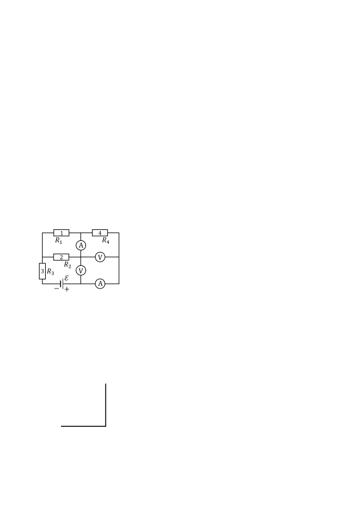
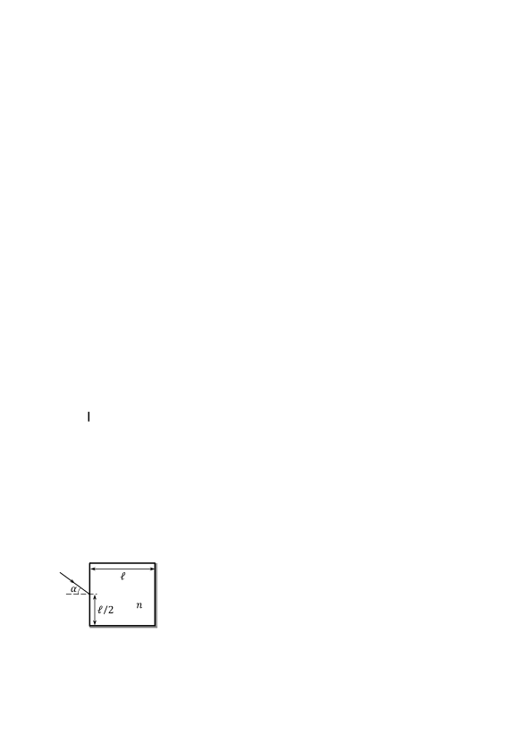

Задача 1. Топлинна машина

Топлинна машина с работно вещество идеален газ работи по цикъла 1-2-3-4-1, показан на фигурата вляво. Процесът 1-2 е изобарен, процесът 2-3 е изохорен, процесът 3-4 е изотермен, а процесът 4-1 е отново изохорен. Работата, извършена от външните сили при изотермния процес, е A34 = 0,5 kJ. При процеса 4-1 газът получава топлина Q41 = 0,3 kJ. КПД на машината е $\eta$ = 20%. Вътрешната енергия на газа в дадено състояние е U = 3BT/2, където B $\approx$ 8,3 J/K, а T е абсолютната температура на газа. Използвайте, че съотношението между
налягането p1, обема V1 и температурата T1 на газа в състояние (1) е p1 V1 = BT1 .

а) Начертайте процесите от цикъла на pV-диаграма. \[1 т.\]

б) Определете разликата T1 - T3 между температурите на газа в състояния (1) и (3). \[1,5 т.\]

в) Намерете разликата T2 - T3 между температурите на газа в състояния (2) и (3). \[6 т.\]

г) На колко е равна отдадената от газа топлина Qотд по време на цикъла? \[1,5 т.\]

Задача 2. Електрическа верига

Батерия с неизвестно електродвижещо напрежение $\mathcal E$ е свързана с два идеални амперметъра, два идеални волтметъра и четири резистора с неизвестни съпротивления R1 , R2 , R3 и R4 , означени на фигурата вляво с "1", "2", "3" и "4". Съответните мощности, които се отделят в четирите резистора, ще означим с P1 , P2 , P3 и P4 . Дадено е, че за тази верига отношенията на отделените мощности са P1 : P2 : P3 : P4 = 1 : 2 : 3 : 4.

а) Изразете съпротивленията R1 , R2 и R3 чрез съпротивлението
R4 . Колко е еквивалентното съпротивление Rекв на веригата, изразено чрез R4 ? \[4 т.\]

Разменяме местата на амперметрите и волтметрите в горната верига, т.е. двата амперметъра се поставят на местата на волтметрите и обратно. За така получената електрическа верига новите отделени мощности в резисторите ще означим съответно с P1' , P2' , P3' и P4' .

б) Ако означим еквивалентното съпротивление на новата верига с Rекв , определете отношението Rекв /Rекв между еквивалентните съпротивления на двете вериги. \[2 т.\]

в) Ако новите мощности на резисторите се отнасят както P1' : P2' : P3' : P4' = 1 : x : y : z, намерете на колко са равни числата x, y и z. \[4 т.\]

Задача 3. Геометрична оптика

Върху куб от стъкло с коефициент на пречупване n = 1,5 пада светлинен лъч по начина, показан на фигурата вляво. Дясната и долната стена на куба са идеално отразяващи. Страната на куба е с дължина l = 10 cm. Точката, където лъчът пада върху лявата стена на куба, е на разстояние l/2 от долната му стена.
 
 а) Намерете минималния ъгъл на падане $\alpha_0$ , такъв че лъчът да се отрази от дясната и долната стена преди да излезе от лявата стена на куба. Излезлият лъч е успореден на първоначално падащия лъч. Колко е разстоянието d0 между двата лъча? \[4 т.\]

б) Нека ъгълът на падане е $\alpha$ = 30$^\circ$. Светлинният лъч се отразява първо от дясната стена на куба, а след това от долната стена, преди да излезе обратно от лявата му стена. Излезлият лъч е успореден на първоначално падащия лъч. Намерете разстоянието d между лъчите. \[6 т.\]
