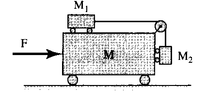

Задача 1. Топлинни машини

А. Идеална топлинна машина работи по хладилен цикъл между резервоари с кипяща вода ( 100 $^\circ$C ) и топящ се лед ( 0 $^\circ$C ). Като резултат от работата на машината 1 kg вода от горещия резервоар се превръща във водни пари.

а) Каква работа A е извършил външният източник? \[2,5 т.\]

б) Каква маса лед допълнително се е образувала в студения резервоар? \[1 т.\]

Полезни данни. Специфична топлина на парообразуване r = 2, 26 MJ/kg , специфична топлина на топене на леда $\lambda$ = 0,335 MJ/kg

Б. В стая през зимата поддържането на температура 20 $^\circ$C се осъществява чрез
електронагревател с мощност 500 W . Температурата на външния въздух е -15 $^\circ$C. За поддържане в стаята на същата температура може да се използва топлинна помпа вместо електронагревателя.

а) Опишете принципа на действие на разглежданата топлинна помпа. \[1 т.\]

б) Каква минимална мощност ще консумира топлинната помпа от електрическата мрежа, ако тя работи с максимално възможна ефективност? \[2,5 т.\]

В. През лятото за поддържане на температура 20 $^\circ$C се използва климатик при
температура на външния въздух 40 $^\circ$C . С колко трябва да се увеличи потребяваната от климатика мощност от електрическата мрежа, за да може да се поддържа в стаята същата температура след като се включи електрическа лампа с нажежаема нишка с мощност P0 = 150 W . Приемете, че климатикът работи с максимално възможна ефективност. \[3 т.\]

Задача 2. Идеален газ от електрони

А. В металите валентните електрони образуват газ, който на фона на йонните остатъци се разглежда като идеален (взаимодействието между електроните е пренебрежимо).
Оценете концентрацията на електроните n = N /V в електронния газ на метала Cu
(мед), като отчетете, че всеки атом Cu отдава един електрон. Числото на Авогадро е N A = 6, 02.1023 mol -1 , а конкретният метал се характеризира с моларна маса $\mu$ = 63,5 g/mol и плътност на масата $\rho$ = 8,9 g/cm3 .\[1,5 т.\]

Б. Получете формула, аналогична на тази от пункт А, за концентрацията на
електроните n = N /V в напълно йонизирани атоми на водородно-хелиева смес, в която отношението на масата на водорода m1 и масата на хелия m2 е m1 /m2 = p /q . \[2,5 т.\]

В. Получете формула за температурата на електронния газ, когато средното разстояние r между електроните е приблизително равно на дължината на вълната на Дьо Бройл $\lambda$T , съответстваща на топлинното им хаотично движение. \[3,5 т.\]

Г. Определете температурата от пункт В. в случаите:

а) за електронния газ в метала Cu (мед) \[0,5 т.\]

б) за електронния газ в напълно йонизирана водородно-хелиева смес с плътност
$\rho$ = 160 g/cm3 , за която p = 1 , q = 2 . Моларната маса на атомарния водород е
$\mu$1 = 1 g/mol , а на хелия - $\mu$ 2 = 4 g/mol . \[2 т.\]

Маса на електрона m0 = 9,1.10-31 kg ,

Константата на Планк h = 6, 63.10-34 J.s ,

Константата на Болцман k = 1,38.10-23 J/K .

Задача 3. Относителност на движението

На фиг. 1 е показана движеща се система от тела под действие на постоянна сила F . Масата на голямата количка е M , а малките колички имат маси съответно M1 и M 2 , като M 2 > M 1 . Свързващата нишка е неразтеглива и с пренебрежима маса. Триенето се пренебрегва, а земното ускорение е известно и равно на g .

Фиг. 2

а) Намерете ускорението a на количката с маса М и ускорението a1 , с което
тялото с маса M1 се движи спрямо количката с маса M . \[5 т.\]
б) Определете силата на опън T на нишката. \[1 т.\]
в) В зависимост от големината на силата F определете всички възможни
видове движения на телата с маси M1 и M 2 спрямо количката с маса M \[4 т.\].

Указание. Когато количката с маса M е неподвижна, тялото с маса M1 се движи
с ускорение a0 спрямо нея, а така също и спрямо страничен наблюдател. Когато
количката с маса M се движи с ускорение a спрямо външния наблюдател, а тялото с маса M1 с ускорение a1 спрямо нея, ускорението на тялото M1 спрямо външния наблюдател е a $\pm$ a1 в зависимост от посоката му на движение.
При извършване на пресмятанията и записването на крайния резултат
използвайте означенията
 M 1M 2
 m = M + M1 + M 2 , $\mu$= .
 M1 + M 2