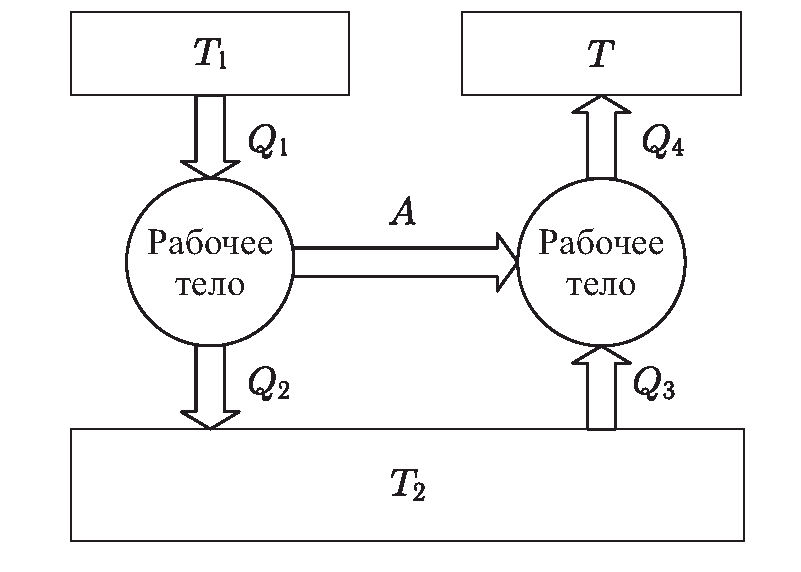
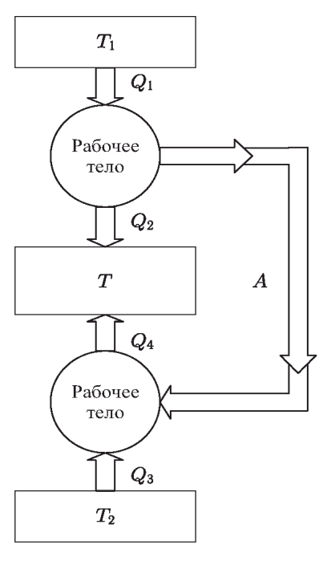

Задача 1. Движение на $\alpha$-частица в електрично и магнитно поле
Под действие на еднородно (хомогенно) електрично поле (област А1 ) изпусканите от
радиоактивен източник $\alpha$-частици с маса m = 6,7.10-27 kg и електричен заряд
q = 3, 2.10-19 C се ускоряват от състояние на покой и изминават разстояние d = 1 cm
(фиг. 1). Ускоряващото напрежение е U = 100 V. След това те попадат в областта А2, в
която е създадено постоянно и еднородно магнитно поле с индукция B = 0,1 T. Тя е
насочена перпендикулярно на равнината, в която се движат $\alpha$-частиците. Широчината
на областта А2 е s = 1 cm. Определете:

 а) скоростта v , с която $\alpha$-частиците навлизат в областта А2 (1 т.)
 б) ускорението а1 , с което $\alpha$-частиците се движат в областта А1 . Как това
ускорение променя скоростта в А1 ? (1,75 т.)
 в) ускорението а2 , с което $\alpha$-частиците се движат в областта А2 . Как това
ускорение променя скоростта в А2 ? (1,75 т.)
 г) посоката на индукцията на магнитното поле (1 т.)
 д) ъгъла $\beta$ на отклонение на $\alpha$-частиците от първоначалната им посока на
движение, когато те напускат А2 (2,5 т.)
 е) времето t на движение на $\alpha$-частиците от радиоактивния източник до
напускане на магнитното поле (2 т.)

Задача 2. История на физиката - топлинни явления
Идеята на Уйлям Томсън (Лорд Келвин) за динамично отопление е предложена в 1852 г.
Тя предполага не непосредствено нагряване, а използването на топлинна машина,
работеща по обратен (хладилен) цикъл, която по съвременна терминология се нарича
топлинна помпа. На фиг. 2 е показана схемата на действие на комбинирано устройство,
чиято цел е поддържането на температура Т в отопляем обем, ако горивото (въглища)
се използва за поддържане на температурата Т1 на нагревателя.
 а) Обяснете качествено работата на комбинираното устройство на фиг. 2. (2,5 т.)

Фиг. 2

б) Какво количество топлина получава отопляемия обем, ако устройството
работи с максимална теоретична ефективност? Разгледайте случая Т < Т1 . (4,5 т.)
в) Възможна е и друга конструкция на устройството, която е показана на фиг. 3.

 Фиг. 3

Какво количество топлина Q получава нагрявания обем при същото количество
топлина Q1 , ако устройството работи с максимална ефективност? Сравнете получения
резултат с този от пункт б). (3 т.)

Задача 3. Молекулно-кинетичен анализ
Топлинно изолирана кухина е съединена чрез два отвора с еднаква площ S с два обема,
в които се намира хелиев газ (фиг. 4).

Налягането на хелия във всеки от обемите се поддържа постоянно и равно на Р0 , като
температурата в левия обем е Т 0 , а в десния - 2Т 0 . В кухината прониква хелий и се
установява равновесно състояние на газа в нея. От молекулна гледна точка това
състояние е динамично, което означава, че колкото частици навлизат в кухината за
единица време, толкова частици я напускат, но изменения на термодинамичните
величини не се наблюдават.
 а) За идеален газ, намиращ се в термодинамично равновесие, изразете броя на
частиците, които попадат върху площ S за единица време, чрез налягането на газа и
неговата температура. Приемете, че в равновесие към стената на съда се движат 1/6 от
общия брой частици и всяка от тях има скорост, равна на средноквадратичната. (4 т.)
 б) Като използвате получения резултат, определете температурата Т и
налягането Р на газа в кухината. (6 т.)